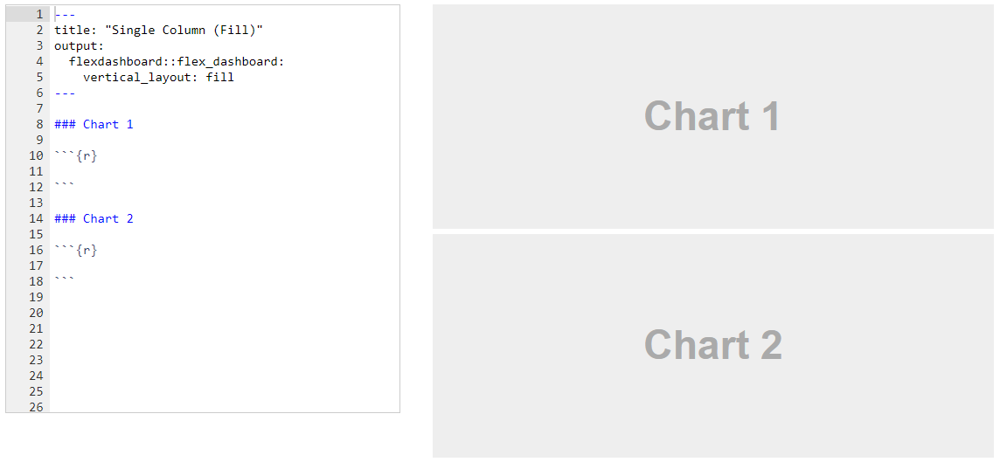
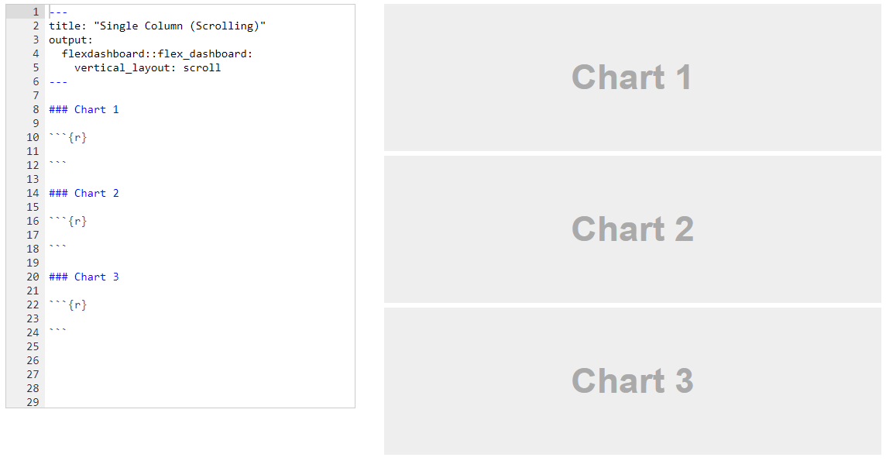
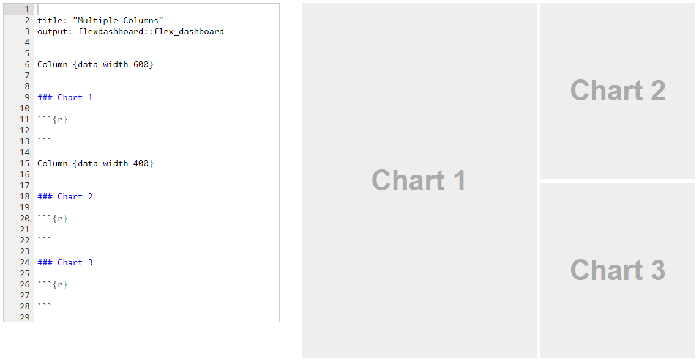
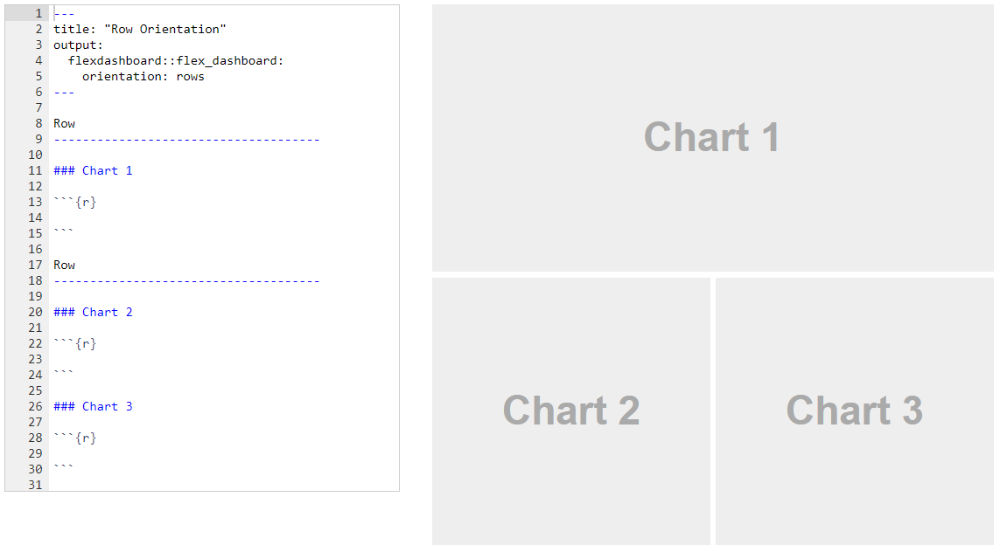

# Dashboards

We will be using [flexdashboard](https://pkgs.rstudio.com/flexdashboard/) to explore dashboards in R. Great article on visualizations in accounting: [Deloitte visualizations](https://www2.deloitte.com/us/en/pages/finance/articles/cfo-insights-data-visualization.html). This website has more details on constructing a flexdashboard: [Details](https://epirhandbook.com/en/dashboards-with-r-markdown.html). Here is another: [Link](https://garrettgman.github.io/rmarkdown/flexdashboard/index.html)

Dashboards[^1] are clear, interactive, and user-friendly. They need to communicate information at a glance through efficient data visualizations that will enable users to extract actionable insights, identify trends and patterns, and find improvement opportunities through a data analysis process. Keeping these needs in mind, the basis for an efficient dashboard design should be to prioritize the most relevant data, think about usability, and be guided by core business goals.

[^1]: Content comes from: <https://www.datapine.com/blog/dashboard-design-principles-and-best-practices/>

1.  Consider your audience

Concerning dashboard best practices in design, your audience is one of the most important factors you have to take into account. You need to know who's going to use the dashboard and for what purpose they will use it in order to create the best analytical tool for them. 

To do so successfully, you need to put yourself in your audience's shoes. The context and device on which users will regularly access their dashboards will have direct consequences on the style in which the information is displayed. Will the dashboard be viewed on the go, in silence at the office desk or will it be displayed as a presentation in front of a large audience?

Additionally, if you make the charts look too complex, the users will spend even more time on data analysis than they would without the dashboard. Data analysis displayed on a dashboard should provide additional value. For example, a user shouldn't need to do some more calculations on his own, to get to the information he was looking for, because everything he needs will be clearly displayed on the charts. Always try to put yourself in the **audience's position**.

2.  Determine your goals

The next dashboard UI design principle has a direct relationship between the user's needs and the purpose of the dashboard, which is to establish your ultimate goals. Rather you are creating a client dashboard or an internal report, each dashboard that you create will serve a purpose and answer key questions through the data. Here, it is important to consider that not all the data available will be useful for the analysis process and that getting this part of the process wrong can render your further efforts meaningless.  

To get this step right, you need to carefully consider what metrics and data sets will bring value to the goals that want to be measured or achieved with this dashboard. Answering questions like; What exactly needs to be measured? Who will measure it? What is the time interval to be measured? Might point you in the right direction.

3.  Tell a story

To put it simply, dashboard storytelling is the process of presenting data in a visual manner that will depict the whole narrative of the data analysis process in order to efficiently understand business strategies and goals. In other words, efficient storytelling will help you communicate your message in the clearest way possible. 

This is a fundamental step as an effective data story will close the gap between more technical users and the ones that have no closeness to analytics. As [Forbes](https://www.forbes.com/sites/forbestechcouncil/2021/03/01/empower-your-team-members-to-become-skilled-data-storytellers/?sh=5f77788f17ad) states in one of their articles: *"storytellers use data-driven narratives to enlighten those team members for whom data analysis is unavailable, inaccessible or simply not the best use of their time"*. 

A good practice for efficient data storytelling is to design your dashboard beforehand. Planning what charts you will include based on your audience and goals will help you be more focused when you actually start building your dashboard. This way you avoid putting a mix of visualizations and seeing if they make sense together but instead generate useful reports considering the level of understanding of users and the final objectives.

4.  Provide Context

Without providing context, how will you know whether those numbers are good or bad, or if they are typical or unusual? Without comparison values, numbers on a dashboard are meaningless for the users. And more importantly, they won't know whether any action is required. For example, a management dashboard design will focus on high-level metrics that are easy to compare and, subsequently, offer a visual story.

Always try to provide maximum information, even if some of them seem obvious to you, your audience might find them perplexing. Name all the axes and measurement units and add titles to all charts. Remember to provide comparison values. The rule of thumb here is to use most common comparisons, for example, comparison against a set target, against a preceding period, or against a projected value. This is an effective dashboard design tip that you should always consider.

5.  Use the right type of chart

In't stress enough the importance of choosing the right data visualization types. You can destroy all of your efforts with a missing or incorrect chart type. It's important to understand what type of information you want to convey and choose a data visualization that is suited to the task. Check module 5.

6.  Choose your layout carefully

Dashboard best practices in design concern more than just good metrics and well-thought-out charts. The next step is the placement of charts on a dashboard. If your dashboard is visually organized, users will easily find the information they need. Poor layout forces users to think more before they grasp the point, and nobody likes to look for data in a jungle of charts and numbers. The general rule is that the key information should be displayed first -- at the top of the screen, upper left-hand corner. There is some scientific wisdom behind this placement -- most cultures read their written language from left to right and top to bottom, which means that people intuitively look at the upper-left part of a page first, no matter if you're developing an enterprise dashboard design or a smaller-scaled within the department - the rule is the same.

Another useful dashboard layout principle is to start with the big picture. The major trend should be visible at a glance. After this revealing first overview, you can proceed with more detailed charts. Remember to group the charts by theme with the comparable metrics placed next to each other. This way, users don't have to change their mental gears while looking at the dashboard by, for example, jumping from sales data to marketing data, and then again to sales data. This analytics dashboard best practice will enable you to present your data in the most meaningful way and clear to the end-user.

7.  Simple is better

One of the best practices for dashboard design focuses on simplicity. Nowadays, we can play with a lot of options in chart creation and it's tempting to use them all at once. However, try to use those frills sparingly. Frames, backgrounds, effects, gridlines... Yes, these options might be useful sometimes, but only when there is a reason for applying them.

Moreover, be careful with your labels or legend and pay attention to the font, size, and color. It shouldn't hide your chart, but also be big enough to be readable. Don't waste space on useless decorations, like for example a lot of pictures.

Round numbers and be careful with colors. Add interactive elements. 😱

Lets look at one 👀

## [Getting Started](https://garrettgman.github.io/rmarkdown/flexdashboard/index.html)

Install the **flexdashboard** package from CRAN as follows:

```{r dash1, eval=FALSE}

install.packages("flexdashboard")
```

To author a flexdashboard you create an [R Markdown](http://rmarkdown.rstudio.com/) document with the `flexdashboard::flex_dashboard` output format. You can do this from within RStudio using the **New R Markdown** dialog:


## Dashboard Basics

### Components

You can use flexdashboard to publish groups of related data visualizations as a dashboard. A flexdashboard can either be static (a standard web page) or dynamic (a [Shiny](http://shiny.rstudio.com/) interactive document). A wide variety of components can be included in flexdashboard layouts, including:

1.  Interactive JavaScript data visualizations based on [htmlwidgets](http://www.htmlwidgets.org/).

2.  R graphical output including base, lattice, and grid graphics.

3.  Tabular data (with optional sorting, filtering, and paging).

4.  Value boxes for highlighting important summary data.

5.  Gauges for displaying values on a meter within a specified range.

6.  Text annotations of various kinds.

See the [dashboard components](https://garrettgman.github.io/rmarkdown/flexdashboard/using.html#components) documentation for additional details on the use of each component type.

### Layout

#### Single Column (Fill)

Dashboards are divided into columns and rows, with output components delineated using level 3 markdown headers (`###`). By default, dashboards are laid out within a single column, with charts stacked vertically within a column and sized to fill available browser height. For example, this layout defines a single column with two charts that fills available browser space:

{width="100%"}

#### Single Column (Scroll)

Depending on the nature of your dashboard (number of components, ideal height of components, etc.) you may prefer a scrolling layout where components occupy their natural height and the browser scrolls when additional vertical space is needed. You can specify this behavior via the `vertical_layout: scroll` option. For example, here is the definition of a single column scrolling layout with three charts:

Depending on the nature of your dashboard (number of components, ideal height of components, etc.) you may prefer a scrolling layout where components occupy their natural height and the browser scrolls when additional vertical space is needed. You can specify this behavior via the `vertical_layout: scroll` option. For example, here is the definition of a single column scrolling layout with three charts:

{width="100%"}

#### Multiple Columns

To lay out charts using multiple columns you introduce a level 2 markdown header (`--------------`) for each column. For example, this dashboard displays 3 charts split across two columns:

{width="100%"}

In this example we've moved Chart 1 into its own column which it will fill entirely. We've also given the column a larger size via the `data-width` attribute to provide additional emphasis to Chart 1.

#### Row Orientation

You can also choose to orient dashboards row-wise rather than column-wise by specifying the `orientation: rows` option. For example, this layout defines two rows, the first of which has a single chart and the second of which has two charts:

{width="100%"}

Lets try this one ⬇️

[Click me](https://beta.rstudioconnect.com/jjallaire/htmlwidgets-rbokeh-iris/htmlwidgets-rbokeh-iris.html#) then click Source Code in the upper right corner 😟

[Another Example](https://beta.rstudioconnect.com/jjallaire/htmlwidgets-ggplotly-examples/htmlwidgets-ggplotly-examples.html)

[Another Example](https://beta.rstudioconnect.com/jjallaire/htmlwidgets-ggplotly-geoms/htmlwidgets-ggplotly-geoms.html#geom_density)

```{r, eval=FALSE}

---
title: "Professor Hunt's Example"
author: "Professor Hunt"
output: 
  flexdashboard::flex_dashboard:
    orientation: columns
    vertical_layout: scroll
    source_code: embed
---

library(flexdashboard)
library(ggplot2)
library(plotly)
library(dplyr)
library(curl)

load(curl("https://raw.githubusercontent.com/Professor-Hunt/ACC3053/main/data/Orders_Data.Rda"))

### Explanation
    
Explain main findings
    
### Scatter Plot

g1<-ggplot(data = Orders_Data) + 
  geom_point(mapping = aes(x = Profit, y = Sales))

ggplotly(g1)

### Line Graph

library(lubridate)

OrdersData_LG<-Orders_Data%>%
  mutate(yearmonth= ym(paste0(year(`Order Date`),"-",month(`Order Date`))))%>%
  group_by(yearmonth)%>%
  summarise(Tot_Ord_Quant=sum(Quantity))

g2<-ggplot(data=OrdersData_LG)+
  geom_line(mapping=aes(x=yearmonth, y=Tot_Ord_Quant))

ggplotly(g2)

### Histogram

g3<-ggplot(data=Orders_Data)+
  geom_histogram(mapping = aes(x=Profit), binwidth=100, color="darkred", fill="pink")+
  xlim(-1000,1000)

ggplotly(g3)

### Box Plot

This graph is a Scatter plot is shows ...
g4<-ggplot(data=Orders_Data)+
  geom_boxplot(mapping=aes(x=factor(year(`Order Date`)),y=Profit))+
  ylim(-30,30)

ggplotly(g4)

### Bar Plot

This graph is a Scatter plot is shows ...
g5<-ggplot(data=Orders_Data)+
  geom_bar(mapping=aes(x=Category))

ggplotly(g5)


```

fin
