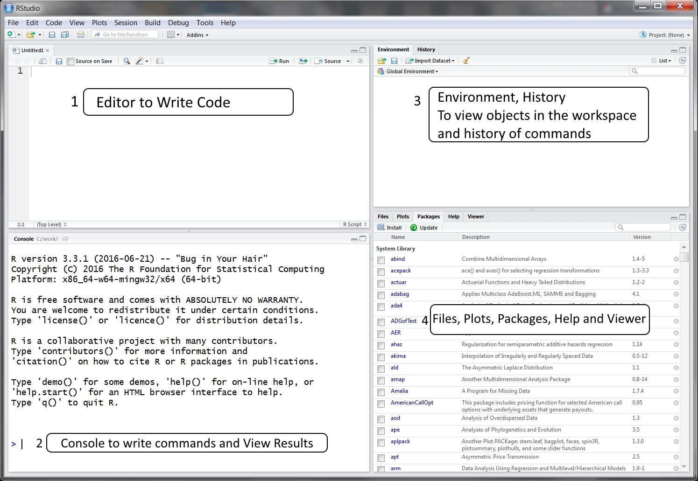
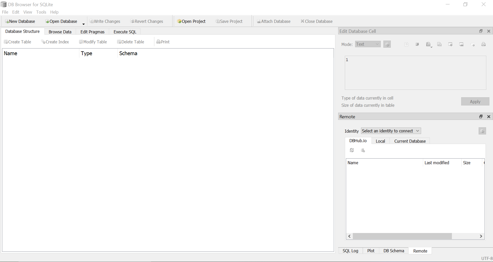

```{r setup, include=FALSE}
knitr::opts_chunk$set(echo = FALSE)
```

# Introduction, syllabus, and Foundations

## Outline of Module 0

1.  What technology are we using in this class?

    -   [Primarily R and Rstudio](#why-use-r)

    -   [Excel](#excel-is-still-relevant)

    -   [DB Browser for SQLite](#db_browser_for_sqlite)

2.  Data analytics in Accounting

    -   [What is data analytics?](#so-why-is-data-analytics-so-important-in-accounting)

    -   [What do the big 4 have to say?](#data_analytics_in_accounting)

    -   [How can it be helpful?](#how-can-data-analytics-be-helpful-to-accountants)

3.  Setting up Technology

    -   [Install it](#installupdate-r-and-rstudio)

    -   [Layout of Technology]

## Why use R? {#why-use-r}

R is a **statistical** programming language developed by **scientists** that has open source libraries for statistics, machine learning, and data science. **R lends itself well to business because of its depth of topic-specific packages and its communication infrastructure**. R has packages covering a wide range of topics such as econometrics, finance, and time series. R has best-in-class tools for visualization, reporting, and interactivity, which are as important to business as they are to science. Because of this, R is well-suited for scientists, engineers and business professionals.[^1]

[^1]: <https://www.business-science.io/business/2020/12/17/six-reasons-to-use-R-for-business-2021.html>

There are plenty of advantages of using R instead of other software packages...

-   `Complete statistical environment and programming language`\
    R integrates with other tools to generate manuscripts from your code. If you collect more data, or fix a mistake in your dataset, the figures and the statistical tests in your manuscript are updated automatically. R code is great for reproducibility. Reproducibility is when someone else (including your future self) can obtain the same results from the same dataset when using the same analysis.

-   `Efficient functions and data structures for data analysis`\
    R is designed for data analysis. It comes with special data structures and data types that make handling of missing data and statistical factors convenient. R can connect to spreadsheets, databases, and many other data formats, on your computer or on the web. The skills you learn with R scale easily with the size of your dataset. Whether your dataset has hundreds or millions of lines, it won't make much difference to you.

-   `Powerful graphics`\
    The plotting functionalities in R are endless, and allow you to adjust any aspect of your graph to convey most effectively the message from your data.

-   `Access to fast growing number of analysis packages`\
    With 10,000+ packages that can be installed to extend its capabilities, R provides a framework that allows you to combine statistical approaches from many scientific disciplines to best suit the analytical framework you need to analyze your data. For instance, R has packages for image analysis, GIS, time series, population genetics, and a lot more. R has a large and welcoming community. Thousands of people use R daily. Many of them are willing to help you through mailing lists and websites such as Stack Overflow, or on the RStudio community.

-   `Technical advantages: free, open-source, available for all OSs`\
    Anyone can inspect the source code to see how R works. Because of this transparency, there is less chance for mistakes, and if you (or someone else) find some, you can report and fix bugs.

It's easy to get distracted by Tableau and PowerBI's visuals, but when it comes to making business decisions, your organization needs to be able to take actions. This is where R is lightyears ahead of the other tools.

[business-science](https://www.business-science.io/assets/2020-03-09-shiny-vs-tableau/dashboard-ecosystem.png)

**Tools like Excel and tableau are easier to learn, but have a lower Business Capability. R does not involve lots of pointing and clicking, and that's a good thing. The learning curve might be steeper than with other software, but with R, the results of your analysis do not rely on remembering a succession of pointing and clicking, but instead on a series of written commands. So, if you want to redo your analysis because you collected more data, you don't have to remember which button you clicked in which order to obtain your results; you just have to run your script again. Working with scripts makes the steps you used in your analysis clear, and the code you write can be inspected by someone else who can give you feedback and spot mistakes. Working with scripts forces you to have a deeper understanding of what you are doing, and facilitates your learning and comprehension of the methods you use.**[^2]

[^2]: <https://www.mle.hamburg/_repos/dat_sci/00_preface/>

## Excel is still relevant {#excel-is-still-relevant}

Excel is still the most widely used analysis tool in business. [**Every**]{.ul} accountant will use excel.

Then why learn anything else? See above. Also, we will learn to use excel and R together.

## DB Browser for SQLite {#db_browser_for_sqlite}

*DB Browser for SQLite*[^3] (DB4S) is a high quality, visual, open source tool to create, design, and edit database files compatible with SQLite.

[^3]: <https://sqlitebrowser.org/>

DB4S is for users and developers who want to create, search, and edit databases. DB4S uses a familiar spreadsheet-like interface, and complicated SQL commands do not have to be learned.

Controls and wizards are available for users to:

-   Create and compact database files

-   Create, define, modify and delete tables

-   Create, define, and delete indexes

-   Browse, edit, add, and delete records

-   Search records

-   Import and export records as text

-   Import and export tables from/to CSV files

-   Import and export databases from/to SQL dump files

-   Issue SQL queries and inspect the results

-   Examine a log of all SQL commands issued by the application

-   Plot simple graphs based on table or query data

Databases have a very large place in businesses. Accountants will interact with databases or data retrieved from a database. Large companies cannot exist without databases.

## What is Data Analytics?

A buzz word for sure. But it is becoming more clear everyday. Analytics is the process which will help you to make meaningful conclusions. A lot of industries have recognized the potential that big data and analytics provide. One such industry where we can see the significant potential is the Accounting world.

The data that exists is scattered, often unused until it is pulled for an audit or a tax return. There was a time when only samples were selected and verified during an audit but now with the advent of Data Analytics auditors are able to analyze the business 24\*7.

To understand the changing customer behavior and market trends Chief Financial Officers (CFOs) and finance leaders are embracing accounting software equipped with "Big data" and analytic techniques. The predictive power of data analytics enables CFO's to make financial decisions based not on what happened in the past but what is likely to happen in the future.

## **So why is data analytics so important in accounting?** {#so-why-is-data-analytics-so-important-in-accounting}

Accountants use accounting software empowered with data analytics to help businesses uncover the most valuable insights associated with finance, identify process improvements that can increase efficiency and better manage risks. Data analytics gives them the necessary tool-set to strengthen their partnership with business leaders.

***A few examples***

-   Auditors who are working both externally and internally can shift from a sample based model to model that allows continuous monitoring where larger data sets can be analyzed and verified. The outcome is less margin of error and more precise recommendations.

-   Tax accountants can also use data science to quickly analyze complex taxation questions related to investment scenarios.

-   Accountants use big data to study the consumer behavioral patterns. These help businesses build analytic models which can help them identify investment opportunities and generate higher profit margins.

## **Four Types of Data Analytics every accountant should be aware of**

### **1- *Descriptive Analytics = "What happening?"***

This one is used most often and includes classification and categorization of information. Accountants keep an eagle eye on the flow of money through their organization -- they take care of the revenue and expenses, inventory counts and sales tax collected. Accurate generation is a trademark of solid accounting practices and for this accurate report generation compiling and verifying large amounts of data is important.

### ***2- Diagnostic Analytics = "Why did it happen?"***

Diagnostic is primarily used to monitor the changes in the data. Accountants on daily basis analyze the variances in the data and calculate the historical performance. A lot of accountants use variance analysis for budgeting. There is also specialized accounting software available in the market that can be used for detecting high-risk transactions.

### ***3- Predictive Analytics = "What's likely to happen"?***

In the predictive analysis, data is used to access the likelihood of future outcomes. Accountants are experts in building forecasts and identifying patterns and trends that shape those forecasts.

### ***4- Prescriptive Analysis ="What should we do?"***

Simulation and optimization of data are done to answer questions such as "what should we do?" It is something that is not just limited to recommendations and goes beyond that. It is actually executing actions or taking decisions that are right for a particular situation. The prescriptive analysis is used to answer" What steps or interventions need to be taken to achieve the required outcome?"

Descriptive and diagnostic analytics usually depend on analytics tools that have the capacity to handle the manipulation of large sets of data. Examples include SQL, Oracle DB, Hadoop, Tableau, Microsoft Access, R, python etc.

Predictive and Prescriptive analysis rely on analytics tools that have mathematical modeling capabilities. Examples include SAS, R, Python, optimization tools like Garrobi, Riverlogic; simulation tools like Analogic, natural Language processing tools like Natural Language Toolkit or OpenNLP.

### **The Future**

It is expected that in the coming years there will be a tremendous use of analytic tools. Accounting professionals will delve themselves deeper into the combined analysis of structured data such as financial statements and unstructured data such as the large volume of client contracts. They will provide more extensive data analytics and quality business insights.

Machine learning, Artificial Intelligence, robotics, blockchain will have a major impact on the profession. But the fact also cannot be denied that "all these technologies in one or another way depends on data". If you can't analyze data you cannot do machine learning, you cannot do robotics and you cannot do blockchain.

Therefore it is important that the accountants to take a deep dive into the pool of data and enable themselves to ask better questions and get better answers.

To make the most out of data analytics such that it suits the needs of the accountants as well as the organization, a clear plan should be carved out that articulates the three components parts- data, analytics, and people. All the three components should be integrated and aligned to create business value.[^4]

[^4]: [Things you Should Know About Data Analytics in Accounting -- StartupGuys.net](https://www.startupguys.net/things-you-should-know-about-data-analytics-in-accounting/)

[Another good Article](https://www.thetaxadviser.com/issues/2017/may/data-analytics-accounting-practitioners.html)

## Data Analytics in Accounting {#data_analytics_in_accounting}

Lets look at some examples (in no particular order)

[**Deloitte**](https://www2.deloitte.com/us/en/pages/deloitte-analytics/articles/business-analytics-case-studies.html)

[**KPMG**](https://advisory.kpmg.us/services/data-analytics.html)

[**EY**](https://www.ey.com/en_gl/big-data-analytics)

[**PWC**](https://www.pwc.com/us/en/services/consulting/analytics.html)

## How Can Data Analytics be Helpful to Accountants? {#how-can-data-analytics-be-helpful-to-accountants}

Given the information above what examples did you see?

To be turned in:

submit a brief summary of what you believe data analytics is and how you think that it might be useful to accountants.

::: {.highlight}
**SEE CANVAS FOR ASSIGNMENT DETAILS**
:::

## Install/update R and RStudio[^5] {#installupdate-r-and-rstudio}

[^5]: <https://datacarpentry.org/R-ecology-lesson/index.html#Install_R_and_RStudio>

R and RStudio are two separate pieces of software:

-   **R** is a programming language that is especially powerful for data exploration, visualization, and statistical analysis

-   **RStudio** is an integrated development environment (IDE) that makes using R easier. In this course we use RStudio to interact with R.

If you don't already have R and RStudio installed, follow the instructions for your operating system below. You have to install R before you install RStudio.

#### **Windows**

-   Download R from the [CRAN website](https://cran.r-project.org/bin/windows/base/release.htm).

-   Run the `.exe` file that was just downloaded

-   Go to the [RStudio download page](https://www.rstudio.com/products/rstudio/download/#download)

-   Under *Installers* select **RStudio x.yy.zzz - Windows Vista/7/8/10** (where x, y, and z represent version numbers)

-   Double click the file to install it

-   Once it's installed, open RStudio to make sure it works and you don't get any error messages.

##### **MacOS**

-   Download R from the [CRAN website](https://cran.r-project.org/bin/macosx/).

-   Select the `.pkg` file for the latest R version

-   Double click on the downloaded file to install R

-   It is also a good idea to install [XQuartz](https://www.xquartz.org/) (needed by some packages)

-   Go to the [RStudio download page](https://www.rstudio.com/products/rstudio/download/#download)

-   Under *Installers* select **RStudio x.yy.zzz - Mac OS X 10.6+ (64-bit)** (where x, y, and z represent version numbers)

-   Double click the file to install RStudio

-   Once it's installed, open RStudio to make sure it works and you don't get any error messages.

### **Update R and RStudio**

If you already have R and RStudio installed, check if your R and RStudio are up to date:

-   When you open RStudio your R version will be printed in the console on the bottom left. Alternatively, you can type `sessionInfo()` into the console. If your R version is 4.0.0 or later, you don't need to update R for this lesson. If your version of R is older than that, download and install the latest version of R from the R project website [for Windows](https://cran.r-project.org/bin/windows/base/), [for MacOS](https://cran.r-project.org/bin/macosx/), or [for Linux](https://cran.r-project.org/bin/linux/)

-   To update RStudio to the latest version, open RStudio and click on `Help" > Check for updates`. If a new version is available, quit RStudio, follow the instruction on screen.

Note: It is not necessary to remove old versions of R from your system, but if you wish to do so you can check [How do I uninstall R?](https://cran.r-project.org/bin/windows/base/rw-FAQ.html#How-do-I-UNinstall-R_003f)

## Install DB Browser

Download DB Browser for SQLite from their [website](https://sqlitebrowser.org/dl/)

Select the appropriate download for your respective operating system **Windows** or **MacOS** (which you should know given the steps above).

### MSSTATE ITS Provides Microsoft Excel if you do not have it. I believe they have it available for windows/macOS

## Layout of Technology

### RStudio




If you are interested in customizing your RStudio GUI see this [article](https://support.rstudio.com/hc/en-us/articles/200549016-Customizing-the-RStudio-IDE).

### DB Browser




