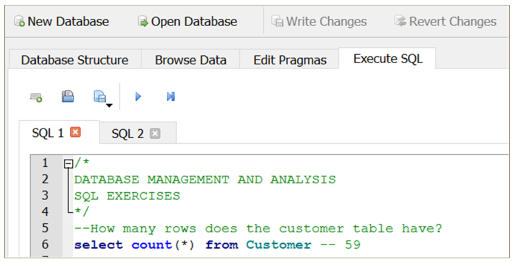

```{r setup, include=FALSE}
knitr::opts_chunk$set(echo = FALSE)
```

# Game Plan

At this point everyone should have the class technology up and running on their machines. We are going to learn the basics ETL using mostly RStudio, but we will start off with concepts learned in ACC3003, relational databases and excel. You should have experience with relational databases and excel, but if you have forgotten do not worry. We will pick up here and discover how R can push these technologies further. Lets get started with Relational databases.

This case study is provided by [PWC](https://www.pwc.com/us/en/careers/university-relations/data-and-analytics-case-studies.html). It was developed for a [masters level course](https://www.pwc.com/us/en/careers/university-relations/data-and-analytics-case-studies.html), but I am adapting it for our class. I will provide all of the knowledge based content because it is important to get an understanding of what accounting firms are looking for, but we may only discuss portions in class.

# Lets Get Started

#### Module 1 Objectives

-   Demonstrate knowledge of relational databases, [data lineage, and ERP systems](Module_1_A.html)

-   Demonstrate how to interpret an entity relationship diagram

-   Demonstrate how to use SQL to transform and analyze data

## Review

#### Data Analytics Process


## What is a Relational Database

A **relational database** is a collection of data that organizes data in tables and maintains relationships between the tables for information retrieval

A **relational database management system** (RDBMS) is computer software that enables users to create, modify, and analyze data in a relational database

#### Enterprise RDBMS include:

-   Microsoft SQL Server

-   Oracle Database

-   Oracle MySQL

-   IBM DB2

-   SAP Sybase

-   Teradata

-   PostgreSQL

#### Lightweight RDBMS include:

-   Microsoft Access

-   SQLite (what we are using 😏)

## Key Terms

-   A [**table**](#tables) is the basic unit of data storage in a database. Data is stored in rows and columns. You can specify rules for each column of a table like establishing its data type, forcing a column to contain a value in every row, or ensuring unique records

-   A **view** is a tailored presentation of data selected from one or more tables, possibly including other views. A view contains no actual data but rather derives what it shows from the tables and views on which it is based. Therefore, a view can be thought of as a virtual table

-   A **schema** is a "container" within a database similar to a directory on a file system that groups tables together

-   The connection between tables is made by a **Primary Key -- Foreign Key** pair, where the Foreign Key in a table is the Primary Key of another table

-   A **query** is used to create, manipulate, or view database objects

-   A **report** is formatted view of data from the database within user-defined parameters, often generated in an external file format such as.txt

## Tables {#tables}

-   Tables consist of one or more records or rows of data

-   The data for each row is organized into a defined set of attributes, organized into columns

::: {.floatting}
```{r out.width='40%', out.extra='style="float:right; padding:10px"'}
knitr::include_graphics("images/Simple_table.png")
```

-   Data types include:

    -   String/Text/Character

    -   Numeric (Integer, Float)

    -   Date/Time

    -   Boolean (Yes/No, True/False)
:::

#### Relational Tables


#### Primary Key

-   Primary key is a unique identifier of records in a table

-   Primary key values may be generated manually or automatically

-   A primary key can consist of more than one field

## Relationship Types

#### **One-to-One**

-   Each instance of one entity relates to only one instance of the second

-   Not frequently used in database systems

-   Might use to divide a table with many fields in order to isolate part of a table

#### **One-to-Many**

-   Each instance of one entity relates to one or more instances of the second entity

-   Most common type of relationship and it is used to relate one record from the 'primary' table with many records in the 'related' table.

-   In a one-to-many relationship, a record ('parent') in Table A can have many matching records ('children') in Table B, but a record ('child') in Table B has only one matching record ('parent') in Table A.

#### **Many-to-Many**

-   Multiple instances of one entity relate to multiple instances of the second entity

#### Entity Relationship Diagram


# [Other Information in PWC Case Study](Module_1_A.html)

# Structured Query Language

## What is SQL

-   Structured Query Language (SQL) is the programming language used when interacting with data in a relational database

-   SQL implementations for different databases may have minor differences in functions and syntax

-   SQL statements can be categorized into two groups: Data Definition Language (DDL) and Data Manipulation Language (DML)

-   DDL statements are used to create and/or alter table structures in a SQL Server database

-   DML statements are used to add, modify, query, or remove data from a SQL Server database

## SQL Basics

-   A statement is a complete sequence of functions, keywords, operators, and values that can be evaluated by the database engine

-   A query returns records from one or more tables in the database

-   A clause is a component of a statement or query

-   An expression is a combination of one or more values, operators, and functions that evaluates to a value

-   Extra white space (spaces, new lines, etc.) is not evaluated

-   SQL is typically case-insensitive, but functions are capitalized by convention

-   SQL statements are often required to end with a semi-colon (;)

## SQLite and DB Browser for SQLite

www.sqlite.org:

-   "SQLite is a self-contained, high-reliability, embedded, full-featured, public-domain, SQL database engine"

-   "SQLite is the most used database engine in the world"

sqlitebrowser.org:

-   "DB Browser for SQLite [DB4S] is a high quality, visual, open source tool to create, design, and edit database files compatible with SQLite"

-   Create, define, modify and delete tables

-   Browse, edit, add and delete records

-   Search records

-   Import and export tables from/to CSV files

-   Issue SQL queries and inspect the results

## SQLite/DB4S Basics

{width="100%"}

## Comments

-   Adding comments is a best practice when writing code, in any programming language

-   These statements are not evaluated by the SQL engine but help the reader understand the intent and the approach behind an individual line of code or the script as a whole

-   In SQL, single-line comments are generally preceded by a double dash ("--"), while block comments across multiple lines are marked by "/\* ... \*/"

{width="100%"}

## Chinook Sample Database

::: {.floatting}
```{r out.width='60%', out.extra='style="float:right; padding:10px"'}
knitr::include_graphics("images/Chinook_Database.png")
```

-   Chinook is a digital media store with several employees

-   Customers can buy individual tracks from a variety of musical artists

-   The database contains master and transactional data for the business

-   Download the database and open the Chinook_Sqlite.sqlite file in DB4S
:::

## SYNTAX

### SELECT statement

-   A SELECT statement is used to fetch records from a database table in the form of a table called a result set

-   One or more columns may be specified, or the asterisk (\*) can be used to return all records from the table

-   Use the LIMIT keyword to return only the first n rows from the result set

-   The result set is not stored in the database without the use of additional functions

$\color{red}{\text{SELECT}}$ column1, column2, column3 $\color{red}{\text{FROM}}$ table_name

$\color{red}{\text{SELECT *  FROM}}$ table_name

$\color{red}{\text{SELECT}}$ column1, column2, column3 $\color{red}{\text{FROM}}$ table_name $\color{red}{\text{LIMIT}}$ 5

### CREATE TABLE statement

-   A **CREATE TABLE** statement is used to add the result set from a query to the database as a new table

-   Complicated queries can be broken down by creating intermediate tables

-   The ability to create a table depends on the level of access granted to a user, so it may not be possible in some situations

$\color{red}{\text{CREATE TABLE}}$ new_table $\color{red}{\text{AS}}$

$\color{red}{\text{SELECT}}$ column1, column2, column3 $\color{red}{\text{FROM}}$ table_name

### ORDER BY

The $\color{red}{\text{ORDER BY}}$ keyword can be added to a **SELECT** statement to sort the records

The typical default order is ascending **(ASC)**, but you can also specify descending **(DESC)**

$\color{red}{\text{SELECT}}$ column1, column2, column3 $\color{red}{\text{FROM}}$ table_name

$\color{red}{\text{ORDER BY}}$ column2, column1, column3 $\color{red}{\text{DESC}}$

### COUNT

-   The COUNT function returns the number of records in the result set

-   The input parameter can be \* or 1

$\color{red}{\text{SELECT}}$ COUNT(\*) $\color{red}{\text{FROM}}$ table_name

$\color{red}{\text{SELECT}}$ COUNT(1) $\color{red}{\text{FROM}}$ table_name

## Exercise \#1

Answer the following questions using the Chinook Database in DB Browser $\color{red}{\text{(Do not peek at the answers 👿 )}}$:

1.  How many columns does the customer table have?[^1]

[^1]: I did not find a great SQL solution. If you find a better one please let me know.

<details>

<summary>

Answer 1

</summary>

<p>

```{r SQL_Exercise_1_1_A, echo=FALSE, out.width = '80%'}
knitr::include_graphics("images/SQL_Exercise_1_1_A.png")
```

</p>

</details>

<details>

<summary>

Answer 2

</summary>

<p>

```{r SQL_Exercise_1_1_B, echo=FALSE, out.width = '80%'}

```

</p>

</details>

2.  If you select only the first 5 rows, what is the country in the last row?

<details>

<summary>

Answer 1

</summary>

<p>

```{r SQL_Exercise_1_2_A, echo=FALSE, out.width = '80%'}
knitr::include_graphics("images/SQL_Exercise_1_2_A.png")
```

</p>

</details>

<details>

<summary>

Answer 2

</summary>

<p>

```{r SQL_Exercise_1_2_B, echo=FALSE, out.width = '80%'}
knitr::include_graphics("images/SQL_Exercise_1_2_B.png")
```

</p>

</details>

3.  If you sort the table on last name, what is the last name in the third row?

<details>

<summary>

Answer 1

</summary>

<p>

```{r SQL_Exercise_1_3_A, echo=FALSE, out.width = '80%'}

```

</p>

</details>

<details>

<summary>

Answer 2

</summary>

<p>

```{r SQL_Exercise_1_3_B, echo=FALSE, out.width = '80%'}

```

</p>

</details>

4.  How many rows are in the invoice table?

<details>

<summary>

Answer 1

</summary>

<p>

```{r SQL_Exercise_1_4_A, echo=FALSE, out.width = '80%'}
knitr::include_graphics("images/SQL_Exercise_1_4_A.png")
```

</p>

</details>

<details>

<summary>

Answer 2

</summary>

<p>

```{r SQL_Exercise_1_4_B, echo=FALSE, out.width = '80%'}

```

</p>

</details>

### WHERE clause

-   The **WHERE** clause can be added to a **SELECT** statement to filter records that meet certain conditions, i.e. return a subset of the table

-   We use expressions to define these conditions

    -   Most conditional operators are self-explanatory (=, \<, \>, etc.)

    -   A common operator for "not equals" is \<\> or !=

$\color{red}{\text{SELECT}}$ column1, column2, column3 $\color{red}{\text{FROM}}$ table_name $\color{red}{\text{WHERE}}$ column1 = 'ABC'

$\color{red}{\text{SELECT}}$ column1, column2, column3 $\color{red}{\text{FROM}}$ table_name $\color{red}{\text{WHERE}}$ column2 \> 100

$\color{red}{\text{SELECT}}$ column1, column2, column3 $\color{red}{\text{FROM}}$ table_name $\color{red}{\text{WHERE}}$ column3 != 0

### Comparative Operators

+--------------------------------+--------------------------------------------------------------------------------------------------------------------+--------------------------------------------+
| $\color{red}{\text{Operator}}$ | $\color{red}{\text{Operator Description}}$                                                                         | $\color{red}{\text{Example (a=10, b=20)}}$ |
+================================+====================================================================================================================+============================================+
| =                              | Checks if the values of two operands are equal or not, if yes then condition becomes true                          | (a= b) is not true                         |
+--------------------------------+--------------------------------------------------------------------------------------------------------------------+--------------------------------------------+
| !=                             | Checks if the values of two operands are equal or not, if values are not equal then condition becomes true         | (a != b) is true                           |
+--------------------------------+--------------------------------------------------------------------------------------------------------------------+--------------------------------------------+
| \<\>                           | Checks if the value of two operands are equal or not, if values are not equal then condition becomes true          | (a \<\> b) is true                         |
+--------------------------------+--------------------------------------------------------------------------------------------------------------------+--------------------------------------------+
| \>                             | Checks if the value of left operand is greater than the value of right operand, if yes then condition becomes true | (a \> b) is not true                       |
+--------------------------------+--------------------------------------------------------------------------------------------------------------------+--------------------------------------------+
| \<                             | Checks if the value of left operand is less than the value of right operand, if yes then condition becomes true    | (a \< b) is true                           |
+--------------------------------+--------------------------------------------------------------------------------------------------------------------+--------------------------------------------+

: Comparative Operators

### AND/OR

-   An AND/OR operator can be added to a WHERE clause to filter records on based on multiple conditions

-   The AND operator returns all records where both conditions are true

-   The OR operator returns all records if either the first condition or the second condition are true

$\color{red}{\text{SELECT}}$ column1, column2, column3 $\color{red}{\text{FROM}}$ table_name

$\color{red}{\text{WHERE}}$ a_condition $\color{red}{\text{AND}}$ another_condition

$\color{red}{\text{SELECT}}$ column1, column2, column3 $\color{red}{\text{FROM}}$ table_name

$\color{red}{\text{WHERE}}$ a_condition $\color{red}{\text{OR}}$ another_condition

### IN

-   The **IN** operator can be used to specify multiple values in a **WHERE** clause

-   This is equivalent to a series of **OR** clauses

$\color{red}{\text{SELECT}}$ column1, column2, column3 $\color{red}{\text{FROM}}$ table_name

$\color{red}{\text{WHERE}}$ column1 $\color{red}{\text{IN}}$ (value1, value2, ..., valueN)

$\color{red}{\text{SELECT}}$ column1, column2, column3 $\color{red}{\text{FROM}}$ table_name

$\color{red}{\text{WHERE}}$ column1 = value1 $\color{red}{\text{OR}}$ column1 = value $\color{red}{\text{OR}}$ ... $\color{red}{\text{OR}}$ column1 = valueN

### BETWEEN

-   The **BETWEEN** operator can be used in a **WHERE** clause to select values within a range

$\color{red}{\text{SELECT}}$ column1, column2, column3 $\color{red}{\text{FROM}}$ table_name

$\color{red}{\text{WHERE}}$ column2 $\color{red}{\text{BETWEEN}}$ value1 $\color{red}{\text{AND}}$ value2

### LIKE

-   The **LIKE** operator can be used in a **WHERE** clause to search for a specified pattern in a column

-   **LIKE** supports the several wildcards

$\color{red}{\text{SELECT}}$ column1, column2, column3 $\color{red}{\text{FROM}}$ table_name

$\color{red}{\text{WHERE}}$ column2 $\color{red}{\text{LIKE}}$ '$\color{red}{\text}$'

| $\color{red}{\text{Wildcard}}$ | $\color{red}{\text{Description}}$                          |
|--------------------------------|------------------------------------------------------------|
| \%                             | A substitute for zero or more characters                   |
| \_ (underscore)                | A substitute for a single character                        |
| [charlist]                     | Sets and ranges of characters to match                     |
| [\^charlist]                   | Matches only a character NOT specified within the brackets |

### NULL and NOT

-   **NULL** means that a value has not been entered for a particular column in a row, i.e. the value is missing

-   **NULL** is not numeric or any other value so it can't equal itself or anything else

-   **NOT** creates the negation of an expression

-   To test for a **NULL** value you will want to use the expressions **IS** **NULL** or **IS NOT NULL**

$\color{red}{\text{SELECT}}$ column1, column2 $\color{red}{\text{FROM}}$ table_name

$\color{red}{\text{WHERE}}$ column2 $\color{red}{\text{IS NULL}}$

$\color{red}{\text{SELECT}}$ column1, column2 $\color{red}{\text{FROM}}$ table_name

$\color{red}{\text{WHERE}}$ column2 $\color{red}{\text{IS NOT NULL}}$

## Exercise \#2

Answer the following questions using the Chinook Database in DB Browser $\color{red}{\text{(Do not peek at the answers 👿 )}}$: [^2]

[^2]: These are not the only answers

1.  How many invoices have totals greater than \$20?

    <details>

    <summary>

    Answer 1

    </summary>

    <p>

    ```{r SQL_Exercise_2_1_A, echo=FALSE, out.width = '80%'}
    
    ```

    </p>

    </details>

    <details>

    <summary>

    Answer 2

    </summary>

    <p>

    ```{r SQL_Exercise_2_1_B, echo=FALSE, out.width = '80%'}
    
    ```

    </p>

    </details>

2.  How many invoices have totals greater than \$10 and less than \$20?

    <details>

    <summary>

    Answer 1

    </summary>

    <p>

    ```{r SQL_Exercise_2_2_A, echo=FALSE, out.width = '80%'}
    knitr::include_graphics("images/SQL_Exercise_2_2_A.png")
    ```

    </p>

    </details>

    <details>

    <summary>

    Answer 2

    </summary>

    <p>

    ```{r SQL_Exercise_2_2_B, echo=FALSE, out.width = '80%'}
    knitr::include_graphics("images/SQL_Exercise_2_2_B.png")
    ```

    </p>

    </details>

3.  How many invoices are from customers in Brazil, Argentina, or Chile?

    <details>

    <summary>

    Answer 1

    </summary>

    <p>

    ```{r SQL_Exercise_2_3_A, echo=FALSE, out.width = '80%'}
    
    ```

    </p>

    </details>

    <details>

    <summary>

    Answer 2

    </summary>

    <p>

    ```{r SQL_Exercise_2_3_B, echo=FALSE, out.width = '80%'}
    
    ```

    </p>

    </details>

4.  How many invoices have a billing country that starts with "C"?

    <details>

    <summary>

    Answer 1

    </summary>

    <p>

    ```{r SQL_Exercise_2_4_A, echo=FALSE, out.width = '80%'}
    knitr::include_graphics("images/SQL_Exercise_2_4_A.png")
    ```

    </p>

    </details>

    <details>

    <summary>

    Answer 2

    </summary>

    <p>

    ```{r SQL_Exercise_2_4_B, echo=FALSE, out.width = '80%'}
    knitr::include_graphics("images/SQL_Exercise_2_4_B.png")
    ```

    </p>

    </details>

5.  How many customers list their company?

    <details>

    <summary>

    Answer 1

    </summary>

    <p>

    ```{r SQL_Exercise_2_5_A, echo=FALSE, out.width = '80%'}
    knitr::include_graphics("images/SQL_Exercise_2_5_A.png")
    ```

    </p>

    </details>

    <details>

    <summary>

    Answer 2

    </summary>

    <p>

    ```{r SQL_Exercise_2_5_B, echo=FALSE, out.width = '80%'}
    knitr::include_graphics("images/SQL_Exercise_2_5_B.png")
    ```

    </p>

    </details>

### Expressions

-   An expression is a combination of one or more values, operators, and SQL functions that evaluates to a value

-   Any time the data must be displayed, filtered, or ordered in a way that is different from how it is stored, you can use expressions and functions to manipulate it

-   We can use expressions to create calculated or derived fields, as in the example below:

    -   $\color{red}{\text{end_bal}}$ -- $\color{red}{\text{beg_bal}}$ is the expression

    -   Minus ($\color{red}{\text{-}}$) is an operator

    -   $\color{red}{\text{end_bal}}$ and $\color{red}{\text{beg_bal}}$ are columns in the existing table

    -   $\color{red}{\text{AS "difference"}}$ provides a name for a new column in the result set

SELECT column1, end_bal, end_bal -- beg_bal $\color{red}{\text{AS}}$ "difference"

FROM table_name

### Arithmetic operators

+--------------------------------+-----------------------------------------------------------------------------------+
| $\color{red}{\text{Operator}}$ | $\color{red}{\text{Description}}$                                                 |
+================================+===================================================================================+
| \+                             | Adds values on either side of the operator                                        |
+--------------------------------+-----------------------------------------------------------------------------------+
| \-                             | Subtracts right hand operand from left hand operand                               |
+--------------------------------+-----------------------------------------------------------------------------------+
| \*                             | Multiplies values on either side of the operator                                  |
+--------------------------------+-----------------------------------------------------------------------------------+
| /                              | Divides left hand operand by right hand operand                                   |
+--------------------------------+-----------------------------------------------------------------------------------+
| \%                             | Divides left hand operand by right hand operand and returns remainder ("modulus") |
+--------------------------------+-----------------------------------------------------------------------------------+

## String functions

-   The **RTRIM** and **LTRIM** functions remove spaces from the right side or left side of a string

$\color{red}{\text{RTRIM(<string>)}}$

$\color{red}{\text{LTRIM(<string>)}}$

-   Use **SUBSTR** to return a portion of a string starting at a given position and for a specified number of characters

$\color{red}{\text{SUBSTR(<string>,<start location>,<length>)}}$

-   Use **LENGTH** to return the number of characters in a string (other SQL implementations may use **LEN**)

$\color{red}{\text{LENGTH(<string>)}}$

### String functions (continued)

-   Use **UPPER** and **LOWER** to change a string to either uppercase or lowercase

-   You may need to display all uppercase data in a report, for example

$\color{red}{\text{UPPER(<string>)}}$

$\color{red}{\text{LOWER(<string>)}}$

-   Use **REPLACE** to substitute one string value for another

-   Use **REPLACE** to clean up data; for example, you may need to replace slashes (/) in a phone number column with hyphens (-) for a report

$\color{red}{\text{REPLACE(<string value>,<string to replace>,<replacement>) }}$

$\color{red}{\text{SELECT}}$ column1, $\color{red}{\text{REPLACE}}$ (column1, '/', '-') $\color{red}{\text{AS}}$ new_col

$\color{red}{\text{FROM}}$ table_name

### Numeric functions

-   Use **ROUND** to specify a number of significant digits:

$\color{red}{\text{SELECT}}$ column1, $\color{red}{\text{ROUND}}$ (column1, 2) $\color{red}{\text{AS}}$ new_col

$\color{red}{\text{FROM}}$ table_name

-   Use **RANDOM** in combination with the absolute value function **ABS** and modulus operator % to generate a random number on a specific range:

$\color{red}{\text{SELECT}}$ \*, $\color{red}{\text{ABS}}$($\color{red}{\text{RANDOM}}$() % 100) $\color{red}{\text{AS}}$ new_col

$\color{red}{\text{FROM}}$ table_name

### Data functions

::: {style="display: flex;"}
::: {.column width="50%"}
-   Different SQL implementations have varying functions and operators for dates and times

-   In SQLite, date objects are created by DATE and related functions, and arithmetic operators are used to do calculations involving dates

-   **DATE('now')** returns the current date and time of the server

-   **JULIANDAY** interprets dates in the standard YYYY-MM-DD format

-   **STRFTIME** provides flexible options for managing dates and times using substitutions shown at right
:::

<div>

| $\color{red}{\text{Sub}}$ | $\color{red}{\text{Description}}$ |
|---------------------------|-----------------------------------|
| %d                        | day of month: 00                  |
| %f                        | fractional seconds: SS.SSS        |
| %H                        | hour: 00-24                       |
| %j                        | day of year: 001-366              |
| %J                        | Julian day number                 |
| %m                        | month: 01-12                      |
| %M                        | minute: 00-59                     |
| %s                        | seconds since 1970-01-01          |
| %S                        | seconds: 00-59                    |
| %w                        | day of week 0-6 with Sunday = 0   |
| %W                        | week of year: 00-53               |
| %Y                        | year: 0000-9999                   |

</div>
:::

### Example - Date functions

$\color{red}{\text{SELECT JULIANDAY}}$('now') - $\color{red}{\text{JULIANDAY}}$('1776-07-04');

$\color{red}{\text{SELECT}}$ column1, $\color{red}{\text{STRFTIME}}$('%Y-%m-%d', column1) $\color{red}{\text{AS}}$ new_col

$\color{red}{\text{FROM}}$ table_name

$\color{red}{\text{SELECT}}$ column1, $\color{red}{\text{STRFTIME}}$('%w', column1) $\color{red}{\text{AS}}$ new_col

$\color{red}{\text{FROM}}$ table_name

$\color{red}{\text{SELECT}}$ column1, $\color{red}{\text{STRFTIME}}$('%W', column1) $\color{red}{\text{AS}}$ new_col

$\color{red}{\text{FROM}}$ table_name

### CAST

-   The **CAST** function is used for explicitly changing the data type of a column, often from text to numeric and vice versa

-   Available data types include:

    -   **INT** - Integer

    -   **CHAR** - Text

    -   **TEXT** - Text

    -   **REAL** - Numeric

    -   **FLOAT** - Numeric

$\color{red}{\text{SELECT}}$ column1, $\color{red}{\text{CAST}}$(column1 $\color{red}{\text{AS INT}}$) $\color{red}{\text{AS}}$ int_col $\color{red}{\text{FROM}}$ table_name

$\color{red}{\text{SELECT}}$ column2, $\color{red}{\text{CAST}}$(column2 $\color{red}{\text{AS CHAR}}$) $\color{red}{\text{AS}}$ char_col $\color{red}{\text{FROM}}$ table_name

## Exercise \#3

Answer the following questions using the Chinook Database in DB Browser $\color{red}{\text{(Do not peek at the answers 👿 )}}$:

1.  How many employees does Chinook have?

    <details>

    <summary>

    Answer 1

    </summary>

    <p>

    ```{r SQL_Exercise_3_1_A, echo=FALSE, out.width = '80%'}
        
    ```

    </p>

    </details>

    <details>

    <summary>

    Answer 2

    </summary>

    <p>

    ```{r SQL_Exercise_3_1_B, echo=FALSE, out.width = '80%'}
        knitr::include_graphics("images/SQL_Exercise_3_1_B.png")
    ```

    </p>

    </details>

2.  Create a new column that shows their phone numbers without the area code.

    <details>

    <summary>

    Answer 1

    </summary>

    <p>

    ```{r SQL_Exercise_3_2_A, echo=FALSE, out.width = '80%'}
        knitr::include_graphics("images/SQL_Exercise_3_2_A.png")
    ```

    </p>

    </details>

    <details>

    <summary>

    Answer 2

    </summary>

    <p>

    ```{r SQL_Exercise_3_2_B, echo=FALSE, out.width = '80%'}
        knitr::include_graphics("images/SQL_Exercise_3_2_B.png")
    ```

    </p>

    </details>

3.  How long is the longest last name?

    <details>

    <summary>

    Answer 1

    </summary>

    <p>

    ```{r SQL_Exercise_3_3_A, echo=FALSE, out.width = '80%'}
        knitr::include_graphics("images/SQL_Exercise_3_3_A.png")
    ```

    </p>

    </details>

    <details>

    <summary>

    Answer 2

    </summary>

    <p>

    ```{r SQL_Exercise_3_3_B, echo=FALSE, out.width = '80%'}
        
    ```

    </p>

    </details>

4.  How many employees were born on a Sunday?

    <details>

    <summary>

    Answer 1

    </summary>

    <p>

    ```{r SQL_Exercise_3_4_A, echo=FALSE, out.width = '80%'}
        knitr::include_graphics("images/SQL_Exercise_3_4_A.png")
    ```

    </p>

    </details>

    <details>

    <summary>

    Answer 2

    </summary>

    <p>

    ```{r SQL_Exercise_3_4_B, echo=FALSE, out.width = '80%'}
        knitr::include_graphics("images/SQL_Exercise_3_4_B.png")
    ```

    </p>

    </details>

5.  How old was the oldest employee when they were hired?

    <details>

    <summary>

    Answer 1

    </summary>

    <p>

    ```{r SQL_Exercise_3_5_A, echo=FALSE, out.width = '80%'}
    knitr::include_graphics("images/SQL_Exercise_3_5_A.png")
    ```

    </p>

    </details>

    <details>

    <summary>

    Answer 2

    </summary>

    <p>

    ```{r SQL_Exercise_3_5_B, echo=FALSE, out.width = '80%'}
    
    ```

    </p>

    </details>

### DISTINCT

-   The **DISTINCT** function returns the unique values in a column or unique records across multiple columns

-   The combination of **COUNT** and **DISTINCT** returns the number of unique values

$\color{red}{\text{SELECT DISTINCT}}$ column1 $\color{red}{\text{FROM}}$ table_name

$\color{red}{\text{SELECT COUNT}}$($\color{red}{\text{DISTINCT}}$ column1) $\color{red}{\text{FROM}}$ table_name

### Aggregate functions

-   The following functions, including **COUNT**, calculate totals or statistics by column

-   These statistics can apply to all rows or groupings of rows using **GROUP BY**

-   Other SQL implementations may include additional statistics (standard deviation, variance, median, etc.)

+--------------------------------+--------------------------------------+
| $\color{red}{\text{Function}}$ | $\color{red}{\text{Description}}$    |
+================================+======================================+
| COUNT()                        | Counts the total number of records   |
+--------------------------------+--------------------------------------+
| SUM()                          | Sum of numeric values                |
+--------------------------------+--------------------------------------+
| AVG()                          | Finds the average                    |
+--------------------------------+--------------------------------------+
| MIN()                          | Returns the smallest number          |
+--------------------------------+--------------------------------------+
| MAX()                          | Returns the largest number           |
+--------------------------------+--------------------------------------+

### GROUP BY clause

-   The SQL **GROUP BY** clause is used in collaboration with the **SELECT** statement to aggregate by groups (similar to Excel's pivot table).

-   The **GROUP BY** clause follows the **WHERE** clause and precedes the **ORDER BY** clause (if present)

-   This clause regularly makes use of SQL's aggregate functions; when used with **GROUP BY**, each aggregate function produces a single value for each group

$\color{red}{\text{SELECT}}$ column1, column2, count(1) as ct, sum(column1) as sum1

$\color{red}{\text{FROM}}$ table_name

$\color{red}{\text{WHERE}}$ a_condition

$\color{red}{\text{GROUP BY}}$ column1, column2

$\color{red}{\text{ORDER BY}}$ column2, column1

### Example - GROUP BY with aggregate function

{width="100%"}

### Having clause

-   The **HAVING** clause can be added to **GROUP BY** to filter records that meet certain conditions, i.e. return a subset of the groupings

-   Operators are the same as the **WHERE** clause

$\color{red}{\text{SELECT}}$ column1, column2, count(1) as counts $\color{red}{\text{FROM}}$ table_name

$\color{red}{\text{GROUP BY}}$ column1, column2 $\color{red}{\text{HAVING}}$ counts \> 5

$\color{red}{\text{SELECT}}$ column1, count(1) as counts, sum(column2) as sum2

$\color{red}{\text{FROM}}$ table_name $\color{red}{\text{GROUP BY}}$ column1

$\color{red}{\text{HAVING}}$ counts \> 1 and sum2 \> 10000

### CASE

-   Use the **CASE** function to evaluate a list of expressions and return the first one that evaluates to true

-   **CASE** can be used inside aggregations to generate a statistic (e.g. sum) only for certain records

$\color{red}{\text{SELECT}}$ column1, column2,

$\color{red}{\text{CASE}}$ \<test expression\>

$\color{red}{\text{WHEN}}$ \<comparison expression1\> $\color{red}{\text{THEN}}$ \<return value1\>

$\color{red}{\text{WHEN}}$ \<comparison expression1\> $\color{red}{\text{THEN}}$ \<return value1\>

$\color{red}{\text{ELSE}}$ \<default value\>

$\color{red}{\text{END AS}}$ new_field_name

$\color{red}{\text{FROM}}$ table_name

$\color{red}{\text{SELECT}}$ column1, $\color{red}{\text{SUM}}$(

$\color{red}{\text{CASE}}$ \<test expression\>

$\color{red}{\text{WHEN}}$ \<comparison expression1\> $\color{red}{\text{THEN 1 ELSE 0}}$

$\color{red}{\text{END AS}}$ new_field_name

) $\color{red}{\text{FROM}}$ table_name $\color{red}{\text{GROUP BY}}$ column1

## Exercise \#4

Answer the following questions using the Chinook Database in DB Browser $\color{red}{\text{(Do not peek at the answers 👿 )}}$:

1.  Return a list of countries by the total value of invoices in descending order.

    <details>

    <summary>

    Answer 1

    </summary>

    <p>

    ```{r SQL_Exercise_4_1_A, echo=FALSE, out.width = '80%'}
        knitr::include_graphics("images/SQL_Exercise_4_1_A.png")
    ```

    </p>

    </details>

2.  How many invoice line items are there?

    <details>

    <summary>

    Answer 1

    </summary>

    <p>

    ```{r SQL_Exercise_4_2_A, echo=FALSE, out.width = '80%'}
        knitr::include_graphics("images/SQL_Exercise_4_2_A.png")
    ```

    </p>

    </details>

3.  How many distinct prices are there?

    <details>

    <summary>

    Answer 1

    </summary>

    <p>

    ```{r SQL_Exercise_4_3_A, echo=FALSE, out.width = '80%'}
        
    ```

    </p>

    </details>

4.  How many downloads of each price have happened?

    <details>

    <summary>

    Answer 1

    </summary>

    <p>

    ```{r SQL_Exercise_4_4_A, echo=FALSE, out.width = '80%'}
        knitr::include_graphics("images/SQL_Exercise_4_4_A.png")
    ```

    </p>

    </details>

5.  Which tracks have been downloaded the most times?

    <details>

    <summary>

    Answer 1

    </summary>

    <p>

    ```{r SQL_Exercise_4_5_A, echo=FALSE, out.width = '80%'}
        
    ```

    </p>

    </details>

6.  What is the range of invoice dates covered by the database?

    <details>

    <summary>

    Answer 1

    </summary>

    <p>

    ```{r SQL_Exercise_4_6_A, echo=FALSE, out.width = '80%'}
        knitr::include_graphics("images/SQL_Exercise_4_6_A.png")
    ```

    </p>

    </details>

    <details>

    <summary>

    Answer 2

    </summary>

    <p>

    ```{r SQL_Exercise_4_6_B, echo=FALSE, out.width = '80%'}
        knitr::include_graphics("images/SQL_Exercise_4_6_B.png")
    ```

    </p>

    </details>

### JOIN clause

A **JOIN** combines fields from two tables using a key column shared by the tables

SELECT table_a.column1, table_a.column2, table_b.column3

FROM table_a $\color{red}{\text{JOIN}}$ table_b ON $\color{green}{\text{table_a.column1}}$ = $\color{green}{\text{table_b.column1}}$

$\color{GREEN}{\text{*KEY*}}$

### Aliases

-   SQL $\color{green}{\text{aliases}}$ are used to temporarily refer to a table or a column by a different name

-   Aliases are commonly used in join clauses to save space and keystrokes

::: {style="display: grid; grid-template-columns: 1fr 1fr; grid-column-gap: 15px;"}
<div>

SELECT Employee.BusinessEntityID, FirstName, LastName, JobTitle, BirthDate FROM HumanResources.Employee INNER JOIN Person.Person ON $\color{orange}{\text{Employee.}}$BusinessEntityID = $\color{orange}{\text{Person.}}$BusinessEntityID

</div>

<div>

SELECT e.BusinessEntityID, FirstName, LastName, JobTitle, BirthDate FROM HumanResources.Employee $\color{green}{\text{AS e}}$ INNER JOIN Person.Person $\color{green}{\text{AS p}}$ ON $\color{green}{\text{e.}}$BusinessEntityID = $\color{green}{\text{p.}}$BusinessEntityID

</div>
:::

### Join types

{width="100%"}

### INNER join

{width="100%"}

### LEFT join

{width="100%"}

### RIGHT join

{width="100%"}

### FULL OUTER join

{width="100%"}

### Example - Join with GROUP BY

{width="100%"}

### Combining queries

-   **SELECT** statements can be combined to avoid hard-coding values or creating intermediate tables

-   In a simple case, an additional **SELECT** statement returns a value for use in a condition:

$\color{red}{\text{SELECT}}$ \* $\color{red}{\text{FROM}}$ table_name $\color{red}{\text{WHERE}}$ column1 \>

($\color{red}{\text{SELECT AVG}}$(column1) $\color{red}{\text{FROM}}$ table_name);

More complex queries with multiple layers of nesting may require the use of aliases

$\color{red}{\text{SELECT COUNT}}$(\*) $\color{red}{\text{FROM}}$ ($\color{red}{\text{SELECT}}$ \* $\color{red}{\text{FROM}}$ table_name $\color{red}{\text{WHERE}}$ column1 \>

($\color{red}{\text{SELECT AVG}}$(column1) $\color{red}{\text{FROM}}$ table_name)) $\color{red}{\text{temp}}$;

## Exercise \#5

Answer the following questions using the Chinook Database in DB Browser $\color{red}{\text{(Do not peek at the answers 👿 )}}$:

1.  Return the top five most downloaded tracks with the full name of the track and number of downloads.

    <details>

    <summary>

    Answer 1

    </summary>

    <p>

    ```{r SQL_Exercise_5_1_A, echo=FALSE, out.width = '80%'}
        
    ```

    </p>

    </details>

2.  How many distinct albums have actually been downloaded?

    <details>

    <summary>

    Answer 1A

    </summary>

    <p>

    ```{r SQL_Exercise_5_2_A, echo=FALSE, out.width = '80%'}
        knitr::include_graphics("images/SQL_Exercise_5_2_A.png")
    ```

    </p>

    </details>

    <details>

    <summary>

    Answer 1B

    </summary>

    <p>

    ```{r SQL_Exercise_5_2_B, echo=FALSE, out.width = '80%'}
        knitr::include_graphics("images/SQL_Exercise_5_2_B.png")
    ```

    </p>

    </details>

    <details>

    <summary>

    Answer 1C

    </summary>

    <p>

    ```{r SQL_Exercise_5_2_C, echo=FALSE, out.width = '80%'}
        
    ```

    </p>

    </details>

3.  What is the most popular genre?

    <details>

    <summary>

    Answer 1

    </summary>

    <p>

    ```{r SQL_Exercise_5_3_A, echo=FALSE, out.width = '80%'}
        
    ```

    </p>

    </details>

# Summary of Analytics Workflow

## Acquire data

+-----------------------------+---------------------------------------------------------------------------+-------------------------------------------------------+
| $\color{red}{\text{Task}}$  | $\color{red}{\text{Description}}$                                         | $\color{red}{\text{SQL}}$                             |
+=============================+===========================================================================+=======================================================+
| **Data access**             | Connect to a data source                                                  |                                                       |
+-----------------------------+---------------------------------------------------------------------------+-------------------------------------------------------+
| **Importing data**          | Read the data into an analytical environment                              | New Database \> File \> Import \> Table from CSV File |
+-----------------------------+---------------------------------------------------------------------------+-------------------------------------------------------+
| **Data profiling**          | Review data dimensions and summary statistics                             | COUNT                                                 |
|                             |                                                                           |                                                       |
|                             |                                                                           | DISTINCT                                              |
|                             |                                                                           |                                                       |
|                             |                                                                           | MIN, MAX, SUM, AVG, etc.                              |
|                             |                                                                           |                                                       |
|                             |                                                                           | ORDER BY                                              |
+-----------------------------+---------------------------------------------------------------------------+-------------------------------------------------------+
| **Data quality assessment** | Identify aspects of the data that pose challenges for subsequent analysis | IS NULL                                               |
|                             |                                                                           |                                                       |
|                             |                                                                           | IS NOT NULL                                           |
+-----------------------------+---------------------------------------------------------------------------+-------------------------------------------------------+
| **Data simulation**         | Generate data based on analytical requirements                            | RANDOM                                                |
+-----------------------------+---------------------------------------------------------------------------+-------------------------------------------------------+

## Transform data

+----------------------------+-------------------------------------------------------------------------------------------------+----------------------------------+
| $\color{red}{\text{Task}}$ | $\color{red}{\text{Description}}$                                                               | $\color{red}{\text{SQL}}$        |
+============================+=================================================================================================+==================================+
| **Cleaning data**          | Address data quality issues to facilitate analysis                                              | LTRIM, RTRIM, UPPER, LOWER, etc. |
|                            |                                                                                                 |                                  |
|                            |                                                                                                 | ROUND                            |
+----------------------------+-------------------------------------------------------------------------------------------------+----------------------------------+
| **Changing data types**    | Convert a value to the appropriate format for analysis                                          | CAST AS                          |
+----------------------------+-------------------------------------------------------------------------------------------------+----------------------------------+
| **Filtering data**         | Create subsets of records and features based on specified conditions                            | WHERE                            |
|                            |                                                                                                 |                                  |
|                            |                                                                                                 | IN, BETWEEN, LIKE                |
|                            |                                                                                                 |                                  |
|                            |                                                                                                 | HAVING                           |
+----------------------------+-------------------------------------------------------------------------------------------------+----------------------------------+
| **Deriving data**          | Create new features from original features                                                      | AS                               |
|                            |                                                                                                 |                                  |
|                            |                                                                                                 | REPLACE, SUBSTR, etc.            |
|                            |                                                                                                 |                                  |
|                            |                                                                                                 | JULIANDAY, etc.                  |
|                            |                                                                                                 |                                  |
|                            |                                                                                                 | CASE, IF                         |
+----------------------------+-------------------------------------------------------------------------------------------------+----------------------------------+
| **Scaling data**           | Put features with different ranges of values on the same scale while preserving relative values | MIN, MAX, SUM, AVG, etc.         |
+----------------------------+-------------------------------------------------------------------------------------------------+----------------------------------+

## Transform data (continued)

+----------------------------+-----------------------------------------------------------------------------------------------------+---------------------------+
| $\color{red}{\text{Task}}$ | $\color{red}{\text{Description}}$                                                                   | $\color{red}{\text{SQL}}$ |
+============================+=====================================================================================================+===========================+
| **Sampling data**          | Create subsets of records based on a probability distribution                                       | RANDOM                    |
+----------------------------+-----------------------------------------------------------------------------------------------------+---------------------------+
| **Aggregating data**       | Return a statistic or value for one feature according to different values of another feature        | GROUP BY                  |
|                            |                                                                                                     |                           |
|                            |                                                                                                     | MIN, MAX, SUM, AVG, etc.  |
+----------------------------+-----------------------------------------------------------------------------------------------------+---------------------------+
| **Reshaping data**         | Change whether values are represented in different records or different features                    |                           |
+----------------------------+-----------------------------------------------------------------------------------------------------+---------------------------+
| **Concatenating data**     | Combine data sets through [juxtaposition](https://www.merriam-webster.com/dictionary/juxtaposition) | UNION                     |
|                            |                                                                                                     |                           |
|                            |                                                                                                     | UNION ALL                 |
+----------------------------+-----------------------------------------------------------------------------------------------------+---------------------------+
| **Merging data**           | Combine data sets by matching records on a common identifier                                        | INNER JOIN                |
|                            |                                                                                                     |                           |
|                            |                                                                                                     | LEFT JOIN                 |
+----------------------------+-----------------------------------------------------------------------------------------------------+---------------------------+

## Analyze data

+-------------------------------+------------------------------------------------------------------+---------------------------+
| $\color{red}{\text{Task}}$    | $\color{red}{\text{Description}}$                                | $\color{red}{\text{SQL}}$ |
+===============================+==================================================================+===========================+
| **Summary analysis**          | Calculate representative statistics for features of interest     | MIN, MAX, SUM, AVG, etc.  |
+-------------------------------+------------------------------------------------------------------+---------------------------+
| **Perform statistical tests** | Estimate the probability that the data supports a specific claim |                           |
+-------------------------------+------------------------------------------------------------------+---------------------------+
| **Clustering**                | Identify similar groups of records                               |                           |
+-------------------------------+------------------------------------------------------------------+---------------------------+
| **Predictive modeling**       | Use one set of features to predict the value of another feature  |                           |
+-------------------------------+------------------------------------------------------------------+---------------------------+
| **Network analysis**          | Examine relationships between entities                           |                           |
+-------------------------------+------------------------------------------------------------------+---------------------------+

## Present findings

+----------------------------+------------------------------------------------------------------------------+-------------------------------------------+
| $\color{red}{\text{Task}}$ | $\color{red}{\text{Description}}$                                            | $\color{red}{\text{SQL}}$                 |
+============================+==============================================================================+===========================================+
| **Data visualization**     | Display data using lines, shapes, colors, and other abstract representations |                                           |
+----------------------------+------------------------------------------------------------------------------+-------------------------------------------+
| **Dashboarding**           | Create a collection of dynamic visualizations                                |                                           |
+----------------------------+------------------------------------------------------------------------------+-------------------------------------------+
| **Exporting data**         | Produce output from an analytical environment for future use                 | Copy/paste                                |
|                            |                                                                              |                                           |
|                            |                                                                              | File \> Export \> Table(s) as CSV file... |
+----------------------------+------------------------------------------------------------------------------+-------------------------------------------+
| **Make recommendations**   | Use results of data analysis to guide decision-making                        |                                           |
+----------------------------+------------------------------------------------------------------------------+-------------------------------------------+

# ASSIGNMENT

I would like you to turn in a word document with full screen shots of each of the exercises.

::: {.highlight}
**SEE CANVAS FOR ASSIGNMENT DETAILS**
:::
