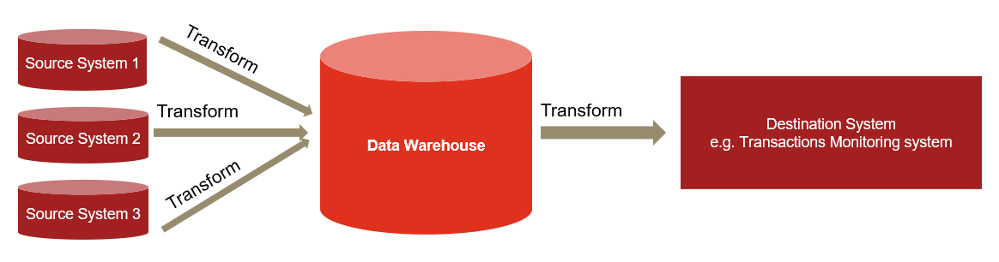
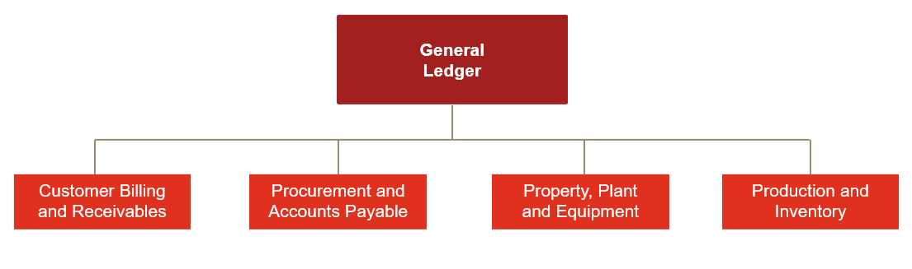
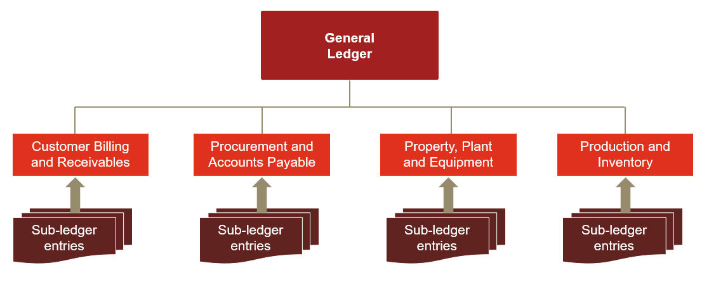
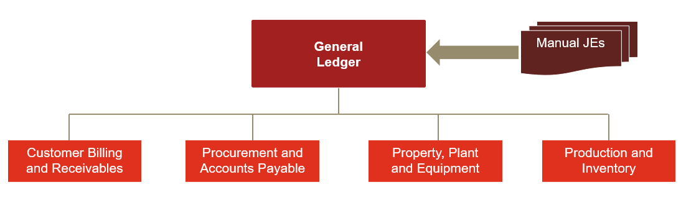
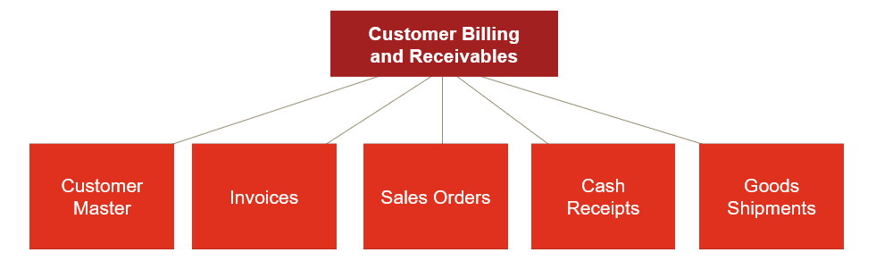
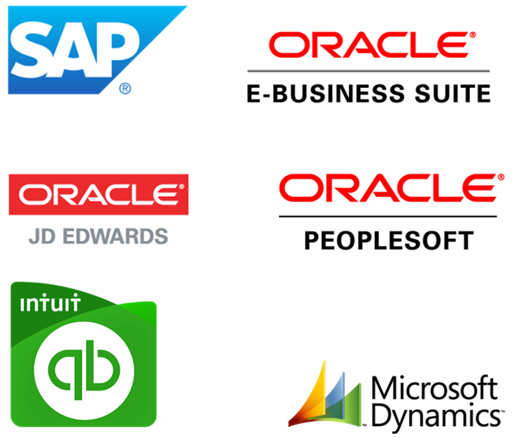

# PWC SQL Case Study {#pwc-sql-case-study}

## Information not discussed in class

## Data Lineage

-   Data lineage refers to how the information flows from source systems to destination systems, such as analytical environments



#### Key Questions to ask:

-   Are all needed records from the source system transferred to the destination system?

-   Are Critical Data Elements required in the destination system transferred?

-   Is data transferred from source to destination at the right frequency?

-   While transforming the data, are required business rules applied to the attributes?

#### What is an ERP System

-   An Enterprise Resource Planning or ERP system provides a platform to integrate the internal and external management of information across an organization

-   Information in the ERP system can include:

    -   Finance and accounting

    -   Supply chain

    -   Manufacturing

    -   Sales

    -   Human resources

#### General ledger and sub-ledger

-   ERP modules (or subledgers) store information unique to various business processes

-   All the modules roll up to the General Ledger

-   For example, the Property, Plant and Equipment (PP&E) module stores information about an asset's useful life, salvage value, date placed in service, depreciation, etc.

    {width="100%"}

#### Automated Journal Entries

-   Sub-ledger transactions account for a substantial amount of the journal entries posted to the general ledger

-   Transactions in the subledger can be a result of automated entries or user activity

-   Subledger activity then flows into the General Ledger



#### Manual Journal Entries

-   Users can also book manual journal entries directly to the general ledger

-   Because these entries are not entered through the normal sub-ledger business processes, these types of entries typically present higher risk

    {width="100%"}

#### Transactions and master data

::: {style="display: grid; grid-template-columns: 1fr 1fr; grid-column-gap: 5px;"}
<div>

-   ERP modules include multiple tables with different types of information about a transaction
-   Key data fields sit in multiple data tables creating relationships across the data
-   Multiple data tables are read, updated, etc. even for simple transactions
-   Within the ERP, each accounting process has configuration settings that ensure transactions are processed correctly and consistently

</div>

<div>

**Transactional data**

-   Generated as a result of a specific transaction

**Master data**

-   Not related to specific events but required for transactions of a given type

</div>
:::



#### Common ERP Systems

::: {.floatting}
```{r out.width='70%',echo=FALSE, out.extra='style="float:right; padding:10px"'}

```

-   SAP

-   Oracle EBS

-   Oracle JD Edwards

-   Oracle Peoplesoft

-   Others ERP include:

    -   Quickbooks

    -   Microsoft Dynamics

    -   NetSuite

    -   Workday
:::
