```{r setup, include=FALSE}
knitr::opts_chunk$set(echo = FALSE)
```

# Excel

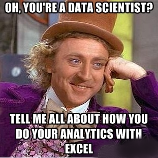{width="40%"}

I may trash talk excel 😈, but I would argue that it is the most used tool for accountants. Accountants are the **original** data scientists[^1] and their weapon of choice has been excel. A large portion of this class will be using R, **BUT** I hope to show you that R and Excel can work together. At the very least you will learn how to do everything we see in this module in R and you can decide which tool you want to use. 😏 This case study is provided by [PWC](https://www.pwc.com/us/en/careers/university-relations/data-and-analytics-case-studies.html). It was developed for a [masters level course](https://www.pwc.com/us/en/careers/university-relations/data-and-analytics-case-studies.html), but I am adapting it for our class. This should be a **Review** and I plan to move through this quickly. But, as always, you can slow me down with questions and comments.

[^1]: in my opinion 😄

# Module Objectives

-   Demonstrate knowledge of data quality concepts

-   Demonstrate knowledge of key terms and capabilities in Excel

-   Demonstrate how to use Excel to acquire, transform, analyze, and visualize data

-   Demonstrate knowledge of leading practices for presenting findings in Excel

## Why excel?

::: {style="display: grid; grid-template-columns: 1fr 1fr; grid-column-gap: 15px;"}
<div>

-   We have no choice... everybody uses it! - this is the hard [**truth**]{.ul}
-   Easy-to-use \<- debatable 😅
-   Many different functions

</div>

<div>

{width="40%"}

</div>
:::

-   Advanced capabilities through add-ins
-   Easy to explore and manipulate the data
-   Can present data and analysis together
-   Integrated with common desktop applications

***But...***

-   Significant potential for human error
-   Limited scalability

***Keep it simple and ask the Internet!***

### Key terms

+----------------------------+--------------------------------------------------------------------------------------------------------------------------------------------------------------+
| $\color{red}{\text{Term}}$ | $\color{red}{\text{Definition}}$                                                                                                                             |
+============================+==============================================================================================================================================================+
| **Workbook**               | An Excel file is referred to as a workbook                                                                                                                   |
+----------------------------+--------------------------------------------------------------------------------------------------------------------------------------------------------------+
| **Worksheet**              | A single "tab" or "sheet" within a Workbook                                                                                                                  |
+----------------------------+--------------------------------------------------------------------------------------------------------------------------------------------------------------+
| **Cell**                   | The boxes within the worksheet where information is stored. Cells are referenced by column letters (A, B, C, ...) and row numbers (1, 2, 3, ...) like a map: |
+----------------------------+--------------------------------------------------------------------------------------------------------------------------------------------------------------+
|                            | -   $\color{red}{\text{A1}}$                                                                                                                                 |
|                            | -   $\color{red}{\text{BX800}}$                                                                                                                              |
|                            | -   $\color{red}{\text{EEE20}}$                                                                                                                              |
+----------------------------+--------------------------------------------------------------------------------------------------------------------------------------------------------------+
| **Range**                  | A contiguous set of cells referenced by the top left and bottom right cells, separated by a colon (:):                                                       |
+----------------------------+--------------------------------------------------------------------------------------------------------------------------------------------------------------+
|                            | -   $\color{red}{\text{A1:D23}}$                                                                                                                             |
|                            | -   $\color{red}{\text{BA2:CT8}}$                                                                                                                            |
+----------------------------+--------------------------------------------------------------------------------------------------------------------------------------------------------------+

### Cell References

-   Excel formulas can reference different cells

-   Changes to the referenced cells result in updates to value calculated by the formula

    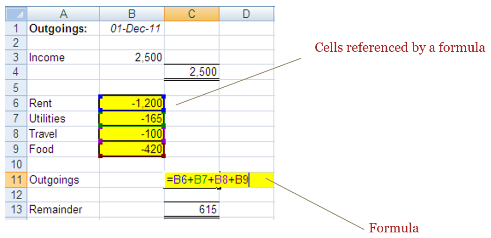{width="100%"}

    #### Inputs within functions can be either a single cell reference or a block of cells referred to as a range.

The two example below provide the same result:

+--------------------+--------------------------------------------------------+------------------------------------------+
| **=SUM(C1,C2,C3)** | **Single cells selection-**                            |                                          |
|                    |                                                        |                                          |
|                    | $\color{red}{\text{Use the Ctrl Key}}$                 |                                          |
+====================+========================================================+==========================================+
| **=SUM(C1:C3)**    | **Range selection-**                                   | 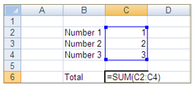{width="100%"} |
|                    |                                                        |                                          |
|                    | $\color{red}{\text{use Shift Key or Drag with mouse}}$ |                                          |
+--------------------+--------------------------------------------------------+------------------------------------------+

Note: should a row be inserted between C1 and C3, then example 1 will still provide the same results, however example two will extend to add 4 cells.

#### Absolute cell references

Absolute referencing is a way of referring to cells within formulas so that once copied, the cell reference remains fixed to a particular cell

+----------------------------------------------+--------------------------------------------------------------------------------+
| 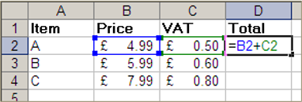{width="100%"} | **Relative referencing**                                                       |
|                                              |                                                                                |
|                                              | As a formula is copied along, the row/column numbers adjust accordingly        |
+----------------------------------------------+--------------------------------------------------------------------------------+
| 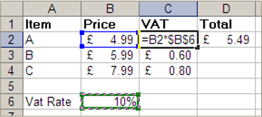{width="100%"} | **Absolute referencing**                                                       |
|                                              |                                                                                |
|                                              | As a formula is copied along, it continues to refer to the same cell as before |
+----------------------------------------------+--------------------------------------------------------------------------------+

#### Absolute cell referencing

With absolute cell referencing, a dollar sign (\$) appears in the cell reference:

-   =B4 Refers to column B and row 4,

But this will vary if the formula is copied across a range of cells $\color{red}{\text{(relative reference)}}$

-   =\$B4 Will always refer to column B, but row reference can vary
-   =B\$4 Will always refer to row 4, but column reference can vary
-   =\$B\$4 Will always refer to column B and row 4

$\color{red}{\text{(absolute reference)}}$

Keyboard shortcut F4 cycles through the four absolute cell reference options

### Formulas

-   Excel calculations are specified with formulas in each cell

-   To create a formula, type an equals sign (=) followed by the function and required arguments

    [Order of Operations]{.ul}

::: {style="display: grid; grid-template-columns: 1fr 1fr; grid-column-gap: 5px;"}
<div>

+-------------------------+------------------+
| Brackets                | ( )              |
+-------------------------+------------------+
| Exponent                | \^               |
+-------------------------+------------------+
| Division/Multiplication | / \*             |
+-------------------------+------------------+
| Addition/Subtraction    | \+ -             |
+-------------------------+------------------+

</div>

<div>

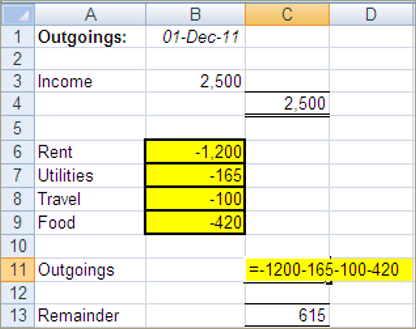{width="60%"}

</div>
:::

### Functions

The fx button to the left of the formula bar opens a list of all available functions

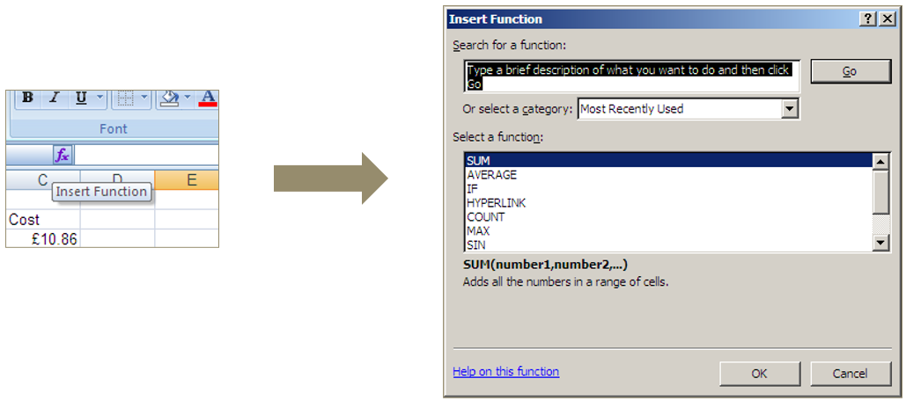{width="100%"}

#### Arguments

Functions take zero or more inputs or arguments

=FUNCTION(Input1,Input2,...)

Arguments can be:

|                 |                                                          |
|-----------------|----------------------------------------------------------|
| Values          | 1, 2, 3 or 1.2, 3.6, 2.1 or "x", "y", "z" or TRUE, FALSE |
| Cell References | B91, A452, C3                                            |

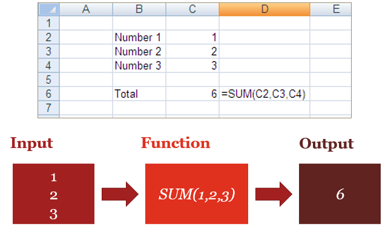{width="100%"}

### Navigation shortcuts (Windows)

+-----------------------------+------------------------------------------------------------------+
| Ctrl + ➡️(⬅️,⬆️,⬇️)         | navigate to the last non-empty cell in that direction            |
+-----------------------------+------------------------------------------------------------------+
| Ctrl + Shift + ➡️(⬅️,⬆️,⬇️) | select a block of cells to last non-empty cell in that direction |
+-----------------------------+------------------------------------------------------------------+
| Ctrl + Space                | select the entire column of the cell you have selected           |
+-----------------------------+------------------------------------------------------------------+
| Shift + Space               | select the entire row of the cell you have selected              |
+-----------------------------+------------------------------------------------------------------+

## Acquire data

### Getting data into excel

-   Excel files have the extension .xlsx or .xls (older versions)

-   Excel can also import data from delimited text files

    -   Some comma-separated values files can be opened directly by Excel

    -   Tab-separated values can be copy-and-pasted directly into an Excel worksheet

    -   Delimited text can also be copy-and-pasted into Excel and then separated with text-to-columns

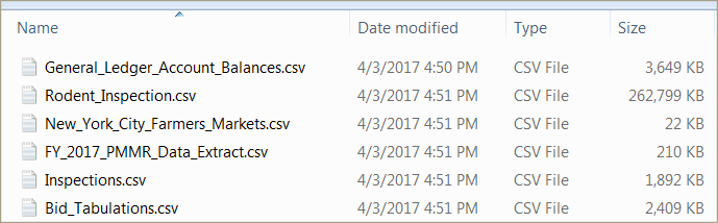{width="100%"}

#### Example - Delimited text

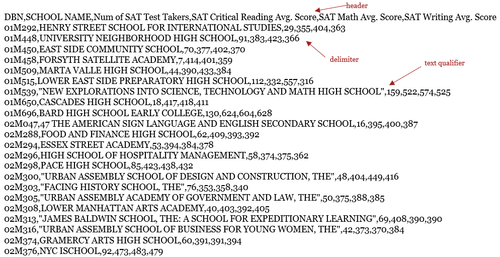{width="100%"}

### Text to columns

-   You might have text in one column that should be split across multiple columns, such as "1-Q-Fred" in the example below
-   You can use the "Text to Columns" wizard to accomplish this

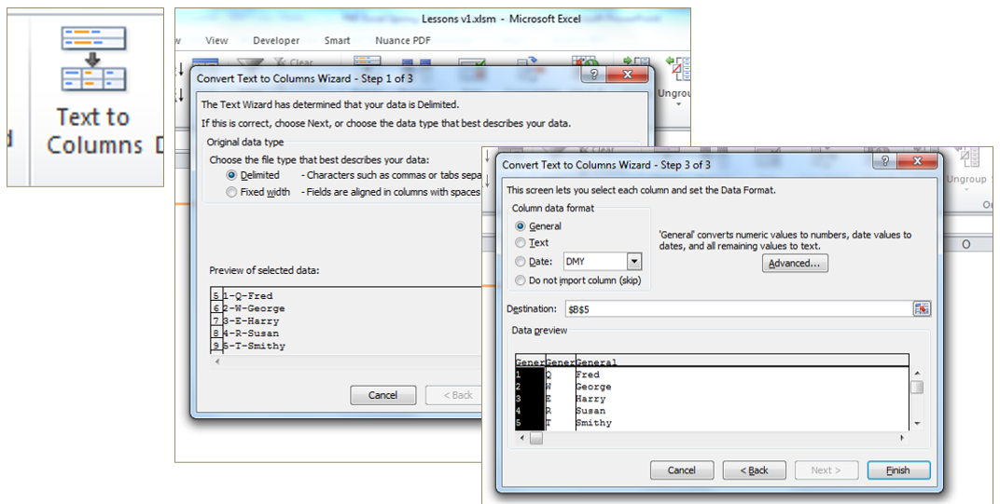{width="100%"}

-   Follow the steps prompted when clicking the icon in the Data tab. You can specify:

    -   Whether the separation point is defined by a certain character (Delimited) or at a fixed point in the cell (Fixed Width).
    -   What character separates the information
    -   Where you would like the newly separated information to go.

### References to worksheets and workbooks

-   You can also use data from other worksheets or other workbooks in your formulas
-   Another worksheet in the same workbook is represented by "Sheet!"
-   A worksheet in a different workbook is represented by "[Workbook.xlsx]Sheet!"

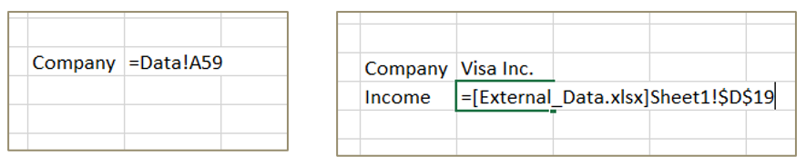{width="100%"}

#### Sample spreadsheet

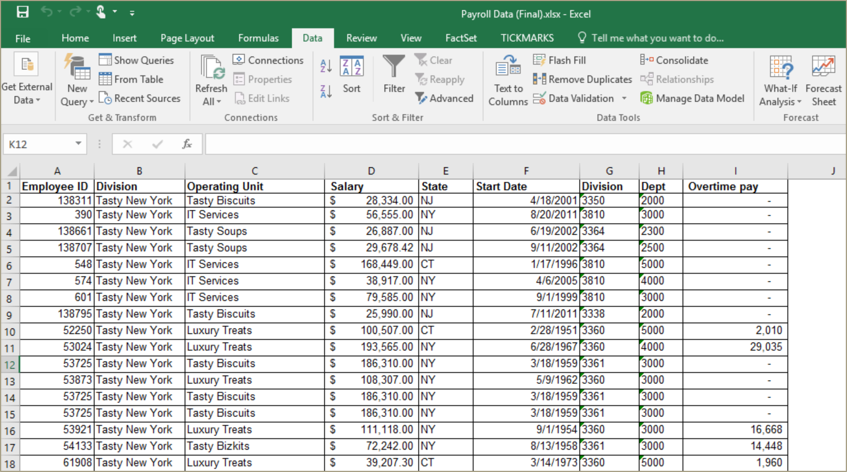{width="100%"}

### Sorting

-   Highlight a range and use the Sort option to order records by one or more columns

-   Make sure to select an entire table to avoid sorting only part of it

    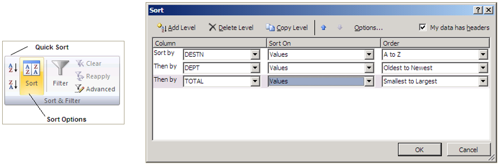{width="100%"}

### Filters

-   Filtering allows you to hide rows in a range if they don't match select criteria

-   Highlight the range and click the "Filter" button

    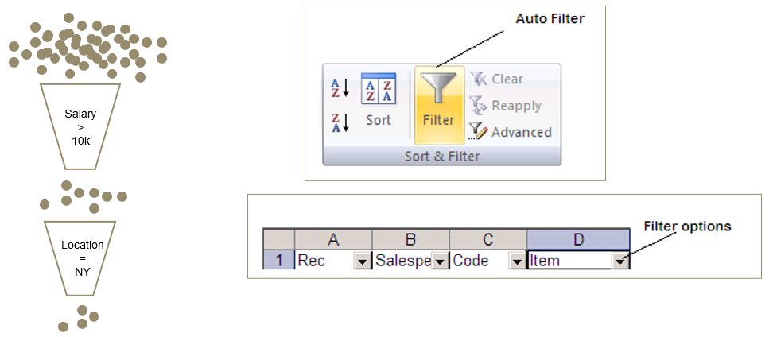{width="100%"}

#### Custom filters

Custom filters allow you to use multiple criteria such as AND or OR

-   Click on drop down arrow
-   Click "Text Filters"
-   Choose Custom

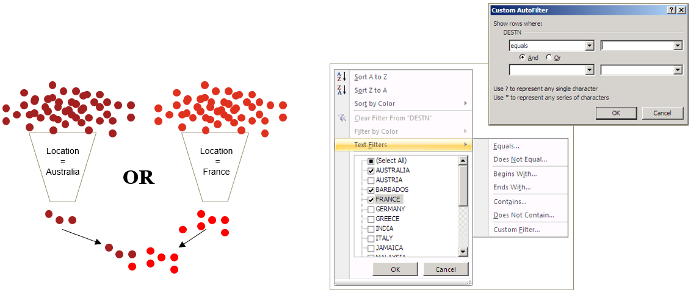{width="100%"}

## Summary statistics

::: {style="display: grid; grid-template-columns: 1fr 1fr; grid-column-gap: 10px;"}
<div>

**COUNT() -** Counts numbers

**COUNTBLANK() -** Counts empty cells

**COUNTA() -** Counts non-empty cells

**MIN() -** Returns minimum

**MAX()** **-** Returns maximum

**AVERAGE()** **-** Returns average/mean

**ROWS/COLUMNS() -** Return number of rows/columns

</div>

<div>

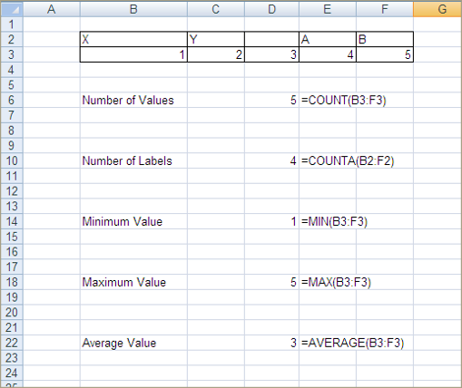{width="100%"}

</div>
:::

### Status Bar

-   Highlighting a range of cells returns summary statistics on the status bar in the lower right corner

-   This is a quick way to get information about part of your data

    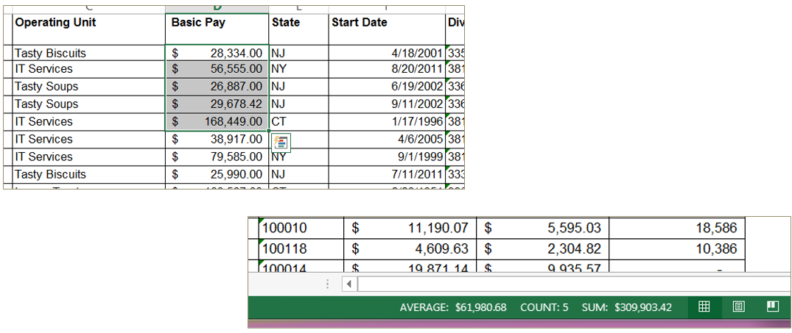{width="100%"}

## Can we rely on the data?

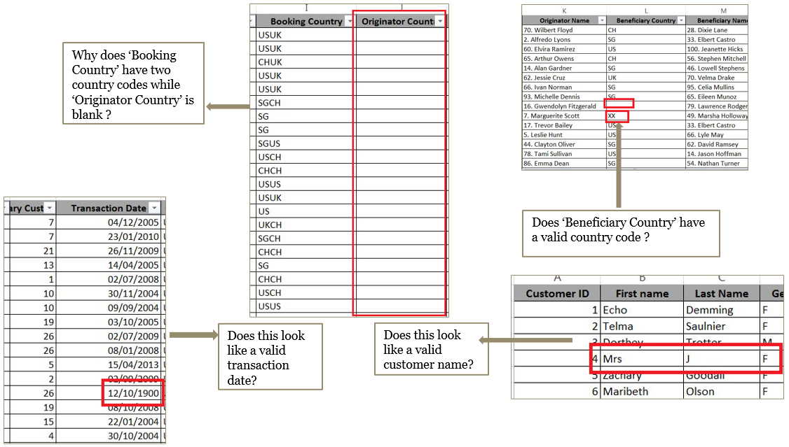{width="100%"}

### Data quality dimensions

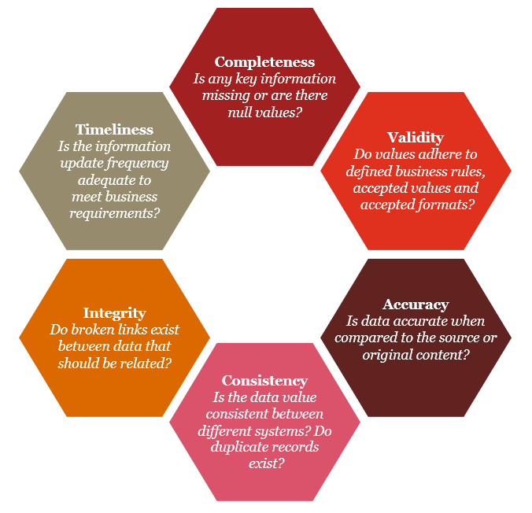{width="100%"}

#### Exercise - Data quality dimensions

Identify which of the six DQ dimensions applies to the issues described below $\color{red}{\text{(please do not peek at the answers 😈)}}$:

1.  'Gender' field has the special characters like \~!\@\#\$%\^\*();

    <details>

    <summary>

    Answer

    </summary>

    <p>

    ```{r DQ_Exercise_1_1_A, echo=FALSE}
        print("Validity")
    ```

    </p>

    </details>

2.  'First name' is blank or Null

    <details>

    <summary>

    Answer

    </summary>

    <p>

    ```{r DQ_Exercise_1_2_A, echo=FALSE}
        print("Completeness")
    ```

    </p>

    </details>

3.  'Last name' field has only designators such as LLP, LLC, Mr., Mrs., etc

    <details>

    <summary>

    Answer

    </summary>

    <p>

    ```{r DQ_Exercise_1_3_A, echo=FALSE}
        print("Accuracy")
    ```

    </p>

    </details>

4.  'Address' field has only numbers

    <details>

    <summary>

    Answer

    </summary>

    <p>

    ```{r DQ_Exercise_1_4_A, echo=FALSE}
        print("Validity")
    ```

    </p>

    </details>

5.  'Account Type' field does not have pre-defined list of values

    <details>

    <summary>

    Answer

    </summary>

    <p>

    ```{r DQ_Exercise_1_5_A, echo=FALSE}
        print("Consistency")
    ```

    </p>

    </details>

6.  'Account Number' field have duplicate values

    <details>

    <summary>

    Answer

    </summary>

    <p>

    ```{r DQ_Exercise_1_6_A, echo=FALSE}
        print("Integrity")
    ```

    </p>

    </details>

7.  'Forex rate' field does not have up to date exchange rate

    <details>

    <summary>

    Answer

    </summary>

    <p>

    ```{r DQ_Exercise_1_7_A, echo=FALSE}
        print("Timeliness")
    ```

    </p>

    </details>

## Exercise - Excel \#1

Load the data from 'payroll_data.txt' and 'reference_data.txt' into two tabs in an Excel spreadsheet and save it as 'Payroll Data\_\<NETID\>.xlsx' $\color{red}{\text{(please do not peek at the answers)😈}}$ :

1.  How did you import the data?

    <details>

    <summary>

    Answer

    </summary>

    <p>

    ```{r Excel_Exercise_1_1_A, echo=FALSE, out.width = '100%'}
      knitr::include_graphics("images/Animation.gif")
    ```

    </p>

    </details>

2.  How many rows are there?

    <details>

    <summary>

    Answer

    </summary>

    <p>

    ```{r Excel_Exercise_1_2_A, echo=FALSE}
          print(c("payroll_data = 202 rows including header","reference_data = 199 rows including header"))
    ```

    </p>

    </details>

3.  How many columns?

    <details>

    <summary>

    Answer

    </summary>

    <p>

    ```{r Excel_Exercise_1_3_A, echo=FALSE}
          print(c("payroll_data = 9 columns","reference_data = 3 columns*"))
    ```

    </p>

    </details>

4.  What is the average salary?

    <details>

    <summary>

    Answer

    </summary>

    <p>

    ```{r Excel_Exercise_1_4_A, echo=FALSE, out.width = '100%'}
      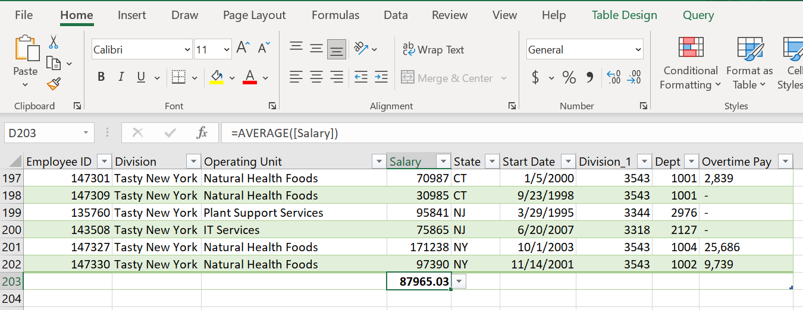
    ```

    </p>

    </details>

5.  How many missing values are in each column?

    <details>

    <summary>

    Answer

    </summary>

    <p>

    ```{r Excel_Exercise_1_5_A, echo=FALSE, out.width = '100%'}
      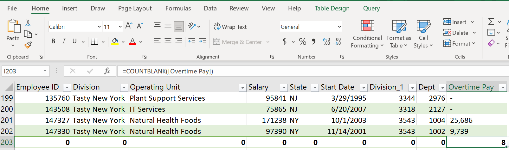
    ```

    </p>

    </details>

6.  What potential data quality issues do you find? Which dimensions are they related to?

    <details>

    <summary>

    Answer (one example)

    </summary>

    <p>

    ```{r Excel_Exercise_1_6_A, echo=FALSE, out.width = '100%'}
      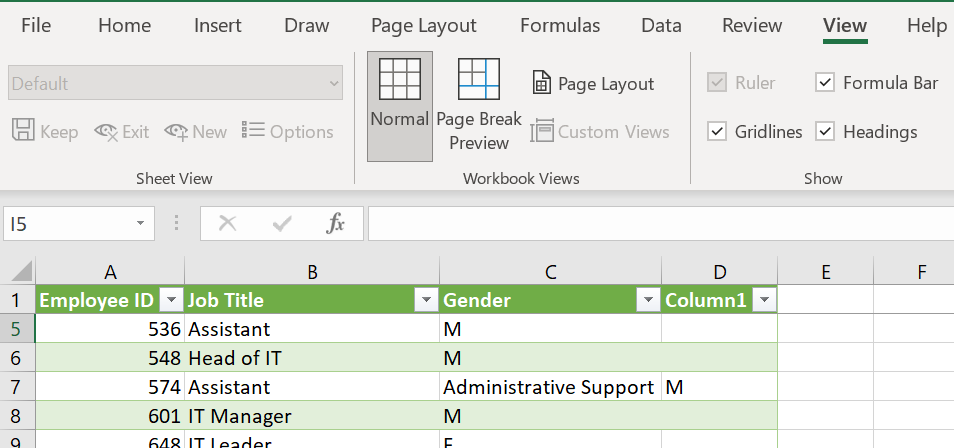
    ```

    </p>

    </details>

## Transform Data

### Data formats

Data entered an Excel worksheet can be represented in different formats, for example:

-   Number
-   Currency
-   Percentage
-   Text
-   Date

Dates are stored as the number of days from a fixed historical date

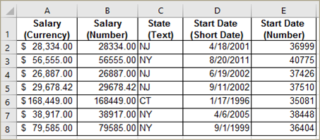{width="100%"}

### Text functions

::: {style="display: grid; grid-template-columns: 1fr 1fr; grid-column-gap: 10px;"}
<div>

=CONCATENATE (text1, text2, ...) or &

:   Appends two or more strings

=MID(text, start_num, num_chars)

:   Extracts a specific number of characters starting from a given position

</div>

<div>

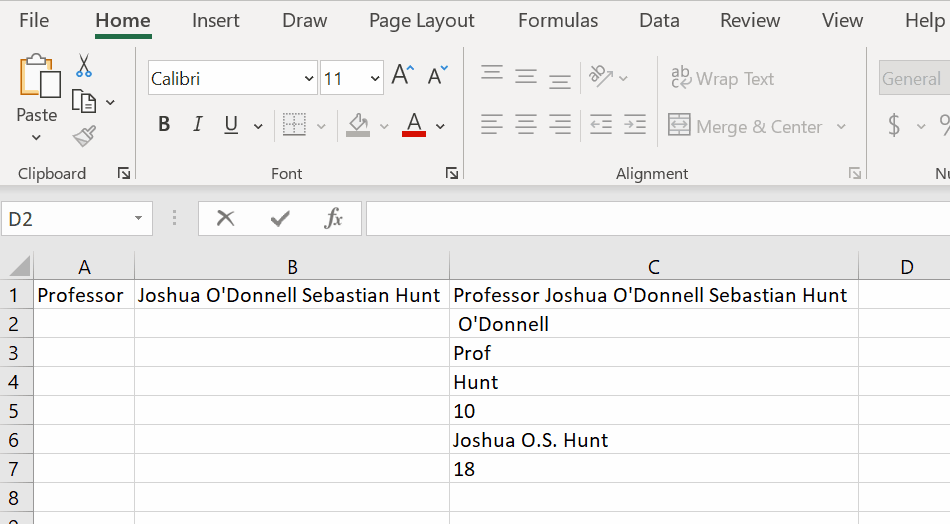{width="100%"}

</div>
:::

=LEFT(text, num_chars)

:   Extracts a specific number of characters from the left of a cell

=RIGHT(text, num_chars)

:   Extracts a specific number of characters from the right of a cell

=LEN(text)

:   Return the number of characters (including spaces) in a cell

=SUBSTITUTE(text, old_text, new_text)

:   Replaces a string with another string

=FIND(find_text, within_text, start_position)

:   Return the position of a match and error if no match

### Number functions

::: {style="display: grid; grid-template-columns: 1fr 1fr; grid-column-gap: 10px;"}
<div>

=ROUND(number, num_digits)

:   Rounds a figure to a specified number of digits

=LARGE(array, k)

:   Returns the kth largest number

=SMALL(array, k)

:   Returns the kth smallest number

</div>

<div>

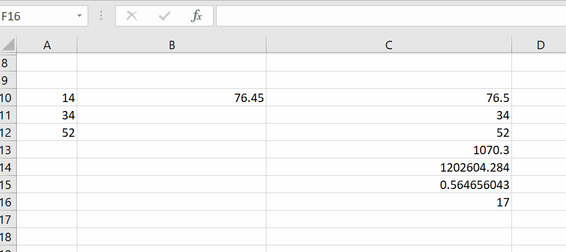{width="100%"}

</div>
:::

=PRODUCT(number1, number2, ...)

:   Multiplies several values together

=EXP(number)

:   Returns Euler's number (e) raised to a number

=RAND()

:   Returns a random number between 0 and 1

=RANDBETWEEN(bottom, top)

:   Returns a random integer between the specified values

### Date/time functions

::: {style="display: grid; grid-template-columns: 1fr 1fr; grid-column-gap: 10px;"}
<div>

=TODAY()

:   Displays current date

=NOW()

:   Displays current date and time

=DATE(year, month, day)

:   Generates a date given day, month, and year

</div>

<div>

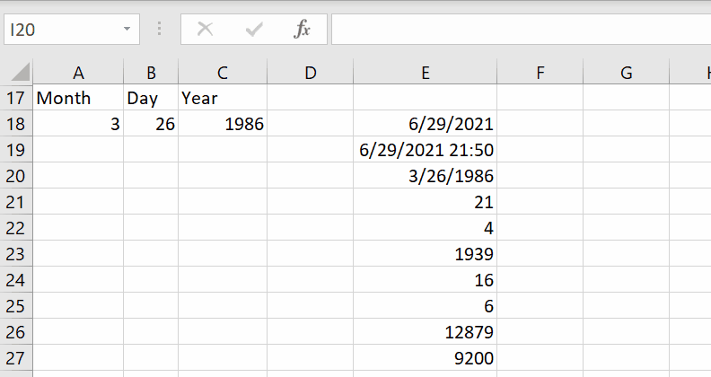{width="100%"}

</div>
:::

=DAY(serial_number)

:   Determines day of date, e.g. 31

=MONTH(serial_number)

:   Determines month of date, e.g. 12

=YEAR(serial_number)

:   Determines year of date, e.g. 2001

=WEEKNUM(serial_number)

:   Returns the week number in the year

=WEEKDAY(serial_number)

:   Returns the position of the day in a workweek

=DAYS(end_date, start_date)

:   Returns number of days between two dates

=NETWORKDAYS(start_date, end_date)

:   Returns the number of working days between dates

### Fill

-   You can apply a formula to an entire column by using the Fill options

-   You can also Fill Down by double-clicking a cell with a formula in a table

    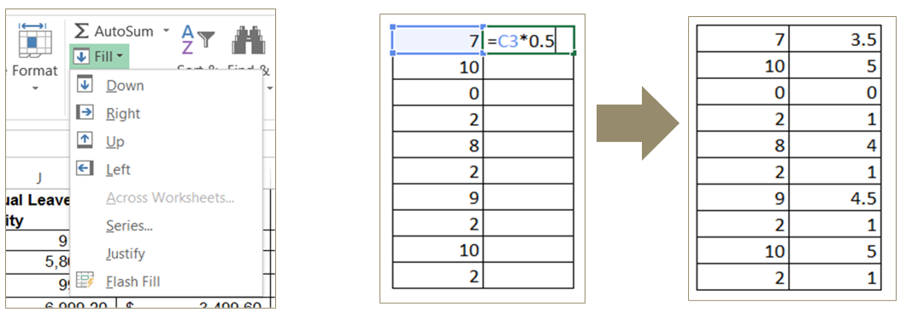{width="100%"}

### Error trapping

=ISNA(value)

:   Determine if cell or result of formula is showing \#N/A!

=ISERROR(value)

:   Determine if cell or result of formula is an error

=IFERROR(value, value_if_error)

:   Give an alternative result if the formula produces an error

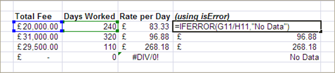{width="100%"}

### IF statements

-   **IF()** analyses the contents of one or more cells to determine whether a condition is TRUE or FALSE

-   Given the value of the condition, different values can be returned

    **Syntax**

=IF ( $\color{darkred}{\text{logical_test}}$ , $\color{red}{\text{value_if_true}}$ , $\color{maroon}{\text{value_if_false}}$ )

Examples

=IF ( $\color{darkred}{\text{B1 > 50}}$ , $\color{red}{\text{B1 * A1}}$, $\color{maroon}{\text{B1 * A3}}$)

=IF ( $\color{darkred}{\text{B1 > B2}}$ , $\color{red}{\text{B1}}$ , $\color{maroon}{\text{B2}}$ )

=IF ( $\color{darkred}{\text{B1 = "awesome"}}$ , $\color{red}{\text{B1}}$ , $\color{maroon}{\text{B2}}$ )

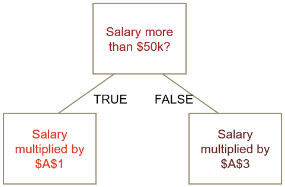{width="100%"}

### Conditional operators

Any function can be used with conditional operators in IF statements to test conditions

\> Greater than

\< Less than

\>= Greater than and equal to

\<= Less than and equal to

\<\> Not equal to

= Equal to

### NOTE:

Some of functions can be used only on numbers, some to dates and some to strings.

-   Addition: Numbers, Dates
-   Subtraction: Numbers, Dates
-   Multiplication: Numbers
-   Division: Numbers
-   Power: Numbers
-   (): Anything
-   Order operators (\>,\< etc.) : Numbers, Dates, Strings
-   Concatenation: Anything

### Nested conditional statements

=IF ($\color{darkred}{\text{logical_test}}$ , $\color{red}{\text{value_if_true}}$ , IF ($\color{darkred}{\text{logical_test}}$ , $\color{red}{\text{value_if_true}}$ , $\color{maroon}{\text{value_if_false}}$ ))

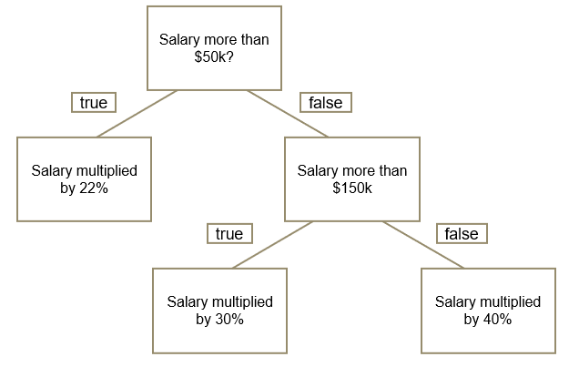{width="100%"}

=IF ( $\color{darkred}{\text{B1 > 50}}$ , $\color{red}{\text{B1 * A1}}$, IF ( $\color{darkred}{\text{B1 > 150}}$ , $\color{red}{\text{B1 * A2}}$, $\color{maroon}{\text{B1 * A3}}$) )

### Logical operators

=AND($\color{darkred}{\text{logical1}}$, $\color{red}{\text{logical2}}$, ...) Gives **True** if all the conditions are met

=OR($\color{darkred}{\text{logical1}}$, $\color{red}{\text{logical2}}$, ...) Gives **True** if at least one condition is met

=NOT($\color{darkred}{\text{logical}}$) Gives **True** if the condition is not met

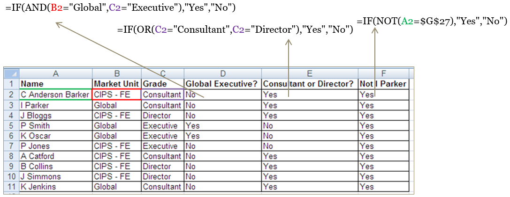{width="100%"}

### VLOOKUP

-   Often we need to add data from one table to another. This requires one column in each table to act as the link between them
-   **VLOOKUP** searches vertically down the left-hand column of a table to find a match, then returns the corresponding value from a specified column of the table
-   In most cases, the fourth argument should be 'FALSE' to require exact matches

Always use absolute cell references to specify the range containing the lookup data

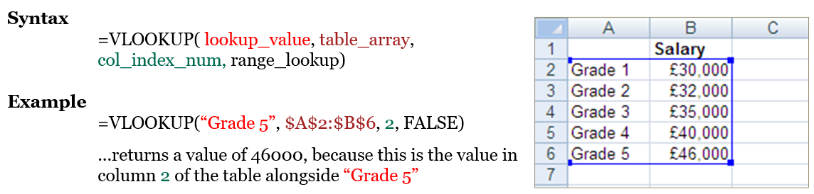{width="100%"}

### Unique values and duplicates

-   Excel has an option to reduce a single column to its unique values
-   This option can also remove duplicate rows from a table across multiple columns

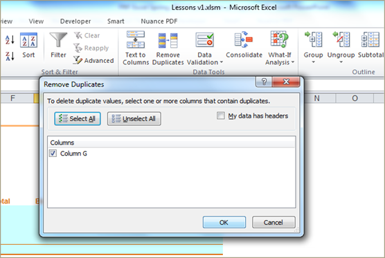{width="100%"}

### Find/Replace

-   You may need to find or replace values across a worksheet or workbook, which would be time-consuming if done manually

-   Use Find/Replace to do this efficiently:

    -   Ctrl + F: find

    -   Ctrl + H: replace

-   Excel will search the whole worksheet (or workbook) unless a range is selected

-   The "Options \>\>" button enables the use of requirements such as "Match case"

    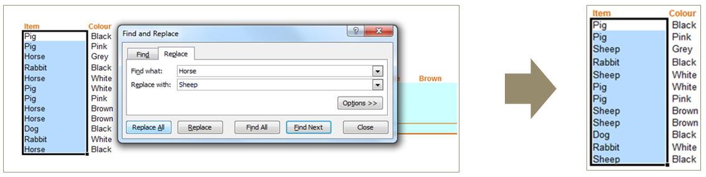{width="100%"}

## Exercise Excel \#2

In 'Payroll Data\_\<NETID\>.xlsx' $\color{red}{\text{(please do not peek at the answers)😈}}$ :

1.  Address any data quality issues identified previously.

    👍

2.  Create a new column with total compensation (salary plus overtime pay)... what is the average total compensation?

    <details>

    <summary>

    Answer

    </summary>

    <p>

    ```{r Excel_Exercise_2_2_A, echo=FALSE, out.width = '100%'}
      knitr::include_graphics("images/Excel_Exercise_2_2_A.gif")
    ```

    </p>

    </details>

3.  Add a column for the employee's tenure at the company in years.

    <details>

    <summary>

    Answer

    </summary>

    <p>

    ```{r Excel_Exercise_2_3_A, echo=FALSE, out.width = '100%'}
      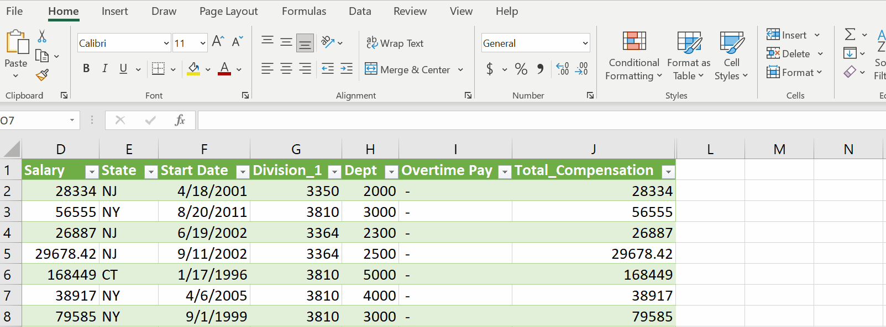
    ```

    </p>

    </details>

4.  It turns out that all of the NJ employees work for separate division called "Tasty New Jersey". Correct the Division column with this information.

    <details>

    <summary>

    Answer

    </summary>

    <p>

    ```{r Excel_Exercise_2_4_A, echo=FALSE, out.width = '100%'}
      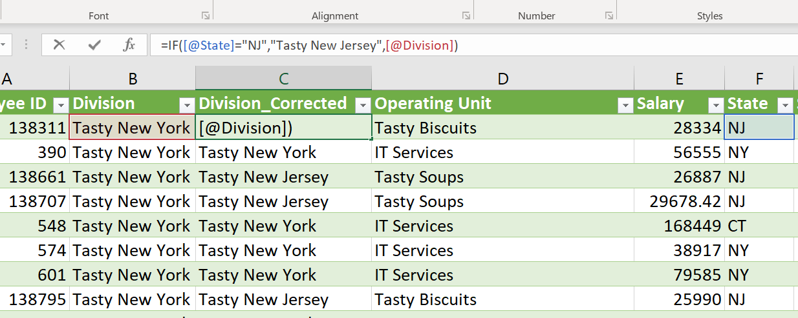
    ```

    ```{r Excel_Exercise_2_4_B, echo=FALSE, out.width = '100%'}
      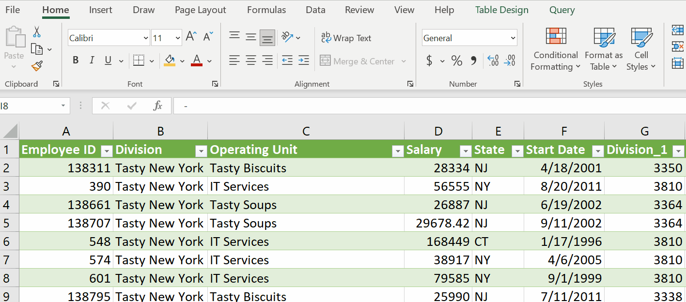
    ```

    </p>

    </details>

5.  Create a binary column (0/1) that identifies employees of the "Tasty" operating units.

    <details>

    <summary>

    Answer

    </summary>

    <p>

    ```{r Excel_Exercise_2_5_A, echo=FALSE, out.width = '100%'}
      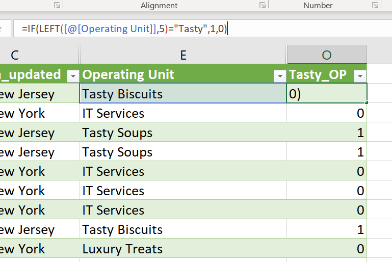
    ```

    </p>

    </details>

6.  Add columns for Job Position and Gender from the 'Reference Data' worksheet.

    <details>

    <summary>

    Answer

    </summary>

    <p>

    ```{r Excel_Exercise_2_6_A, echo=FALSE, out.width = '100%'}
      knitr::include_graphics("images/Excel_Exercise_2_6_A.gif")
    ```

    </p>

    </details>

7.  Select a random 5% sample of employees to receive a survey.

    <details>

    <summary>

    I had to search the web for this one

    </summary>

    <p>

    ```{r Excel_Exercise_2_7_A, echo=FALSE, out.width = '100%'}
      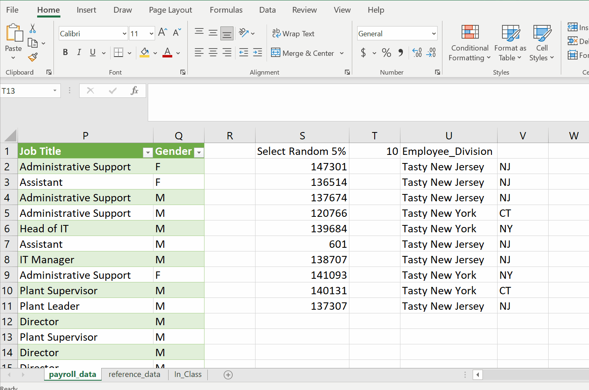
    ```

    </p>

    </details>

## Analyze data

### Pivot tables

::: {style="display: grid; grid-template-columns: 1fr 1fr; grid-column-gap: 10px;"}
<div>

-   A pivot table is an aggregation of a source table

-   Supports summary statistics:

    -   Count
    -   Sum
    -   Min/Max
    -   Average

</div>

<div>

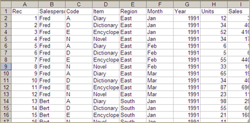{width="100%"}

</div>
:::

-   This summary is presented in a table format which can be formatted and filtered

-   A table with categories down the rows and across the columns is a cross table

+------------------------------------+-----------------------------+-------+-------+-------------+
| $\color{red}{\text{Sum of Sales}}$ | $\color{red}{\text{Month}}$ |       |       |             |
+====================================+=============================+=======+=======+=============+
| Salesperson                        | Jan                         | Feb   | Mar   | Grand Total |
+------------------------------------+-----------------------------+-------+-------+-------------+
| Bert                               | 7508                        | 10360 | 6281  | 24149       |
+------------------------------------+-----------------------------+-------+-------+-------------+
| Bill                               | 5113                        | 8916  | 7642  | 21671       |
+------------------------------------+-----------------------------+-------+-------+-------------+
| Fred                               | 7561                        | 9735  | 11221 | 28517       |
+------------------------------------+-----------------------------+-------+-------+-------------+
| Harry                              | 10513                       | 3583  | 9452  | 23548       |
+------------------------------------+-----------------------------+-------+-------+-------------+
| Grand Total                        | 30695                       | 32594 | 34596 | 97885       |
+------------------------------------+-----------------------------+-------+-------+-------------+

#### Customizing pivot tables

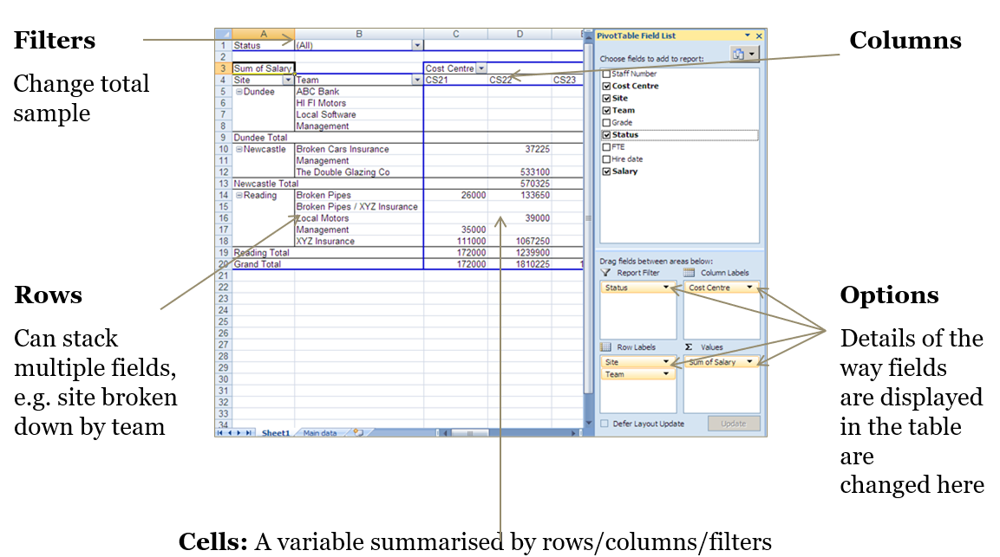{width="100%"}

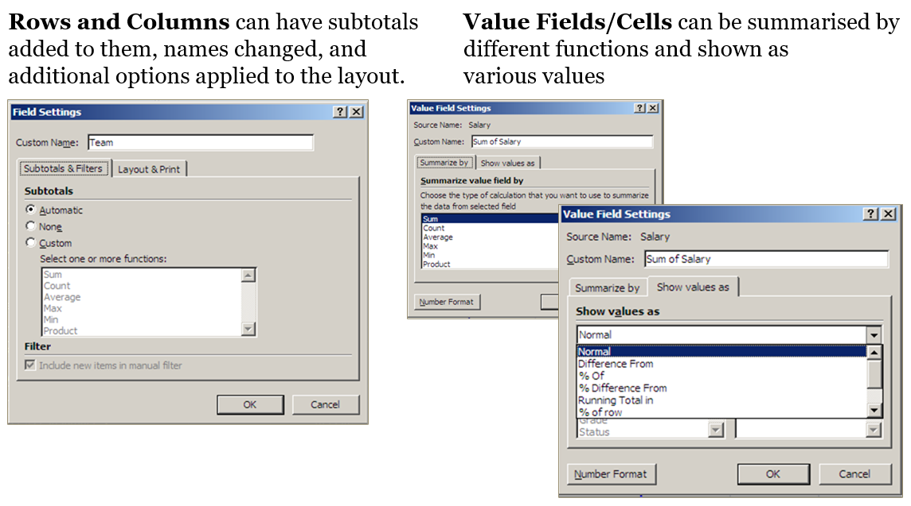{width="100%"}

### Analysis ToolPak

Excel can be used for more advanced analysis than summary statistics and charts

1.  Click the File tab, click Options, and then click the Add-Ins category
2.  In the Manage box, select Excel Add-ins and then click 'Go'
3.  In the Add-Ins box, check the 'Analysis ToolPak' and 'Solver' check boxes, and then click 'OK'
4.  Go to the 'Data' tab and look for the Analysis section

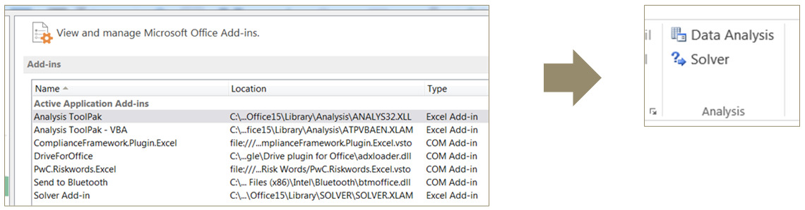{width="100%"}

### Descriptive statistics

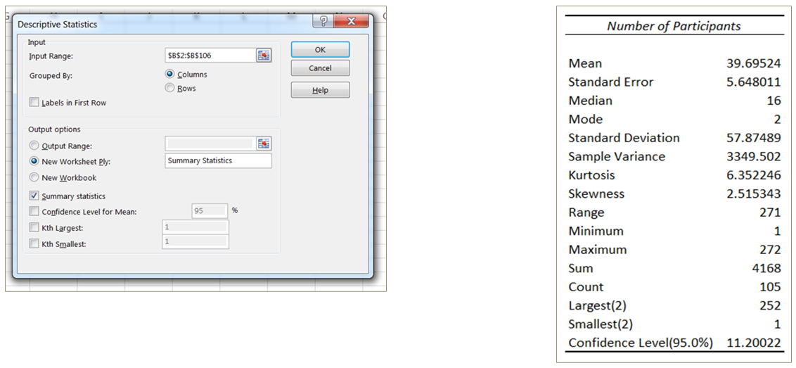{width="100%"}

### Histograms

A histogram depicts the frequency or probability distribution of a numeric variable across bins of equal width

Variable distributions may appear statistically "normal" or display non-normal characteristics such as skewness or kurtosis

Create a histogram through 'Data analysis' by specifying the bins in a separate range

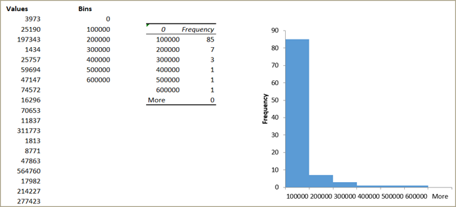{width="100%"}

### Correlation

::: {style="display: grid; grid-template-columns: 1fr 1fr; grid-column-gap: 5px;"}
<div>

-   The CORREL() function (and Data Analysis correlation option) quantify the direction and degree of the relationship between two variables

-   Correlation coefficient is between -1 and 1:

    -   **Negative values** indicate the variables are inversely related

    -   **Positive values** indicate the variables are directly related

    -   **Values close** to zero indicate a weak correlation

    -   **Values close** to 1 indicate a strong correlation

</div>

<div>

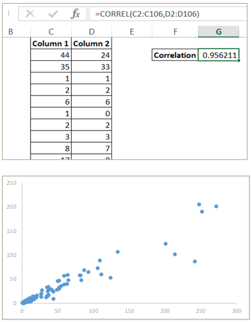{width="100%"}

</div>
:::

-   Correlation is often best visualized with a scatter plot

### Linear regression (univariate)

In addition to descriptive statistics, Excel can build and evaluate simple predictive models:

1.  Select 'Regression' from the Data Analysis section
2.  Select your dependent (Y) variable (to be predicted)
3.  Select your independent (X) variable (used to predict the Y variable)
4.  Check boxes for optional outputs (e.g. residuals, line fit plot)

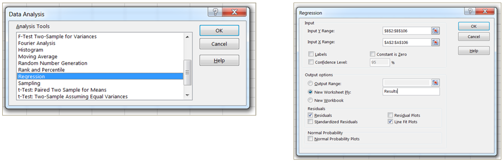{width="100%"}

#### Linear regression output

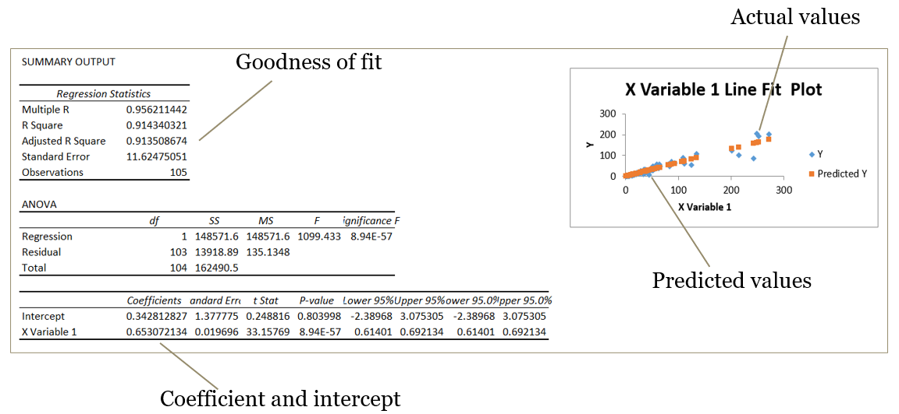{width="100%"}

## Exercise \#3

In 'Payroll Data\_\<NETID\>.xlsx' $\color{red}{\text{(please do not peek at the answers)😈}}$:

1.  What is the average percentage of total compensation that is overtime pay, not including staff with no overtime pay?

    <details>

    <summary>

    Answer

    </summary>

    <p>

    ```{r Excel_Exercise_3_1_A, echo=FALSE, out.width = '100%'}
      knitr::include_graphics("images/Excel_Exercise_3_1_A.gif")
    ```

    </p>

    </details>

2.  Create a pivot table with the following statistics by Operating Unit:

    -   Number of employees
    -   Average total compensation
    -   Average tenure (in years)

    <details>

    <summary>

    Answer

    </summary>

    <p>

    ```{r Excel_Exercise_3_2_A, echo=FALSE, out.width = '100%'}
      knitr::include_graphics("images/Excel_Exercise_3_2_A.gif")
    ```

    </p>

    </details>

3.  Add Job Title to the pivot table across the columns

    <details>

    <summary>

    Answer

    </summary>

    <p>

    ```{r Excel_Exercise_3_3_A, echo=FALSE, out.width = '100%'}
      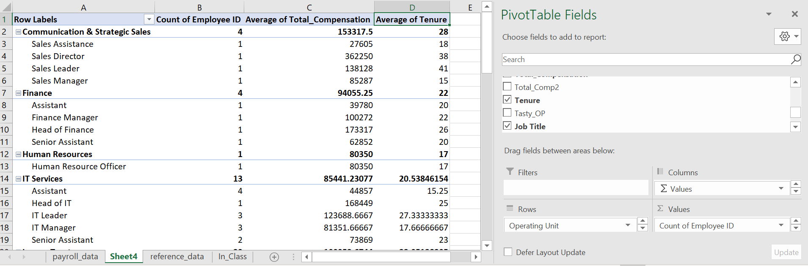
    ```

    </p>

    </details>

4.  What is the correlation between total compensation and tenure?

    <details>

    <summary>

    Answer

    </summary>

    <p>

    ```{r Excel_Exercise_3_4_A, echo=FALSE, out.width = '100%'}
      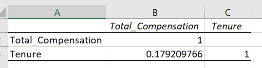
    ```

    </p>

    </details>

5.  Create a histogram for total compensation... how would you characterize the distribution? What if you transform the data to reduce any skewness?

    <details>

    <summary>

    Answer

    </summary>

    <p>

    ```{r Excel_Exercise_3_5_A, echo=FALSE, out.width = '100%'}
      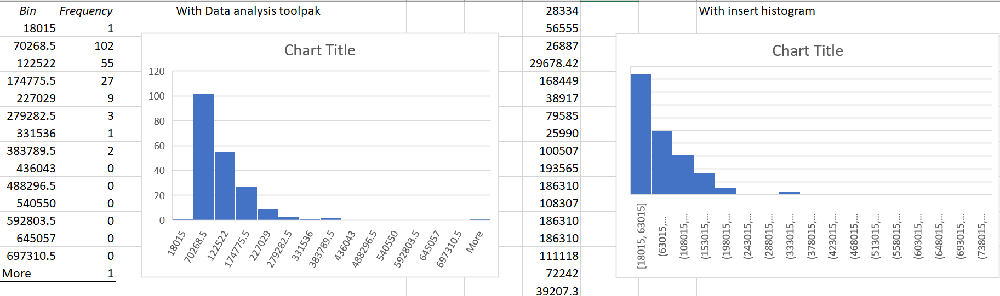
    ```

    </p>

    </details>

6.  Create a linear regression model using tenure to predict total compensation... what is the adjusted R-squared value?

    <details>

    <summary>

    Answer

    </summary>

    <p>

    ```{r Excel_Exercise_3_6_A, echo=FALSE, out.width = '100%'}
      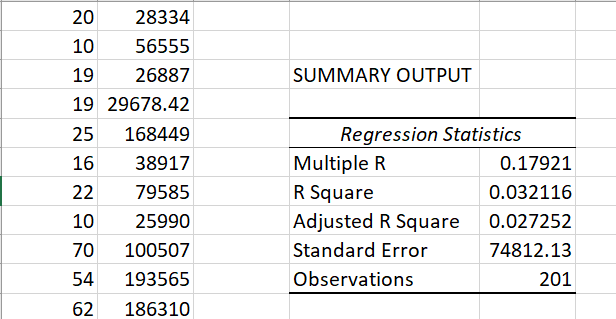
    ```

    </p>

    </details>

## Present findings

### Visualization in excel

-   Visualization is often essential for gaining an understanding of the data and presenting findings to a new audience

-   Excel can easily produce a variety of basic charts

-   For an effective visualization, always consider:

    -   What question do I want to answer?
    -   What message do I want my audience to take away?
    -   How can I keep it simple?

-   We'll focus more on visualization later in the course

### Conditional formatting

::: {style="display: grid; grid-template-columns: 1fr 1fr; grid-column-gap: 10px;"}
<div>

-   Conditional formatting adjusts the color of a cell according to the relative magnitude of the values or established rules
-   It is commonly used for RAG (Red/Amber/Green) reports, in which good figures are highlighted in green and bad ones in red, but any gradient can be applied

</div>

<div>

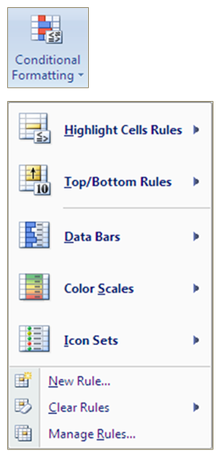{width="30%"}

</div>
:::

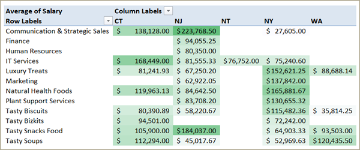{width="90%"}

#### What do you think of this visualization?

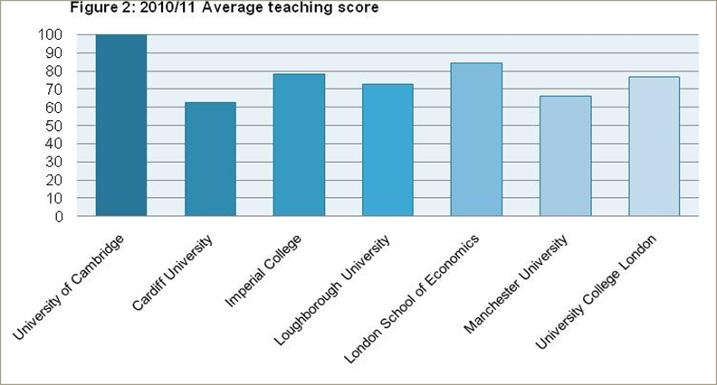{width="100%"}

#### What about this one?

**Manchester University has low teaching scores compared to its competitors**

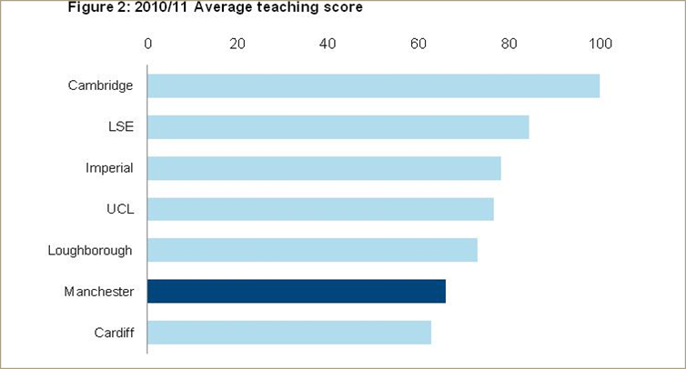{width="100%"}

### Effective visualization

-   More information, less ink
-   Clear out the junk!
-   Use color, shape, placement, etc. to draw attention
-   Use 2D rather than 3D charts

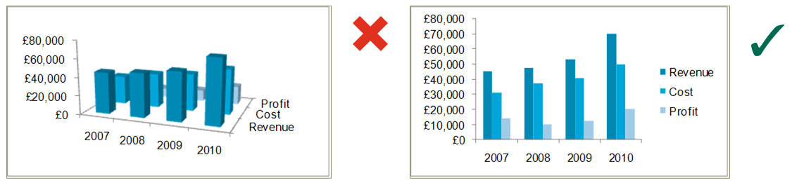{width="100%"}

### Basic charts

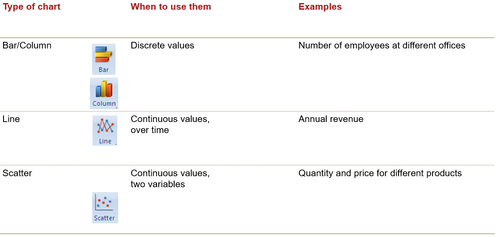{width="100%"}

### Insert chart

::: {style="display: grid; grid-template-columns: 1fr 1fr; grid-column-gap: 10px;"}
<div>

-   The first step to setting up your chart is to arrange the data into a table
-   Then select the table and select the type of graph you are looking for on the Insert tab

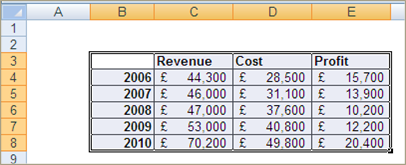{width="80%"}

</div>

<div>

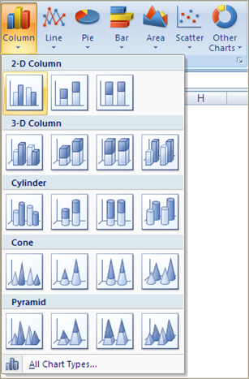{width="50%"}

</div>
:::

### Axis settings

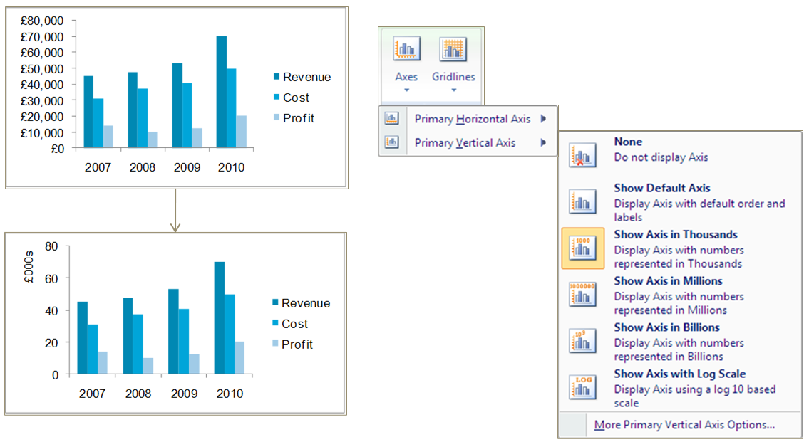{width="100%"}

### Data labels

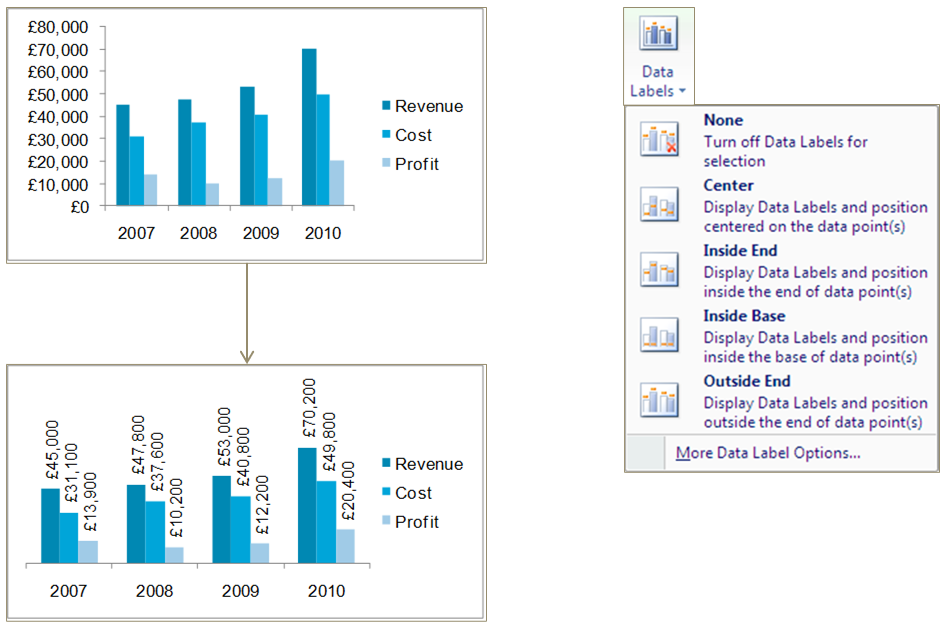{width="100%"}

### Gridlines

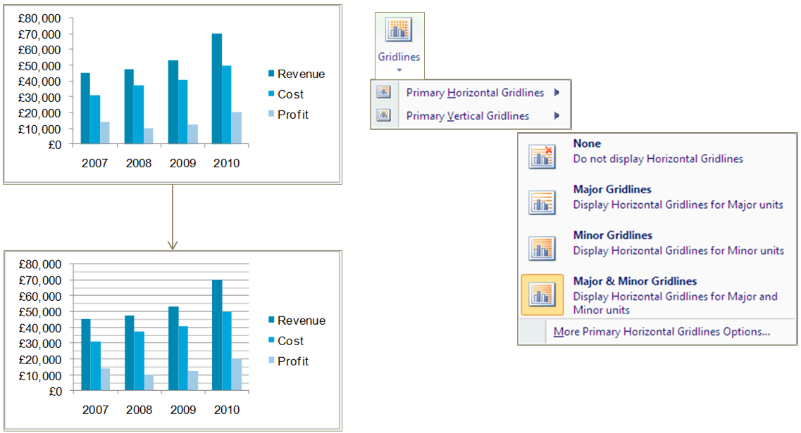{width="100%"}

### Titles

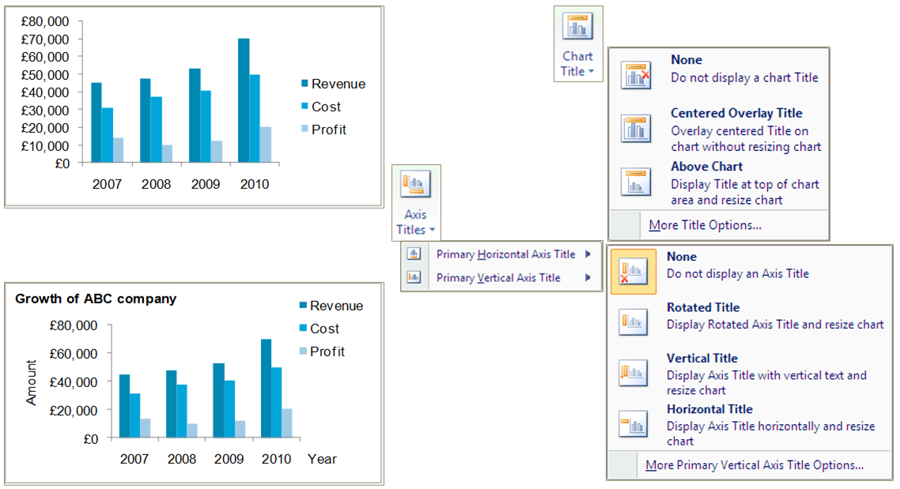{width="100%"}

### Data in rows or columns

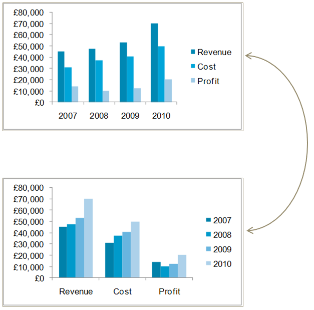{width="100%"}

### Changing data range

Sometimes we want to change the data range covered by a chart or add an extra series

When you select a data series on a chart, the source data range can be adjusted

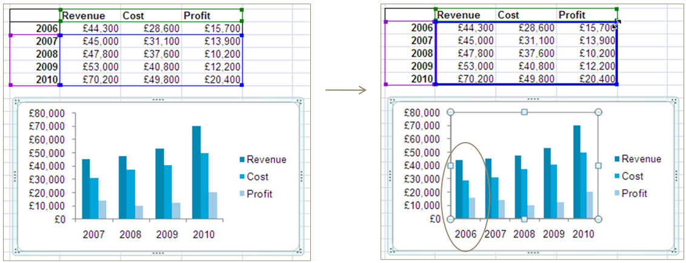{width="100%"}

### Select data source

You can also use the Select Data Source dialog box from the Design tab in the ribbon or by right-clicking the chart to add a new series to a graph

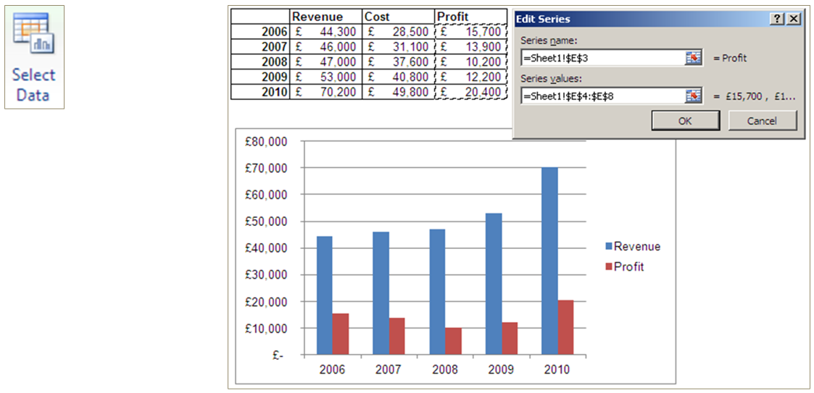{width="100%"}

### Pivot charts

In addition to creating a Pivot table on the data, you can also create a Pivot Chart which is based on the Pivot table itself

Changes made to the chart are replicated on the table and vice versa

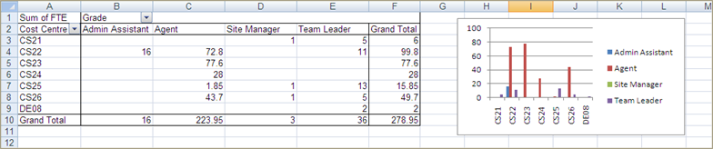{width="100%"}

## Exercise \#4

In 'Payroll Data\_\<NETID\>.xlsx' $\color{red}{\text{(please do  not peek at the answers)😈}}$:

I am not going to lie...these took longer than they should have....😢

1.  Create a pivot table with average salary by Operating Unit and State and add conditional formatting.

    <details>

    <summary>

    Answer

    </summary>

    <p>

    ```{r Excel_Exercise_4_1_A, echo=FALSE, out.width = '100%'}
      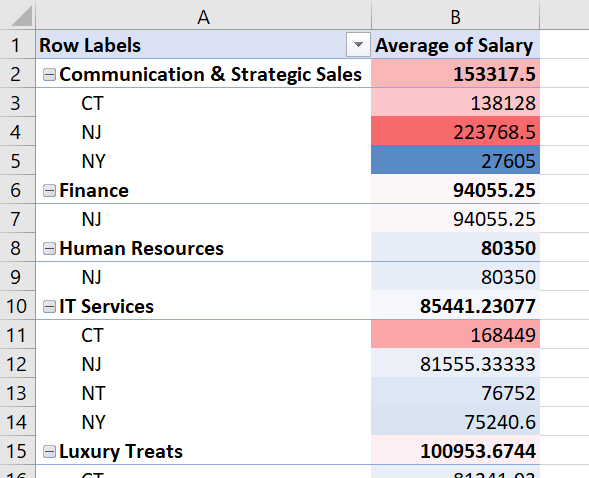
    ```

    </p>

    </details>


2.  Create a bar plot with the number of employees by State

    <details>

    <summary>

    Answer

    </summary>

    <p>

    ```{r Excel_Exercise_4_2_A, echo=FALSE, out.width = '100%'}
      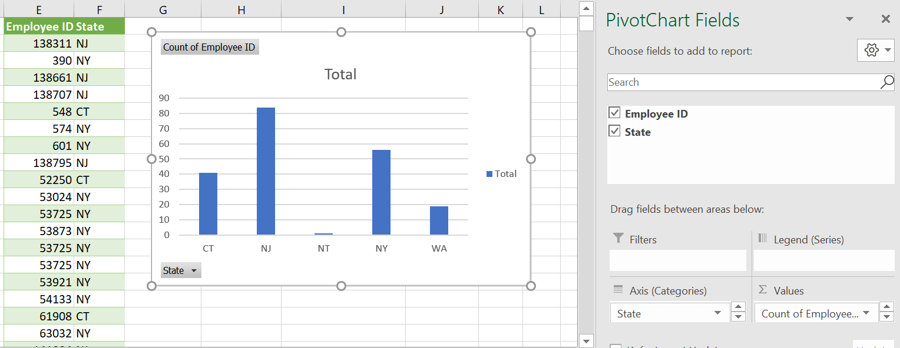
    ```

    </p>

    </details>


3.  Create a scatter plot of salary and tenure

    <details>

    <summary>

    Answer

    </summary>

    <p>

    ```{r Excel_Exercise_4_3_A, echo=FALSE, out.width = '100%'}
      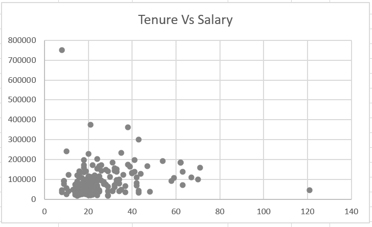
    ```

    </p>

    </details>


4.  Create a line chart to show the cumulative number of employees hired by year.

    <details>

    <summary>

    Answer

    </summary>

    <p>

    ```{r Excel_Exercise_4_4_A, echo=FALSE, out.width = '100%'}
      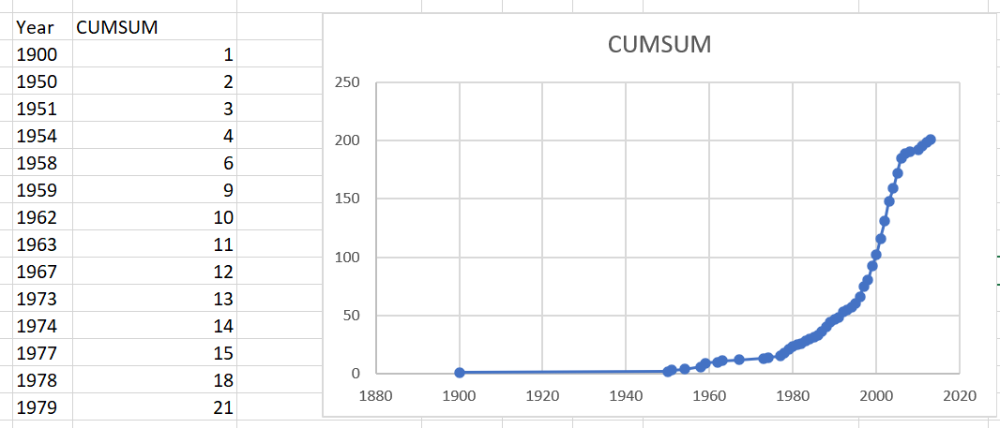
    ```

    </p>

    </details>


### STILL WORKING