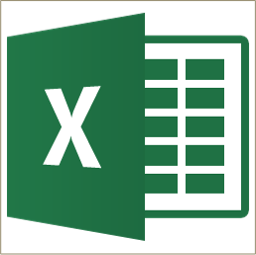

```{r setup, include=FALSE}
knitr::opts_chunk$set(echo = FALSE)
```

# Excel

{width="40%"}

I may trash talk excel 😈, but I would argue that it is the most used tool for accountants. Accountants are the **original** data scientists[^1] and their weapon of choice has been excel. A large portion of this class will be using R, **BUT** I hope to show you that R and Excel can work together. At the very least you will learn how to do everything we see in this module in R and you can decide which tool you want to use. 😏 This case study is provided by [PWC](https://www.pwc.com/us/en/careers/university-relations/data-and-analytics-case-studies.html). It was developed for a [masters level course](https://www.pwc.com/us/en/careers/university-relations/data-and-analytics-case-studies.html), but I am adapting it for our class.

[^1]: in my opinion 😄

# Module Objectives

-   Demonstrate knowledge of data quality concepts

-   Demonstrate knowledge of key terms and capabilities in Excel

-   Demonstrate how to use Excel to acquire, transform, analyze, and visualize data

-   Demonstrate knowledge of leading practices for presenting findings in Excel

## Why excel?

::: {style="display: grid; grid-template-columns: 1fr 1fr; grid-column-gap: 15px;"}
<div>

-   We have no choice... everybody uses it! - this is the hard [**truth**]{.ul}
-   Easy-to-use \<- debatable 😅
-   Many different functions

</div>

<div>

{width="40%"}

</div>
:::

-   Advanced capabilities through add-ins
-   Easy to explore and manipulate the data
-   Can present data and analysis together
-   Integrated with common desktop applications

***But...***

-   Significant potential for human error
-   Limited scalability

***Keep it simple and ask the Internet!***

### Key terms

+----------------------------+--------------------------------------------------------------------------------------------------------------------------------------------------------------+
| $\color{red}{\text{Term}}$ | $\color{red}{\text{Definition}}$                                                                                                                             |
+============================+==============================================================================================================================================================+
| **Workbook**               | An Excel file is referred to as a workbook                                                                                                                   |
+----------------------------+--------------------------------------------------------------------------------------------------------------------------------------------------------------+
| **Worksheet**              | A single "tab" or "sheet" within a Workbook                                                                                                                  |
+----------------------------+--------------------------------------------------------------------------------------------------------------------------------------------------------------+
| **Cell**                   | The boxes within the worksheet where information is stored. Cells are referenced by column letters (A, B, C, ...) and row numbers (1, 2, 3, ...) like a map: |
+----------------------------+--------------------------------------------------------------------------------------------------------------------------------------------------------------+
|                            | -   $\color{red}{\text{A1}}$                                                                                                                                 |
|                            | -   $\color{red}{\text{BX800}}$                                                                                                                              |
|                            | -   $\color{red}{\text{EEE20}}$                                                                                                                              |
+----------------------------+--------------------------------------------------------------------------------------------------------------------------------------------------------------+
| **Range**                  | A contiguous set of cells referenced by the top left and bottom right cells, separated by a colon (:):                                                       |
+----------------------------+--------------------------------------------------------------------------------------------------------------------------------------------------------------+
|                            | -   $\color{red}{\text{A1:D23}}$                                                                                                                             |
|                            | -   $\color{red}{\text{BA2:CT8}}$                                                                                                                            |
+----------------------------+--------------------------------------------------------------------------------------------------------------------------------------------------------------+

### Cell References

-   Excel formulas can reference different cells

-   Changes to the referenced cells result in updates to value calculated by the formula

    {width="100%"}

    #### Inputs within functions can be either a single cell reference or a block of cells referred to as a range.

The two example below provide the same result:

+--------------------+--------------------------------------------------------+------------------------------------------+
| **=SUM(C1,C2,C3)** | **Single cells selection-**                            |                                          |
|                    |                                                        |                                          |
|                    | $\color{red}{\text{Use the Ctrl Key}}$                 |                                          |
+====================+========================================================+==========================================+
| **=SUM(C1:C3)**    | **Range selection-**                                   | {width="100%"} |
|                    |                                                        |                                          |
|                    | $\color{red}{\text{use Shift Key or Drag with mouse}}$ |                                          |
+--------------------+--------------------------------------------------------+------------------------------------------+

Note: should a row be inserted between C1 and C3, then example 1 will still provide the same results, however example two will extend to add 4 cells.

#### Absolute cell references

Absolute referencing is a way of referring to cells within formulas so that once copied, the cell reference remains fixed to a particular cell

+----------------------------------------------+--------------------------------------------------------------------------------+
| {width="100%"} | **Relative referencing**                                                       |
|                                              |                                                                                |
|                                              | As a formula is copied along, the row/column numbers adjust accordingly        |
+----------------------------------------------+--------------------------------------------------------------------------------+
| {width="100%"} | **Absolute referencing**                                                       |
|                                              |                                                                                |
|                                              | As a formula is copied along, it continues to refer to the same cell as before |
+----------------------------------------------+--------------------------------------------------------------------------------+

#### Absolute cell referencing

With absolute cell referencing, a dollar sign (\$) appears in the cell reference:

-   =B4 Refers to column B and row 4,

But this will vary if the formula is copied across a range of cells $\color{red}{\text{(relative reference)}}$

-   =\$B4 Will always refer to column B, but row reference can vary
-   =B\$4 Will always refer to row 4, but column reference can vary
-   =\$B\$4 Will always refer to column B and row 4

$\color{red}{\text{(absolute reference)}}$

Keyboard shortcut F4 cycles through the four absolute cell reference options

### Formulas

-   Excel calculations are specified with formulas in each cell

-   To create a formula, type an equals sign (=) followed by the function and required arguments

    [Order of Operations]{.ul}

::: {style="display: grid; grid-template-columns: 1fr 1fr; grid-column-gap: 5px;"}
<div>

+-------------------------+------------------+
| Brackets                | ( )              |
+-------------------------+------------------+
| Exponent                | \^               |
+-------------------------+------------------+
| Division/Multiplication | / \*             |
+-------------------------+------------------+
| Addition/Subtraction    | \+ -             |
+-------------------------+------------------+

</div>

<div>

{width="60%"}

</div>
:::
