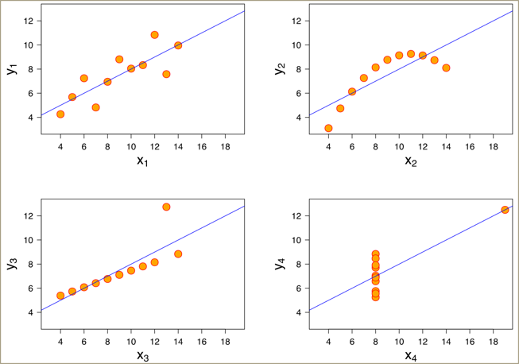

```{r setup, include=FALSE}
knitr::opts_chunk$set(echo = FALSE)
```

# PWC Excel Case Study

## Information not discussed in class

## "Anscombe's quartet"

+--------------------------------+-----------------------------+--------------------------------+
| $\color{red}{\text{Property}}$ | $\color{red}{\text{Value}}$ | $\color{red}{\text{Accuracy}}$ |
+================================+=============================+================================+
| Mean of x                      | 9                           | exact                          |
+--------------------------------+-----------------------------+--------------------------------+
| Sample variance of x           | 11                          | exact                          |
+--------------------------------+-----------------------------+--------------------------------+
| Mean of y                      | 7.5                         | 2 decimal places               |
+--------------------------------+-----------------------------+--------------------------------+
| Sample variance of y           | 4.125                       | plus/minus 0.003               |
+--------------------------------+-----------------------------+--------------------------------+
| Correlation between x and y    | 0.816                       | 3 decimal places               |
+--------------------------------+-----------------------------+--------------------------------+
| Linear regression line         | y = 3.00 + 0.500x           | 2-3 decimal places             |
+--------------------------------+-----------------------------+--------------------------------+

## Visualizing the quartet

{width="100%"}

## Index function

-   An alternative approach that offers greater flexibility is to use a combination of the INDEX and MATCH functions.
-   INDEX returns the value at a particular position (index) in a range

**Syntax**

=INDEX ( $\color{red}{\text{range of values}}$, $\color{maroon}{\text{row number}}$, $\color{green}{\text{column number (optional)}}$ )

::: {style="display: grid; grid-template-columns: 1fr 1fr; grid-column-gap: 10px;"}
<div>

**Example**

=INDEX ($\color{red}{\text{B2:B6}}$, $\color{maroon}{\text{4}}$)

Returns a value of 40,000, because 40,000 is in the fourth row of the range.

</div>

<div>

{width="50%"}

</div>
:::

## Match

-   MATCH is used to find which row or column in a list contains a particular value
-   Typically the match type should be set to zero for an exact match

**Syntax**

=MATCH ( $\color{red}{\text{value to find}}$, $\color{maroon}{\text{range to search}}$, $\color{green}{\text{match type (optional)}}$ )

::: {style="display: grid; grid-template-columns: 1fr 1fr; grid-column-gap: 10px;"}
<div>

**Example**

=MATCH ($\color{red}{\text{"Grade 3"}}$, $\color{maroon}{\text{A2:A6}}$, $\color{green}{\text{0}}$)

Returns a value of 3, because 'Grade 3' is in the third cell of the range

</div>

<div>

{width="50%"}

</div>
:::

## Index/Match

::: {style="display: grid; grid-template-columns: 1fr 1fr; grid-column-gap: 10px;"}
<div>

Example: Find the unit cost based on the number of units

First we use a MATCH function to find the appropriate row based on the (approximate) number of units:

-   =MATCH($\color{red}{\text{C3}}$,\$B\$8:\$B\$12,$\color{maroon}{\text{1}}$)

Then we use an INDEX function to retrieve the cost value contained in this row:

-   =INDEX(\$C\$8:\$C\$12, row number goes here )

These combine to make an overall formula:

-   =INDEX(\$C\$8:\$C\$12,MATCH($\color{red}{\text{C3}}$,\$B\$8:\$B\$12,$\color{maroon}{\text{1}}$))

In this example, the number of units is 595, and the formula returns \$10.

</div>

<div>

{width="70%"}

</div>
:::

## Optimization

::: {style="display: grid; grid-template-columns: 1fr 1fr; grid-column-gap: 10px;"}
<div>

-   Goalseek provides a way to solve simple equations

    -   Set a cell to a value
    -   Change another cell to produce the set value

</div>

<div>

{width="40%"}

</div>
:::

-   Solver provides more powerful and scalable optimization for systems of equations

    {width="100%"}

## Solver - Objective and constraints

{width="100%"}
