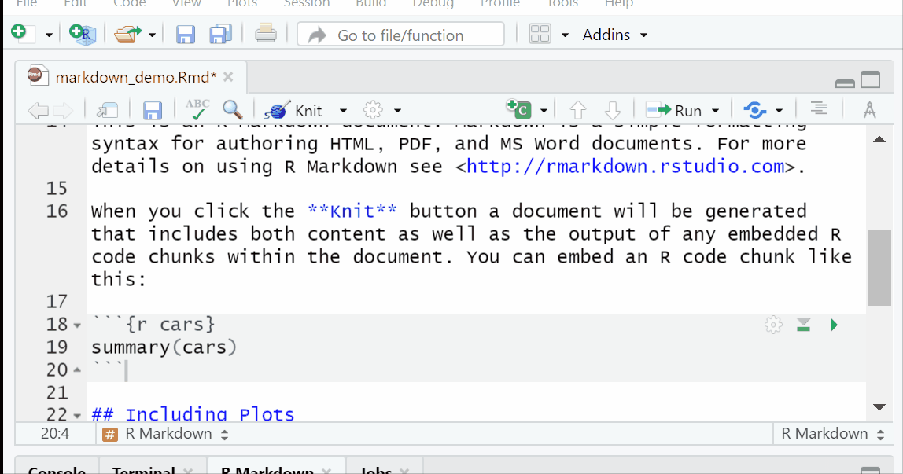

```{r setup, include=FALSE}
knitr::opts_chunk$set(echo = FALSE)
```

# What is RMarkdown?[^1]

[^1]: The information for this module is from [RStudio](https://rmarkdown.rstudio.com/lesson-1.html)

```{r}
vembedr::embed_url("https://vimeo.com/178485416")
```

## Overview

R Markdown provides an authoring framework for data science. You can use a single R Markdown file to both

-   save and execute code
-   generate high quality reports that can be shared with an audience

## Installation

Like the rest of R, R Markdown is free and open source. You can install the R Markdown package from [CRAN](https://cran.r-project.org/) with:

```{r install,  eval=FALSE, echo=TRUE}
install.packages("rmarkdown")
```

#### Once you have installed rmarkdown you can create a document

{width="100%"}

#### Notice that the file contains three types of content:

-   An (optional) YAML header surrounded by `---`s
-   R code chunks surrounded by ```` ``` ````s
-   text mixed with simple text formatting
-   You can run each code chunk by clicking the  icon. RStudio executes the code and display the results inline with your file. {width="100%"}

## Rendering output

To generate a report from the file, run the `render` command:

``` {.r eval="FALSE"}
library(rmarkdown)
render("1-example.Rmd")
```

Better still, use the "Knit" button in the RStudio IDE to render the file and preview the output with a single click. {width="10%"}

R Markdown generates a new file that contains selected text, code, and results from the .Rmd file. The new file can be a finished [web page](https://bookdown.org/yihui/rmarkdown/html-document.html), [PDF](https://bookdown.org/yihui/rmarkdown/pdf-document.html), [MS Word](https://bookdown.org/yihui/rmarkdown/word-document.html) document, [slide show](https://bookdown.org/yihui/rmarkdown/ioslides-presentation.html), [notebook](https://bookdown.org/yihui/rmarkdown/notebook.html), [handout](https://bookdown.org/yihui/rmarkdown/tufte-handouts.html), [book](https://bookdown.org/), [dashboard](https://rmarkdown.rstudio.com/flexdashboard/index.html), [package vignette](https://bookdown.org/yihui/rmarkdown/r-package-vignette.html) or [other format](https://rmarkdown.rstudio.com/formats.html).

## How it works

{width="100%"}\

When you run `render`, R Markdown feeds the .Rmd file to [knitr](http://yihui.name/knitr/), which executes all of the code chunks and creates a new markdown (.md) document which includes the code and its output.

The markdown file generated by knitr is then processed by [pandoc](http://pandoc.org/) which is responsible for creating the finished format.

This may sound complicated, but R Markdown makes it extremely simple by encapsulating all of the above processing into a single `render` function.

Knowing the details is beyond this class, but the gist is that we can create documents with code and output. The facilitates reproducible reports.

Imagine having to generate the same reports each week/month from excel spreadsheets. To some extent you would have to add the formulas that you need to generate the numbers/summary stats you need for the report. [**BUT** if your original report contained the necessary code to generate the desired output all you would have to do is update the data.]{style="color:red"}

## Code Chunks

You can quickly insert chunks like these into your file with

the keyboard shortcut Ctrl + Alt + I (OS X: Cmd + Option + I) the Add Chunk command in the editor toolbar or by typing the chunk delimiters `{r} and`.

When you render your .Rmd file, R Markdown will run each code chunk and embed the results beneath the code chunk in your final report.

#### Chunk Options

Chunk output can be customized with [knitr options](http://yihui.name/knitr/options/), arguments set in the `{}` of a chunk header. Above, we use five arguments:

-   `include = FALSE` prevents code and results from appearing in the finished file. R Markdown still runs the code in the chunk, and the results can be used by other chunks.
-   `echo = FALSE` prevents code, but not the results from appearing in the finished file. This is a useful way to embed figures.
-   `message = FALSE` prevents messages that are generated by code from appearing in the finished file.
-   `warning = FALSE` prevents warnings that are generated by code from appearing in the finished.
-   `fig.cap = "..."` adds a caption to graphical results.

# Exercise 1

Answer the following questions. $\color{red}{\text{Do not peek at the answers.}}$👊

1.  Add echo=FALSE to the following code in your rmarkdown file what happens?

    ```` ```{r cars} ````\
    `summary(cars)`\
    ```` ``` ````

    <details>

    <summary>

    Answer

    </summary>

    ```{r Exercise_1_1_rmarkdown, echo=FALSE, out.width = '100%'}
      
    ```

    </details>

2.  Add include=FALSE to the following code in your rmarkdown file what happens?

    ```` ```{r cars} ````\
    `summary(cars)`\
    ```` ``` ````

    <details>

    <summary>

    Answer

    </summary>

    ```{r Exercise_1_2_rmarkdown, echo=FALSE, out.width = '100%'}
      
    ```

    </details>

3.  Add a caption to the following code in your rmarkdown file.

    ```` ```{r pressure, echo=FALSE} ````\
    `plot(pressure)`\
    ```` ``` ````

    <details>

    <summary>

    Answer

    </summary>

    ```{r Exercise_1_3_rmarkdown, echo=FALSE, out.width = '100%'}
      knitr::include_graphics("images/Exercise_1_3_rmarkdown.gif")
    ```

    </details>

See the [R Markdown Reference Guide](https://www.rstudio.com/wp-content/uploads/2015/03/rmarkdown-reference.pdf) for a complete list of knitr chunk options.

#### Global Options

To set global options that apply to every chunk in your file, call `knitr::opts_chunk$set` in a code chunk. Knitr will treat each option that you pass to `knitr::opts_chunk$set` as a global default that can be overwritten in individual chunk headers.

#### Caching

If document rendering becomes time consuming due to long computations you can use knitr caching to improve performance. [*Knitr chunk and package options*](http://yihui.name/knitr/options) describes how caching works and the [*Cache examples*](http://yihui.name/knitr/demo/cache/) provide additional details.

## Inline Code

Code results can be inserted directly into the text of a .Rmd file by enclosing the code with `` `r ` ``.

copy the following code and add it to your default .Rmd file

```` {.r}
# Inline Code example

```{r inline, include=FALSE}`r ''`
cars_variable<-"dist"
#cars_variable<-"speed"
```


You can use the `<-` to store information in objects. 
`object <- information`. The above code stores  `r "\u0060r cars_variable\u0060"`  in cars_variable.


```{r sum of dist, message=FALSE}`r ''`
library(dplyr)
cars%>%
  select(c(paste(cars_variable)))

```
````

{width="100%"}
