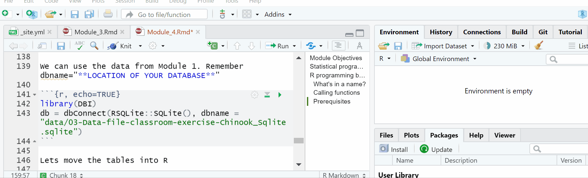

```{r setup, include=FALSE}
knitr::opts_chunk$set(echo = FALSE)
```

This module is based in part on a [PWC case study](https://www.pwc.com/us/en/careers/university-relations/data-and-analytics-case-studies.html) (Graduate level Data Management and Analysis Course), [R for Data Science](https://r4ds.had.co.nz/index.html), and [ModernDive](https://moderndive.com/index.html). I am changing a few things from the PWC case study, most notably is the use of the Tidyverse R packages. I will introduce dplyr for data manipulation and ggplot2 for visualizations. I am also dropping the AI/Predictive modeling portion for this class. My masters level course will focus on AI/ML.

# Module Objectives

-   Explain fundamentals of statistical programming with R
-   Demonstrate basic approaches to acquire, transform, analyze, and visualize data in R

# Statistical programming tools

{width="100%"}

# R programming basics

Lets create a new script to store our code. If we want to keep our code, then we must use a script. Also remember that `#` allows you to make comments that are not run as code. The key shortcut is:

ctrl (cmd)+shift+N

{width="100%"}

You can use R as a calculator:

```{r,  echo=TRUE}
1 / 200 * 30
(59 + 73 + 2) / 3
sin(pi / 2)
```

You can create new objects with `<-`:

```{r,  echo=TRUE}
x <- 3 * 4
x
```

All R statements where you create objects, **assignment** statements, have the same form:

```{r , echo=TRUE, eval = FALSE}
object_name <- value
```

When reading that code say "object name gets value" in your head.

You will make lots of assignments and `<-` is a pain to type. Don't be lazy and use `=`: it will work, but it will cause confusion later.

## What's in a name?

R is case-sensitive, so objects and functions must be used with correct capitalization. Object names must start with a letter, and can only contain letters, numbers, `_` and `.`. You want your object names to be descriptive, so you'll need a convention for multiple words. I recommend **snake_case** where you separate lowercase words with `_`.

```{r,   eval = FALSE, echo=TRUE}
i_use_snake_case
otherPeopleUseCamelCase
some.people.use.periods
And_aFew.People_RENOUNCEconvention
```

```{r,   echo=TRUE,error=TRUE}
x_value <- 3 * 4
X_value
```

```{r,  echo=TRUE,error=TRUE}
x_value <- 3 * 4
x_Value
```

## Calling functions

R has a large collection of built-in functions that are called like this:

```{r , eval = FALSE}
function_name(arg1 = val1, arg2 = val2, ...)
```

Let's try using `seq()` which makes regular **seq**uences of numbers and, while we're at it, learn more helpful features of RStudio.

```{r, echo=TRUE}
seq(1, 10)
```

Type this code and notice you get similar assistance with the paired quotation marks:

```{r, echo=TRUE}
x <- "hello world"
```

Quotation marks and parentheses must always come in a pair. RStudio does its best to help you, but it's still possible to mess up and end up with a mismatch. If this happens, R will show you the continuation character "+":

    > x <- "hello
    +  

The `+` tells you that R is waiting for more input; it doesn't think you're done yet. Usually that means you've forgotten either a `"` or a `)`. Either add the missing pair, or press ESCAPE to abort the expression and try again.

If you make an assignment, you don't get to see the value. You're then tempted to immediately double-check the result:

```{r, echo=TRUE}
y <- seq(1, 10, length.out = 5)
y
```

This common action can be shortened by surrounding the assignment with parentheses, which causes assignment and "print to screen" to happen.

```{r,  echo=TRUE}
(y <- seq(1, 10, length.out = 5))
```

Now look at your environment in the upper right pane. What is there?

The objects we created.

Interested in keyboard shortcuts... try: Alt+Shift+K or use the menus 😄

## Prerequisites

In this module we are going to focus on how to use the dplyr package. If you have not already you need to install the tidyverse of packages. Installing packages is like downloading an app for your phone that adds functionality. After you download an app you have to tap it to use..in R to *tap* the package you use `library(package_name)`.

```{r setup2,  echo=TRUE,eval=FALSE}
install.packages("tidyverse")

```

```{r load libraries,   echo=TRUE,warning=FALSE}
library(tidyverse)
```

We can use the data from Module 1.

Remember dbname="**LOCATION OF YOUR DATABASE**"

```{r,   echo=TRUE}
library(DBI)
db = dbConnect(RSQLite::SQLite(), dbname = "data/03-Data-file-classroom-exercise-Chinook_Sqlite.sqlite")
```

Lets move the tables into R

```{r,   echo=TRUE}
Customer<-dbReadTable(db,"Customer")
```

```{r,   echo=TRUE}
Invoice<-dbReadTable(db,"Invoice")
```

You can also accomplish the same task in a RMarkdown document using SQL with the following code:

```` {.r}
```{sql, connection=db, echo=TRUE, output.var="Customer"}`r ''`
SELECT * 
FROM Customer
```

```{sql, connection=db, echo=TRUE, output.var="Invoice"}`r ''`
SELECT * 
FROM Invoice
```
````

{width="100%"}

[Resource for working with databases in R.](https://www.r-bloggers.com/2019/08/a-comprehensive-introduction-to-working-with-databases-using-r/)

Lets also import our data used in Module 2. I almost always use the import wizard.

{width="100%"}

**Note: Whenever we run tidyverse library it loads several packages**

## Basic Syntax

Lets start with storing our imported data from Module 2 in names we like. This could have been done in the import wizard, but lets do it now.

```{r,   echo=TRUE,eval=FALSE}
Payroll<-Session_2_data_file_1_payroll_data
Reference<-Session_2_data_file_2_reference_data
```

We can remove the old datasets from our environment by using `rm()`

```{r,   echo=TRUE, eval=FALSE}
rm(Session_2_data_file_1_payroll_data)
rm(Session_2_data_file_2_reference_data)
```

At this point you should have a database connection "db" in your environment and 4 datasets: Customer, Invoice, Payroll, and Reference. These are the datasets used in Module 1 and Module 2. Be sure and import the original data because we are going to learn how to fix the same errors that we fixed in Module 2.

{width="50%"}

We are going to be using the dplyr package for data manipulation or data wrangling.

<aside>

dplyr package is loaded whenever you run library(tidyverse)

</aside>

## Operators

### Arithmetic Operators

+--------------+---------------------------------+
| **Operator** | **Description**                 |
+:=============+:================================+
| `+`          | addition                        |
+--------------+---------------------------------+
| `-`          | subtraction                     |
+--------------+---------------------------------+
| `*`          | multiplication                  |
+--------------+---------------------------------+
| `/`          | division                        |
+--------------+---------------------------------+
| \^ or \*\*   | exponentiation                  |
+--------------+---------------------------------+
| x%%y         | modulus (x mod y) 5%%2 is 1     |
+--------------+---------------------------------+
| x%/%y        | integer division 5%/%2 is 2     |
+--------------+---------------------------------+

### Logical Operators {#logical-operators}

| **Operator** | **Description**          |
|:-------------|:-------------------------|
| \<           | less than                |
| \<=          | less than or equal to    |
| \>           | greater than             |
| \>=          | greater than or equal to |
| ==           | exactly equal to         |
| !=           | not equal to             |
| !x           | Not x                    |
| x\|y         | x OR y                   |
| x&y          | x AND y                  |
| isTRUE(x)    | test if x is TRUE        |

## Built-in Functions

-   R has many built in functions that compute different statistical procedures.
-   Functions in R are followed by ( ).
-   Inside the parenthesis we write the object (vector, array, matrix, dataframe) to which we want to apply the function.

### Numeric Functions

| **Function**           | **Description**                       |
|:-----------------------|:--------------------------------------|
| abs(x)                 | absolute value                        |
| sqrt(x)                | square root                           |
| ceiling(x)             | ceiling(3.475) is 4                   |
| floor(x)               | floor(3.475) is 3                     |
| trunc(x)               | trunc(5.99) is 5                      |
| round(x, digits=n)     | round(3.475, digits=2) is 3.48        |
| signif(x, digits=n)    | signif(3.475, digits=2) is 3.5        |
| cos(x), sin(x), tan(x) | also acos(x), cosh(x), acosh(x), etc. |
| log(x)                 | natural logarithm                     |
| log10(x)               | common logarithm                      |
| exp(x)                 | e\^x                                  |

### Character Functions

+--------------------------------------------------------------+-------------------------------------------------------------------------------------------------------------------------------------------------------------------------------------------------------+
| **Function**                                                 | **Description**                                                                                                                                                                                       |
+:=============================================================+:======================================================================================================================================================================================================+
| substr(x, start=n1, stop=n2)                                 | Extract or replace substrings in a character vector. x \<- "abcdef", substr(x, 2, 4) is "bcd"                                                                                                         |
+--------------------------------------------------------------+-------------------------------------------------------------------------------------------------------------------------------------------------------------------------------------------------------+
| grep(pattern, x, ignore.case=FALSE, fixed=FALSE)             | Search for pattern in x. If fixed =FALSE then pattern is a regular expression. If fixed=TRUE then pattern is a text string. Returns matching indices. grep("A", c("b","A","c"), fixed=TRUE) returns 2 |
+--------------------------------------------------------------+-------------------------------------------------------------------------------------------------------------------------------------------------------------------------------------------------------+
| sub(pattern, replacement, x, ignore.case=FALSE, fixed=FALSE) | Find pattern in x and replace with replacement text. If fixed=FALSE then pattern is a regular expression. If fixed = T then pattern is a text string. sub("",".","Hello There") returns "Hello.There" |
+--------------------------------------------------------------+-------------------------------------------------------------------------------------------------------------------------------------------------------------------------------------------------------+
| strsplit(x, split)                                           | Split the elements of character vector x at split. strsplit("abc", "") returns 3 element vector "a","b","c"                                                                                           |
+--------------------------------------------------------------+-------------------------------------------------------------------------------------------------------------------------------------------------------------------------------------------------------+
| paste(..., sep="")                                           | Concatenate strings after using sep string to seperate them. paste("x",1:3,sep="") returns c("x1","x2" "x3") paste("x",1:3,sep="M") returns c("xM1","xM2" "xM3") paste("Today is", date())            |
+--------------------------------------------------------------+-------------------------------------------------------------------------------------------------------------------------------------------------------------------------------------------------------+
| toupper(x)                                                   | Uppercase                                                                                                                                                                                             |
+--------------------------------------------------------------+-------------------------------------------------------------------------------------------------------------------------------------------------------------------------------------------------------+
| tolower(x)                                                   | Lowercase                                                                                                                                                                                             |
+--------------------------------------------------------------+-------------------------------------------------------------------------------------------------------------------------------------------------------------------------------------------------------+

### Statistical Functions

+---------------------------------------------------------------------------------------+----------------------------------------------------------------------------------------------------------------------------------------------------------------------------------------------------------------------------------------------------+
| **Function**                                                                          | **Description**                                                                                                                                                                                                                                    |
+:======================================================================================+:===================================================================================================================================================================================================================================================+
| dnorm(x)                                                                              | normal density function (by default m=0 sd=1) \# plot standard normal curve x \<- pretty(c(-3,3), 30) y \<- dnorm(x) plot(x, y, type="l", xlab="Normal Deviate", ylab="Density", yaxs="i")                                                         |
+---------------------------------------------------------------------------------------+----------------------------------------------------------------------------------------------------------------------------------------------------------------------------------------------------------------------------------------------------+
| pnorm(q)                                                                              | cumulative normal probability for q (area under the normal curve to the right of q) pnorm(1.96) is 0.975                                                                                                                                           |
+---------------------------------------------------------------------------------------+----------------------------------------------------------------------------------------------------------------------------------------------------------------------------------------------------------------------------------------------------+
| qnorm(p)                                                                              | normal quantile. value at the p percentile of normal distribution qnorm(.9) is 1.28 \# 90th percentile                                                                                                                                             |
+---------------------------------------------------------------------------------------+----------------------------------------------------------------------------------------------------------------------------------------------------------------------------------------------------------------------------------------------------+
| rnorm(n, m=0, sd=1)                                                                   | n random normal deviates with mean m and standard deviation sd. \#50 random normal variates with mean=50, sd=10x \<- rnorm(50, m=50, sd=10)                                                                                                        |
+---------------------------------------------------------------------------------------+----------------------------------------------------------------------------------------------------------------------------------------------------------------------------------------------------------------------------------------------------+
| dbinom(x, size, prob), pbinom(p, size,prob), qbinom(q,size,prob), rbinom(n,size,prob) | binomial distribution where size is the sample size and prob is the probability of a heads (pi) \# prob of 0 to 5 heads of fair coin out of 10 flips dbinom(0:5, 10, .5) \# prob of 5 or less heads of fair coin out of 10 flips pbinom(5, 10, .5) |
+---------------------------------------------------------------------------------------+----------------------------------------------------------------------------------------------------------------------------------------------------------------------------------------------------------------------------------------------------+
| dpois(x, lamda), ppois(q,lamda), qpois(p,lamda), rpois(n,lamda)                       | poisson distribution with m=std=lamda \#probability of 0,1, or 2 events with lamda=4 dpois(0:2, 4) \# probability of at least 3 events with lamda=4 1- ppois(2,4)                                                                                  |
+---------------------------------------------------------------------------------------+----------------------------------------------------------------------------------------------------------------------------------------------------------------------------------------------------------------------------------------------------+
| dunif(x,min,max=1)                                                                    | uniform distribution, follows the same pattern                                                                                                                                                                                                     |
+---------------------------------------------------------------------------------------+----------------------------------------------------------------------------------------------------------------------------------------------------------------------------------------------------------------------------------------------------+
| punif(q,min=0,max=1)                                                                  | as the normal distribution above.                                                                                                                                                                                                                  |
+---------------------------------------------------------------------------------------+----------------------------------------------------------------------------------------------------------------------------------------------------------------------------------------------------------------------------------------------------+
| qunif(p,min=0,max=1)                                                                  | \#10 uniform random variates                                                                                                                                                                                                                       |
+---------------------------------------------------------------------------------------+----------------------------------------------------------------------------------------------------------------------------------------------------------------------------------------------------------------------------------------------------+
| runif(n,min=0,max=1)                                                                  | x \<- runif(10)                                                                                                                                                                                                                                    |
+---------------------------------------------------------------------------------------+----------------------------------------------------------------------------------------------------------------------------------------------------------------------------------------------------------------------------------------------------+
| mean(x,trim=0, na.rm=FALSE)                                                           | mean of object x, \# trimmed mean, removing any missing values and \# 5 percent of highest and lowest scores mx \<- mean(x,trim=.05,na.rm=TRUE)                                                                                                    |
+---------------------------------------------------------------------------------------+----------------------------------------------------------------------------------------------------------------------------------------------------------------------------------------------------------------------------------------------------+
| sd(x)                                                                                 | standard deviation of object(x). also look at var(x) for variance and mad(x) for median absolute deviation.                                                                                                                                        |
+---------------------------------------------------------------------------------------+----------------------------------------------------------------------------------------------------------------------------------------------------------------------------------------------------------------------------------------------------+
| median(x)                                                                             | median                                                                                                                                                                                                                                             |
+---------------------------------------------------------------------------------------+----------------------------------------------------------------------------------------------------------------------------------------------------------------------------------------------------------------------------------------------------+
| quantile(x)                                                                           | quantiles where x is the numeric vector whose quantiles are desired and probs is a numeric vector with probabilities in [0,1]. \# 30th and 84th percentiles of x, y \<- quantile(x, c(.3,.84))                                                     |
+---------------------------------------------------------------------------------------+----------------------------------------------------------------------------------------------------------------------------------------------------------------------------------------------------------------------------------------------------+
| range(x)                                                                              | range                                                                                                                                                                                                                                              |
+---------------------------------------------------------------------------------------+----------------------------------------------------------------------------------------------------------------------------------------------------------------------------------------------------------------------------------------------------+
| sum(x)                                                                                | sum                                                                                                                                                                                                                                                |
+---------------------------------------------------------------------------------------+----------------------------------------------------------------------------------------------------------------------------------------------------------------------------------------------------------------------------------------------------+
| diff(x,lag=1)                                                                         | lagged differences, with lag indicating which lag to use                                                                                                                                                                                           |
+---------------------------------------------------------------------------------------+----------------------------------------------------------------------------------------------------------------------------------------------------------------------------------------------------------------------------------------------------+
| min(x)                                                                                | minimum                                                                                                                                                                                                                                            |
+---------------------------------------------------------------------------------------+----------------------------------------------------------------------------------------------------------------------------------------------------------------------------------------------------------------------------------------------------+
| max(x)                                                                                | maximum                                                                                                                                                                                                                                            |
+---------------------------------------------------------------------------------------+----------------------------------------------------------------------------------------------------------------------------------------------------------------------------------------------------------------------------------------------------+
| scale(x, center=TRUE, scale=TRUE)                                                     | column center or standardize a matrix                                                                                                                                                                                                              |
+---------------------------------------------------------------------------------------+----------------------------------------------------------------------------------------------------------------------------------------------------------------------------------------------------------------------------------------------------+

### Other Functions {#other-functions}

+----------------------------+---------------------------------------------------------------------------+
| **Function**               | **Description**                                                           |
+:===========================+:==========================================================================+
| seq(from, to, by)          | generate a sequence indices \<- seq(1,10,2) \#indices is c(1, 3, 5, 7, 9) |
+----------------------------+---------------------------------------------------------------------------+
| rep(x,ntimes)              | repeat x n times y \<- rep(1:3, 2) \# y is c(1, 2, 3, 1, 2, 3)            |
+----------------------------+---------------------------------------------------------------------------+
| cut(x,n)                   | divide continuous variable in factor with n levels y \<- cut(x, 5)        |
+----------------------------+---------------------------------------------------------------------------+
| length(object)             | number of elements or components                                          |
+----------------------------+---------------------------------------------------------------------------+
| str(object)                | structure of an object                                                    |
+----------------------------+---------------------------------------------------------------------------+
| class(object)              | class or type of an object                                                |
+----------------------------+---------------------------------------------------------------------------+
| names(object)              | names                                                                     |
+----------------------------+---------------------------------------------------------------------------+
| c(object, object,...)      | combine objects into a vector                                             |
+----------------------------+---------------------------------------------------------------------------+
| cbind(object, object,...)  | combine objects as columns                                                |
+----------------------------+---------------------------------------------------------------------------+
| rbind(object, object,...)  | combine objects as rows                                                   |
+----------------------------+---------------------------------------------------------------------------+
| ls()                       | list current objects                                                      |
+----------------------------+---------------------------------------------------------------------------+
| rm(object)                 | delete an object                                                          |
+----------------------------+---------------------------------------------------------------------------+
| newobject \<- edit(object) | create a new object                                                       |
+----------------------------+---------------------------------------------------------------------------+
| fix(object)                | edit an object in place                                                   |
+----------------------------+---------------------------------------------------------------------------+

## Dplyr

### Pipes %\>%

Before we start data wrangling, let's first introduce a tool that gets loaded with the `dplyr` package: the pipe operator `%>%`. The pipe operator allows us to combine multiple operations in R into a single sequential *chain* of actions.

Let's start with a hypothetical example. Say you would like to perform a hypothetical sequence of operations on a hypothetical data frame `x` using hypothetical functions `f()`, `g()`, and `h()`:

1.  Take `x` *then*

2.  Use `x` as an input to a function `f()` *then*

3.  Use the output of `f(x)` as an input to a function `g()` *then*

4.  Use the output of `g(f(x))` as an input to a function `h()`

One way to achieve this sequence of operations is by using nesting parentheses as follows...This is how **Excel** works. We saw this multiple times in Module 2.

    h(g(f(x)))

This isn't terrible, but as we saw...as you nest more things it gets more complicated. This is where the pipe operator `%>%` comes in handy. `%>%` takes the output of one function and then "pipes" it to be the input of the next function. Furthermore, a helpful trick is to read `%>%` as "then" or "and then." For example, you can obtain the same output as the hypothetical sequence of functions as follows:

    x %>% 
      f() %>% 
      g() %>% 
      h()

You would read this sequence as:

1.  Take `x` *then*

2.  Use this output as the input to the next function `f()` *then*

3.  Use this output as the input to the next function `g()` *then*

4.  Use this output as the input to the next function `h()`

So while both approaches achieve the same goal, the latter is much more human-readable because you can clearly read the sequence of operations line-by-line.

```{r filter1, echo=TRUE}
#lets look at some pipes
USA_Customer <- Customer %>%
  filter(Country=="USA")

```

<details>

<summary>

Take a Peek

</summary>

<p>

```{r}

knitr::kable(USA_Customer,caption = "The resulting data")%>%
  kableExtra::kable_styling("striped")%>%
  kableExtra::scroll_box(width = "100%",height="300px")
```

</p>

</details>

### Functions

functions include:

1.  Pick variables by their names (`select()`).

2.  `filter()` a data frame's existing rows to only pick out a subset of them.

3.  `summarize()` one or more of its columns/variables with a *summary statistic*.

4.  `group_by()` its rows. In other words, assign different rows to be part of the same *group*. We can then combine `group_by()` with `summarize()` to report summary statistics for each group *separately*. For example, say you don't want a single overall average sales for a company, but want it by department.

5.  `mutate()` its existing columns/variables to create new ones. For example, you can create ROA from income divided by assets.

6.  `arrange()` its rows. Sorting rows.

`join()` it with another data frame by matching along a "key" variable. In other words, merge these two data frames together. This is similar to what we saw in Module 1.

#### Filter

The `filter()` function here works much like the "Filter" option in Microsoft Excel; it allows you to specify criteria about the values of a variable in your dataset and then filters out only the rows that match that criteria.

*Note: not including the select function is similar to including SELECT \* in SQL. We select everything.*

```{r filter2,  echo=TRUE, eval=FALSE}
#lets look at some pipes
USA_Customer <- Customer %>%
  filter(Country=="USA")

View(USA_Customer)
```

We can use any of the [logical operators](#logical-operators) in the above table.

```{r filter3,  echo=TRUE,eval=FALSE}
Customer_USA_2_Cities <- Customer %>% 
  filter(Country == "USA" & 
           (City == "Reno" | City == "Mountain View" | City== "New York") &
           SupportRepId >= 4)
View(Customer_USA_2_Cities)
```

Why do we only end up with two cities?

For any row in the data `City` can be `"Reno"` OR `"Mountain View"` OR `"New York"`, but not all three simultaneously...our data does not stack more than one city on a row. The `Country` must be `"USA"` and the `SupportRepid` must be greater than or equal to 4.

You can use the "not" operator `!`. Below we can `filter` the customer data dropping USA and Italy.

```{r filter4, echo=TRUE,eval=FALSE}
Customer_NOT_USA_Italy <- Customer %>% 
  filter(!(Country == "USA" | Country == "Italy"))

View(Customer_NOT_USA_Italy)
```

Again, note the careful use of parentheses around the `(Country == "USA" | Country == "Italy")`.

What would happen if the parentheses were not present?

```{r filter5,  echo=TRUE,eval=FALSE}
Customer %>% 
  filter(!Country == "USA" | Country == "Italy")

```

Can anyone explain the results?

<details>

<summary>

Take a Peek

</summary>

<p>

```{r}
knitr::kable(Customer %>% 
  filter(!Country == "USA" | Country == "Italy"))%>%
  kableExtra::kable_styling("striped")%>%
  kableExtra::scroll_box(width = "100%",height="300px")

```

</p>

</details>

As we progressively include more countries, this will get unwieldy to write. A slightly shorter approach uses the `%in%` operator along with the [`c()` function](#other-functions). The `c()` function "combines" or "concatenates" values into a single *vector* of values.

```{r filter6, echo=TRUE,eval=FALSE}
many_countries<-Customer%>%
  filter(Country %in% c("USA","Italy","Brazil","Canada"))

View(many_countries)
```

<details>

<summary>

Did it work?

</summary>

<p>

```{r}
knitr::kable(Customer %>% 
  filter(Country %in% c("USA","Italy","Brazil","Canada")))%>%
  kableExtra::kable_styling("striped")%>%
  kableExtra::scroll_box(width = "100%",height="300px")
```

</p>

</details>

# Exercise \#1
