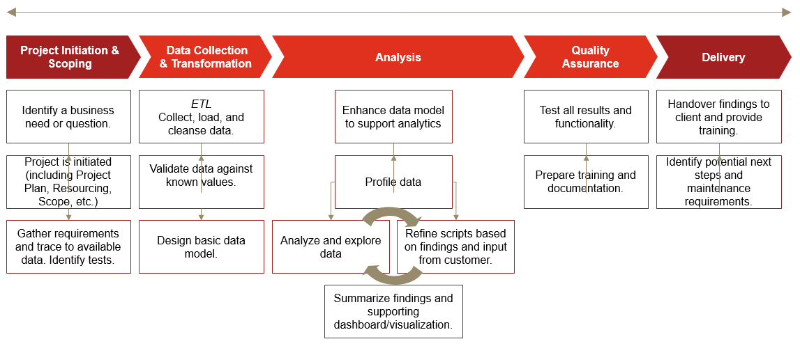

# Module objectives

-   Demonstrate knowledge of what makes an effective visualization

-   Demonstrate knowledge of use cases for visualizations

-   Demonstrate how to create basic visualizations and dashboards

## PWC: What is required to do data analysis?

{width="100%"}

## Visual analysis -- Why is it important?

-   Using simple graphical information to gain insight and solve real-world (business) problems

-   The purpose of information visualization is to help us think by assisting memory and representing data in ways that our brain could easily comprehend

    -   Visualizing datasets side-by-side allows us to make immediate comparisons

    -   Charting measures over time help us understand behavior trends

    -   Dashboards allow us to see data from many perspectives at once to start to find reasons for trends or anomalies

-   Interactive and interesting

## What is a dashboard?

A dashboard is a business intelligence management tool used to determine performance and progress towards business goals. Successful dashboards should have:

-   Proper Metrics

    -   Relevant to the past, present, or future

    -   Should be actionable

-   Executive Support

    -   Buy-in should come from the top

    -   Should be viewed as critical decision support tools

-   Simplicity

    -   Users should not need a lengthy manual to understand the information presented

    -   Information should be communicated in a straight forward way

# Using R for Visualizations

## The grammar of graphics 

The specific content largely comes from [ModernDive](https://moderndive.com/index.html) and [R for Data Science](https://r4ds.had.co.nz/index.html).

We start with a discussion of a theoretical framework for data visualization known as "the grammar of graphics." This framework serves as the foundation for the ggplot2 package which we'll use extensively in this chapter. Think of how we construct and form sentences in English by combining different elements, like nouns, verbs, articles, subjects, objects, etc. We can't just combine these elements in any arbitrary order; we must do so following a set of rules known as a linguistic grammar. Similarly to a linguistic grammar, "the grammar of graphics" defines a set of rules for constructing statistical graphics by combining different types of layers. This grammar was created by Leland Wilkinson (Wilkinson 2005) and has been implemented in a variety of data visualization software platforms like R, but also Plotly and Tableau.

## Components of the grammar In short, the grammar tells us that:

A statistical graphic is a mapping of data variables to aesthetic attributes of geometric objects.

**A statistical graphic is a `mapping` of `data` variables to `aes`thetic attributes of `geom`etric objects.**

Specifically, we can break a graphic into the following three essential components:

data: the dataset containing the variables of interest. geom: the geometric object in question. This refers to the type of object we can observe in a plot. For example: points, lines, and bars. aes: aesthetic attributes of the geometric object. For example, x/y position, color, shape, and size. Aesthetic attributes are mapped to variables in the dataset. You might be wondering why we wrote the terms data, geom, and aes in a computer code type font. We'll see very shortly that we'll specify the elements of the grammar in R using these terms. However, let's first break down the grammar with an example.

```{r loaddata}
#load data. 
#curl package lets us download data from a website with the proper location
#check the packages tab and see if you have curl
#try following
  #?curl
library(tidyverse)
library(curl)

load(curl("https://raw.githubusercontent.com/Professor-Hunt/ACC3053/main/data/AnnualCompanyData.Rda"))
```

## Graph Introduction

[Scatter Plots](https://moderndive.com/2-viz.html#scatterplots)

```{r}

ggplot(data = AnnualCompanyData, mapping = aes(x = NetIncome, y = LongtermDebt)) + 
  geom_point()

ggplot(data = AnnualCompanyData, mapping = aes(x = NetIncome, y = LongtermDebt)) + 
  geom_point()+xlim(-20000,20000)+ylim(0,100000)
```

[Line Graph](https://moderndive.com/2-viz.html#linegraphs)

```{r,echo=TRUE}
#line graph..

linegraph1<-AnnualCompanyData

ggplot(data=linegraph1,mapping = aes(x=FiscalYear,y=TotalAssets))+geom_line()


linegraph2<-AnnualCompanyData%>%
  filter(CompanyName=="APPLE INC")

ggplot(data=linegraph2,mapping = aes(x=FiscalYear,y=TotalAssets))+geom_line()


linegraph3<-AnnualCompanyData%>%
  group_by(FiscalYear)%>%
  summarise(mean_TotalAssets=mean(TotalAssets,na.rm=TRUE))

ggplot(data=linegraph3,mapping = aes(x=FiscalYear,y=mean_TotalAssets))+geom_line()

```

[Histograms](https://moderndive.com/2-viz.html#histograms)

```{r,echo=TRUE}

ggplot(data=AnnualCompanyData,mapping = aes(x=NetIncome,fill=factor(FiscalYear)))+geom_histogram(position = "dodge")
```

[Boxplots](https://moderndive.com/2-viz.html#boxplots)

```{r,echo=TRUE}
ggplot(data=AnnualCompanyData,mapping = aes(x=NetIncome,y=factor(FiscalYear)))+geom_boxplot()
```

[Bar plots](https://moderndive.com/2-viz.html#geombar)

```{r,echo=TRUE}

bardata<-AnnualCompanyData%>%
  mutate(sic1=factor(substr(sic,0,1)))
  
ggplot(data=bardata,mapping = aes(x=sic1, fill=sic1))+geom_bar()
```

## ggplot2 package

we will use the `ggplot2` package for data visualization, which is an implementation of the `g`rammar of `g`raphics for R (Wickham, Chang, et al. [2021](https://moderndive.com/2-viz.html#ref-R-ggplot2)). As we noted earlier, a lot of the previous section was written in a computer code type font. This is because the various components of the grammar of graphics are specified in the `ggplot()` function included in the `ggplot2` package. For the purposes of this class, we'll always provide the `ggplot()` function with the following arguments (i.e., inputs) at a minimum:

-   The data frame where the variables exist: the `data` argument.

-   The mapping of the variables to aesthetic attributes: the `mapping` argument which specifies the `aes`thetic attributes involved.

After we've specified these components, we then add *layers* to the plot using the `+` sign. The most essential layer to add to a plot is the layer that specifies which type of `geom`etric object we want the plot to involve: points, lines, bars, and others. Other layers we can add to a plot include the plot title, axes labels, visual themes for the plots, and facets

## Lets get some more data:

This loads data directly from my GitHub 😈

```{r getdata}

library(curl)

load(curl("https://raw.githubusercontent.com/Professor-Hunt/ACC3053/main/data/Orders_Data.Rda"))

load(curl("https://raw.githubusercontent.com/Professor-Hunt/ACC3053/main/data/People_Data.Rda"))

load(curl("https://raw.githubusercontent.com/Professor-Hunt/ACC3053/main/data/Returns_Data.Rda"))

```

Make sure you load the proper libraries:

```{r libs}

library(tidyverse)
```

# First Steps:

Lets answer a question: What is the relationship between Sales and Profit?

## Creating the plot:

```{r plot1}

ggplot(data = Orders_Data) + 
  geom_point(mapping = aes(x = Profit, y = Sales))

# ggplot(data = Orders_Data,aes(x = Profit, y = Sales)) + 
#   geom_point()

```

This plot is not as clear as we expected. Sales is positively related to Profit, but it is not as strong as you might have expected.

With ggplot2, you begin a plot with the function `ggplot()`. `ggplot()` creates a coordinate system that you can add layers to. The first argument of `ggplot()` is the dataset to use in the graph.

You complete your graph by adding one or more layers to `ggplot()`. The function `geom_point()` adds a layer of points to your plot, which creates a scatterplot. ggplot2 comes with many geom functions that each add a different type of layer to a plot.

Each geom function in ggplot2 takes a `mapping` argument. This defines how variables in your dataset are mapped to visual properties. The `mapping` argument is always paired with `aes()`, and the `x` and `y` arguments of `aes()` specify which variables to map to the x and y axes.

## Aesthetic mappings

You can add a third variable, like `Category`, to a two dimensional scatterplot by mapping it to an **aesthetic**. An aesthetic is a visual property of the objects in your plot. Aesthetics include things like the size, the shape, or the color of your points. You can display a point in different ways by changing the values of its aesthetic properties.

You can convey information about your data by mapping the aesthetics in your plot to the variables in your dataset.

```{r plot2}

ggplot(data = Orders_Data) + 
  geom_point(mapping = aes(x = Profit, y = Sales, color=Category))

# ggplot(data = Orders_Data,aes(x = Profit, y = Sales, color=Category)) + 
#   geom_point()
```

To map an aesthetic to a variable, associate the name of the aesthetic to the name of the variable inside `aes()`. ggplot2 will automatically assign a unique level of the aesthetic (here a unique color) to each unique value of the variable, a process known as **scaling**. ggplot2 will also add a legend that explains which levels correspond to which values.

In the above example, we mapped `Category` to the color aesthetic, but we could have mapped `Category` to the size aesthetic in the same way. In this case, the exact size of each point would reveal its class affiliation. We get a *warning* here, because mapping an unordered variable (`Category`) to an ordered aesthetic (`size`) is not a good idea.

```{r plot3 }

ggplot(data = Orders_Data) + 
  geom_point(mapping = aes(x = Profit, y = Sales, size=Category))

 # ggplot(data = Orders_Data,aes(x = Profit, y = Sales, size=Category)) + 
 #   geom_point()
```

Or we could have mapped `Category` to the *alpha* aesthetic, which controls the transparency of the points, or to the shape aesthetic, which controls the shape of the points.

```{r plot4,out.width="50%"}

ggplot(data = Orders_Data) + 
  geom_point(mapping = aes(x = Profit, y = Sales, alpha=Category))

ggplot(data = Orders_Data) + 
  geom_point(mapping = aes(x = Profit, y = Sales, shape=Category))
```
